# Blockchain — Zero to Hero (Blockchain Engineer Edition)

A complete, intuition-first path from "what is a blockchain?" to "I build and maintain private
Ethereum networks, Geth nodes, Clique PoA chains, explorers, smart contracts, and Merkle
verification systems." Every concept starts with an analogy, then the technical internals, then
diagrams and code.

> **Companion files in this repo:** [`merkle-tree-zero-to-hero.md`](./merkle-tree-zero-to-hero.md)
> (Merkle deep dive), [`chains.md`](./chains.md) (private chains & Clique), [`project.md`](./project.md)
> (this app), [`blockchain.md`](./blockchain.md) (system overview). This file is the spine that ties
> them together.

---

## Table of Contents

1. [What is Blockchain](#section-1--what-is-blockchain)
2. [Cryptography Foundations](#section-2--cryptography-foundations)
3. [Blockchain Internals](#section-3--blockchain-internals)
4. [Consensus Mechanisms](#section-4--consensus-mechanisms)
5. [Clique PoA Deep Dive](#section-5--clique-poa-deep-dive)
6. [IBFT and QBFT](#section-6--ibft-and-qbft)
7. [Ethereum Architecture](#section-7--ethereum-architecture)
8. [Geth Internals](#section-8--geth-internals)
9. [Genesis Files](#section-9--genesis-files)
10. [Building Every Type of Chain in Geth](#section-10--building-every-type-of-chain-in-geth)
11. [Ethereum Data Structures](#section-11--ethereum-data-structures)
12. [Block Explorer Engineering](#section-12--block-explorer-engineering)
13. [Transaction Verification](#section-13--transaction-verification)
14. [Smart Contracts](#section-14--smart-contracts)
15. [Rewards and Economics](#section-15--rewards-and-economics)
16. [Production Networks](#section-16--production-networks)
17. [Enterprise Blockchain](#section-17--enterprise-blockchain)
18. [Advanced Topics](#section-18--advanced-topics)
19. [Source Code Deep Dive](#section-19--source-code-deep-dive)
20. [My Current Architecture](#section-20--my-current-architecture)
21. [Troubleshooting](#section-21--troubleshooting)
22. [Interview Preparation (400 Q&A)](#section-22--interview-preparation-400-qa)
23. [Deep Dive Into Blockchain Implementations](#section-23--deep-dive-into-blockchain-implementations)
24. [Consensus Comparison Matrix](#section-24--consensus-comparison-matrix)
25. [Implementing Consensus In Geth](#section-25--implementing-consensus-in-geth)
26. [Building Custom Consensus](#section-26--building-custom-consensus)
27. [Real World Architecture Patterns](#section-27--real-world-architecture-patterns)
28. [Migration Paths](#section-28--migration-paths)

---

## Section 1 — What is Blockchain

### Intuition first
Imagine a **shared Google Sheet** that everyone can read, nobody can secretly edit, and which has
no owner — yet everyone agrees on its contents. Each new row is locked to the previous one with a
tamper-evident seal. That's a blockchain: a **distributed, append-only, tamper-evident ledger**.

### History
- **1979** — Ralph Merkle: hash trees.
- **1991** — Haber & Stornetta: cryptographically time-stamped documents (the first "block chain").
- **2008** — Satoshi Nakamoto publishes the **Bitcoin whitepaper**.
- **2009** — Bitcoin genesis block mined.
- **2015** — Ethereum launches (programmable blockchain / smart contracts).
- **2022** — Ethereum "**The Merge**": Proof of Work → Proof of Stake.

### Why blockchain was invented
To enable **value transfer and agreement without a trusted central party**. Before Bitcoin, digital
money required a bank to prevent **double-spending** (spending the same coin twice). Bitcoin solved
double-spending without a bank using PoW + a public ledger.

### Bitcoin whitepaper motivation
*"A purely peer-to-peer version of electronic cash would allow online payments to be sent directly
from one party to another without going through a financial institution."* The core problem:
**double-spend prevention in a trustless, decentralized network**, solved by ordering transactions
in a chain secured by proof of work (the longest/heaviest chain is truth).

### Problems blockchain solves
1. **Double-spending** without a central authority.
2. **Tamper-evidence** — history can't be silently rewritten.
3. **Censorship resistance** — no single gatekeeper.
4. **Trust minimization** — verify, don't trust.
5. **Shared source of truth** across mutually-distrusting parties (great for consortia).

### Trustless systems
"Trustless" doesn't mean *no trust* — it means **trust is placed in math and incentives, not in
people/institutions.** You verify rules cryptographically instead of trusting a middleman.

### Distributed systems fundamentals
- **Nodes** keep replicas; they must **agree** despite failures (consensus).
- **CAP theorem:** under a network partition you choose Consistency or Availability.
- **Byzantine faults:** some nodes may be malicious/arbitrary, not just crashed. Blockchains need
  **Byzantine Fault Tolerance (BFT)**.
- **FLP impossibility:** no deterministic consensus is guaranteed in a fully async network with one
  faulty node — real systems add timing assumptions / probabilistic finality.

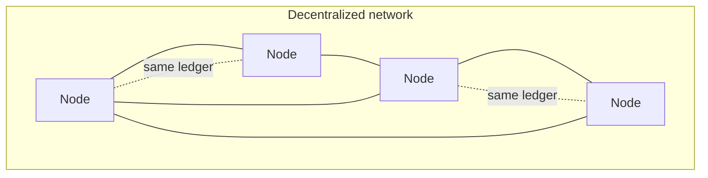

### Exercises
1. Explain double-spending and how a public ledger + ordering prevents it.
2. Why is "trustless" a misleading word? What replaces institutional trust?
3. What's the difference between a crash fault and a Byzantine fault?

### Interview questions
- **Q:** What core problem did Bitcoin solve that prior digital cash couldn't?
  **A:** Double-spending without a trusted central party, via PoW-ordered transactions on a public
  ledger.
- **Q:** What does BFT mean and why do blockchains need it?
  **A:** Tolerating nodes that behave arbitrarily/maliciously; open networks must stay correct
  despite adversaries.

---

## Section 2 — Cryptography Foundations

### Intuition first
Two tools power everything: a **fingerprint maker** (hash) that uniquely IDs any data, and a **wax
seal** (digital signature) that proves *you* authorized something and nobody altered it.

### Hashing
A one-way function mapping any input to a fixed-size digest. Deterministic, collision-resistant,
avalanche effect, irreversible. (Full treatment in `merkle-tree-zero-to-hero.md` §2.)

### SHA-256
256-bit digest; used by **Bitcoin** (double SHA-256) for block hashing, mining, and txids.

### Keccak-256
The hash **Ethereum** uses (a SHA-3 variant). Note: Ethereum's "sha3" is *keccak-256*, slightly
different from finalized NIST SHA3-256.

### Digital signatures
Prove **authenticity** (who signed) + **integrity** (not tampered) + **non-repudiation** (can't
deny). You sign with a **private key**; anyone verifies with the matching **public key**.

### ECDSA
**Elliptic Curve Digital Signature Algorithm.** A signature is `(r, s)` (+ `v` recovery id in
Ethereum). Ethereum can **recover** the signer's address from the signature + message (`ecrecover`).

### secp256k1
The specific elliptic curve Bitcoin and Ethereum use. Private key = a 256-bit number; public key =
a point on the curve = `privKey · G` (G = generator point). Easy forward, infeasible to reverse
(elliptic-curve discrete log problem).

### Public/private keys & addresses
- **Private key:** 32 random bytes (keep secret).
- **Public key:** derived via secp256k1.
- **Ethereum address:** last 20 bytes of `keccak256(publicKey)`, written as `0x…` (often with
  EIP-55 mixed-case checksum).
- **Bitcoin address:** base58check/bech32 of `RIPEMD160(SHA256(pubkey))`.

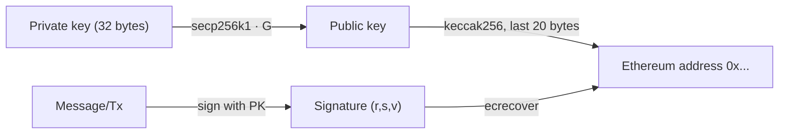

### JavaScript example
```js
// npm i ethers
const { ethers } = require('ethers');
const wallet = ethers.Wallet.createRandom();
console.log('priv:', wallet.privateKey);
console.log('addr:', wallet.address);
const sig = await wallet.signMessage('hello');           // sign
const signer = ethers.verifyMessage('hello', sig);       // recover
console.log('recovered == addr:', signer === wallet.address);
```

### TypeScript example
```ts
import { keccak256, toUtf8Bytes, recoverAddress, hashMessage, Wallet } from 'ethers';

const w = Wallet.createRandom();
const message = 'transfer 5 to Bob';
const sig = await w.signMessage(message);
const recovered = recoverAddress(hashMessage(message), sig);
console.log(recovered === w.address); // true — proves w signed it
console.log(keccak256(toUtf8Bytes('hello'))); // Ethereum-style hash
```

### Go example
```go
package main

import (
    "fmt"
    "github.com/ethereum/go-ethereum/crypto"
)

func main() {
    priv, _ := crypto.GenerateKey()                 // secp256k1 private key
    addr := crypto.PubkeyToAddress(priv.PublicKey)  // keccak256(pub)[12:]
    hash := crypto.Keccak256Hash([]byte("hello"))   // Ethereum keccak256
    sig, _ := crypto.Sign(hash.Bytes(), priv)       // ECDSA sign
    pub, _ := crypto.SigToPub(hash.Bytes(), sig)    // recover public key
    fmt.Println(addr.Hex(), crypto.PubkeyToAddress(*pub).Hex()) // equal
}
```

### Exercises
1. Derive an Ethereum address from a public key by hand-describing each step.
2. What are `r`, `s`, `v` and why does Ethereum include `v`?
3. Why is reversing a public key to a private key infeasible?

### Interview questions
- **Q:** How is an Ethereum address derived?
  **A:** `keccak256(publicKey)` → take the last 20 bytes → hex with EIP-55 checksum.
- **Q:** What is `ecrecover` and why is it useful on-chain?
  **A:** It recovers the signer address from a message hash + signature, enabling signature
  verification without storing public keys.

---

## Section 3 — Blockchain Internals

### Intuition first
A blockchain is a **linked list where each node's "next pointer" is a cryptographic hash of the
previous block.** Change an old block and every later hash breaks — tampering is obvious.

### Blocks
A block = **header** + **body (transactions)**. Blocks are chained by `parentHash`.

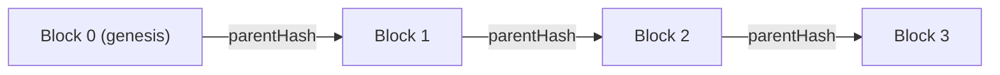

### Transactions
A signed instruction: transfer value or call a contract. Ethereum tx fields: `nonce`, `to`,
`value`, `data`, `gasLimit`, `maxFeePerGas`/`maxPriorityFeePerGas` (EIP-1559), `chainId`, `(v,r,s)`.

### Block headers (Ethereum)
`parentHash`, `stateRoot`, `transactionsRoot`, `receiptsRoot`, `logsBloom`, `number`, `gasLimit`,
`gasUsed`, `timestamp`, `baseFeePerGas`, `extraData`, plus consensus fields (`mixHash`/`nonce` for
PoW, zeroed for PoS; signer seal in `extraData` for Clique).

### State vs World State
- **State:** the current value of everything (all account balances, contract storage).
- **World state (Ethereum):** a mapping `address → account{nonce, balance, storageRoot, codeHash}`,
  stored in the **state trie**, committed as `stateRoot` in each header.
- Bitcoin uses a **UTXO** model (unspent outputs) instead of accounts.

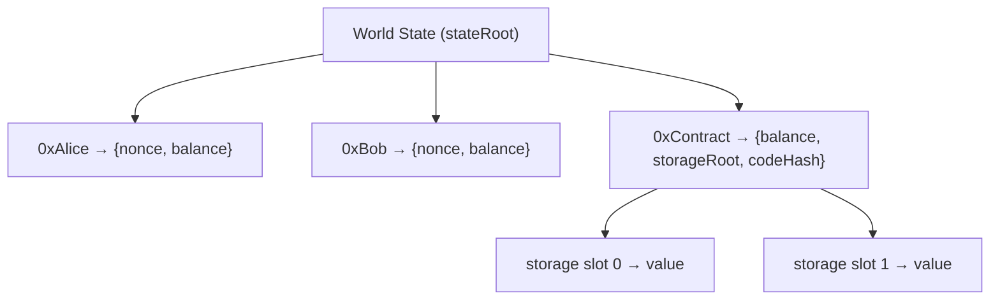

### Transaction lifecycle
```mermaid
sequenceDiagram
    participant U as User
    participant W as Wallet
    participant N as Node (mempool)
    participant V as Validator/Miner
    participant C as Chain
    U->>W: create tx (to, value, data)
    W->>W: sign with private key
    W->>N: broadcast raw tx
    N->>N: validate (nonce, balance, sig, gas) → mempool
    V->>N: pick txs by fee/priority
    V->>V: execute on EVM → new state, receipts
    V->>C: seal block (root commitments) + propagate
    C-->>U: tx mined; after confirmations → final
```

### Exercises
1. Account model vs UTXO model — one advantage of each.
2. Which header fields are *commitments* (roots) and what do they commit to?
3. Trace a tx from signing to finality.

### Interview questions
- **Q:** What does `stateRoot` commit to and why is it in the header?
  **A:** The entire world state after the block; in the header so consensus secures state and light
  clients can prove it.
- **Q:** Difference between account and UTXO models?
  **A:** Accounts track mutable balances per address (Ethereum); UTXO tracks discrete unspent
  outputs consumed/created per tx (Bitcoin).

---

## Section 4 — Consensus Mechanisms

### Intuition first
Consensus answers *"whose turn is it to add the next block, and how does everyone agree it's
valid?"* Different chains buy security differently: with **electricity** (PoW), **capital** (PoS),
or **identity/reputation** (PoA).

### Proof of Work (PoW)
- **Mining:** repeatedly hash the header varying the **nonce** until `hash < target`.
- **Difficulty:** adjusts target so blocks come at a steady rate.
- **Block reward:** new coins + fees pay the winning miner (the incentive to spend electricity).
- **Uncle/ommer blocks (Ethereum PoW):** valid-but-not-canonical blocks rewarded partially to
  reduce centralization and reward near-misses.
- **Bitcoin PoW:** double-SHA256, ~10 min blocks. **Ethereum PoW (pre-Merge):** Ethash (memory-hard,
  ASIC-resistant), ~13s blocks.

Simplified mining:
```js
const { createHash } = require('crypto');
const sha = s => createHash('sha256').update(s).digest('hex');

function mine(blockData, difficulty) {        // difficulty = leading zeros
  const prefix = '0'.repeat(difficulty);
  let nonce = 0;
  while (true) {
    const hash = sha(blockData + nonce);
    if (hash.startsWith(prefix)) return { nonce, hash };
    nonce++;
  }
}
console.log(mine('block#1|prev:000abc|txs:...', 4)); // find nonce so hash starts 0000
```

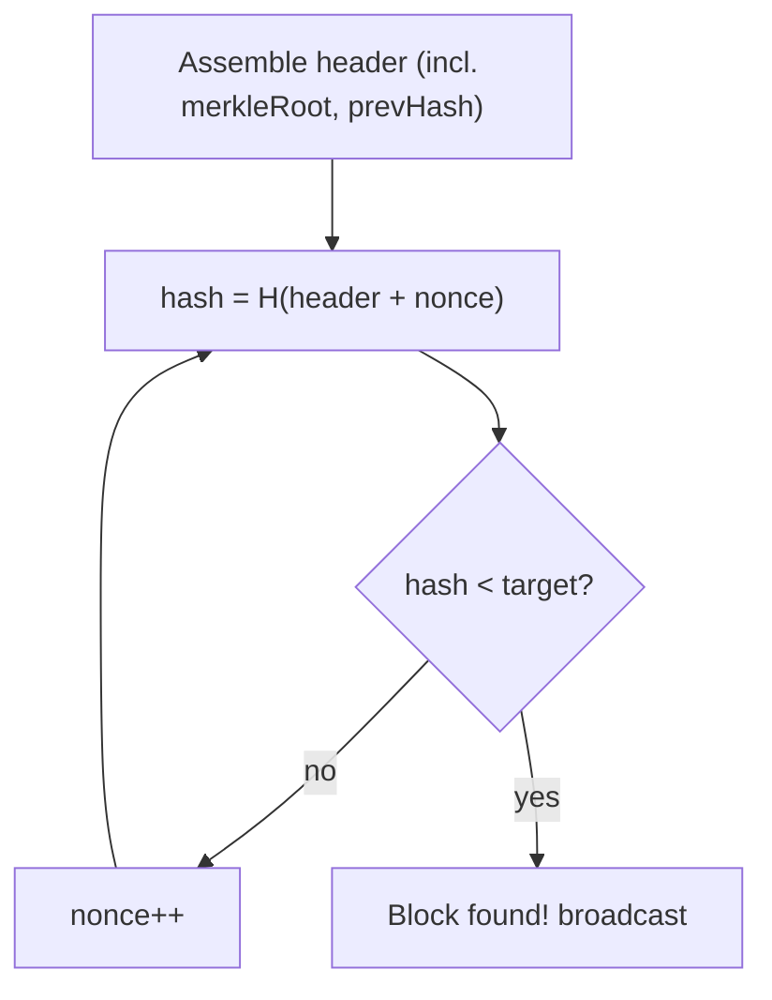

### Proof of Stake (PoS)
- **Validators** lock (**stake**) capital (32 ETH on Ethereum) to be eligible.
- The protocol pseudo-randomly selects a **proposer** each slot; a **committee** attests.
- **Slashing:** provably malicious behavior burns part of the stake.
- **Rewards:** issuance + priority tips for proposing/attesting honestly.
- **Epochs:** Ethereum = 32 slots × 12s = 6.4 min; checkpoints enable **finality**.
- **Finality:** after two justified checkpoints, blocks are **finalized** (reverting costs ≥ 1/3 of
  all stake) — much stronger than PoW's probabilistic finality.

Ethereum PoS architecture:
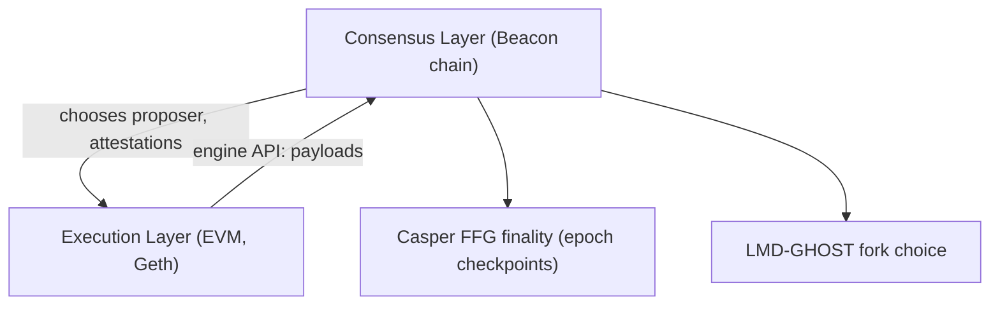
Post-Merge a node = **execution client** (Geth/Besu/Nethermind) + **consensus client**
(Prysm/Lighthouse/Teku/Nimbus) talking over the **Engine API**.

### Delegated Proof of Stake (DPoS)
- Token holders **vote** for a small set of **delegates/block producers** who take turns.
- Faster, fewer validators, more centralized; governance is explicit.
- **EOS** (21 block producers), **TRON** (27 Super Representatives).

### Proof of Authority (PoA)
- A fixed set of **approved authorities (signers/validators)** seal blocks; security = identity.
- Fast, cheap, tiny resource use; ideal for **private/consortium** chains.
- **Geth: Clique.** **Besu/Quorum: IBFT 2.0, QBFT.**
- **No block reward by default** (Section 5 & 15 explain why).

### Comparison
| | PoW | PoS | DPoS | PoA (Clique/IBFT/QBFT) |
|---|---|---|---|---|
| Security from | electricity | staked capital | delegates + stake | identity/reputation |
| Validators | open miners | open stakers | elected few | approved signers |
| Reward | block + fees | issuance + tips | block + fees | **none by default** |
| Finality | probabilistic | economic (epochs) | fast | probabilistic (Clique) / instant (IBFT/QBFT) |
| Energy | very high | low | low | tiny |
| Best for | public money | public smart contracts | high-throughput public | private/enterprise |

### Exercises
1. Implement difficulty as "hash below a numeric target" instead of leading zeros.
2. Why does PoS give stronger finality than PoW?
3. Why is DPoS more centralized than vanilla PoS?

### Interview questions
- **Q:** What stops a PoW miner from rewriting history?
  **A:** They'd need to redo all PoW from that block faster than the honest majority — economically
  infeasible (51% attack).
- **Q:** What is slashing and why does PoS need it?
  **A:** Burning a validator's stake for provable misbehavior; it makes attacks costly, replacing
  PoW's electricity cost.

---

## Section 5 — Clique PoA Deep Dive

> The most important section for your work. Clique is Geth's PoA engine (EIP-225) and powers your
> "Private Ethereum · connected" network.

### Why Clique exists
Public PoW/PoS is overkill for a **private/consortium** chain of known parties. You want: fast,
deterministic blocks; no mining hardware; no valuable token; control over who validates. Clique
delivers exactly that with a **round-robin of approved signers**.

### How Clique works internally
- A set of **signers** (authorities) is authorized to seal blocks.
- Block time is fixed by `period` (seconds). With `period: 0`, blocks are produced on-demand.
- Each block height has a deterministic **in-turn** signer; **out-of-turn** signers may seal after a
  small randomized delay as backup (so one offline signer doesn't stall the chain).
- The signer signs the block header; the signature sits in **`extraData`**, and the signer's address
  is **recovered** from it (no separate "miner" field needed).
- **Difficulty convention:** `2` (DIFF_INTURN) if the sealer was in-turn, `1` (DIFF_NOTURN) if
  out-of-turn — used by the fork-choice to prefer in-turn blocks.

```mermaid
graph LR
    subgraph Signers["Authorized signers (round-robin)"]
        S0["Signer A"] --> S1["Signer B"] --> S2["Signer C"] --> S0
    end
    H["Block N"] -->|in-turn = N mod len(signers)| S0
    H2["Block N+1"] -->|in-turn| S1
```

### Validator rotation & signer voting (on-chain governance)
The signer set changes by **vote**, no restart needed:
- An existing signer **proposes** to add/remove an address via `clique.propose(addr, true|false)`.
- Each proposing signer casts its vote by setting fields in the blocks it seals.
- When **> 50%** of current signers have voted the same way, the change takes effect.
- Votes are tallied over a window and reset at **epoch** boundaries.

### Epoch blocks
Every `epoch` blocks (e.g. 30000) is a **checkpoint block**:
- It **clears all pending votes**.
- Its `extraData` contains the **full list of current signers** (a snapshot), so a fresh/syncing
  node can establish the authoritative signer set without replaying every vote.

### Block sealing & production
```mermaid
sequenceDiagram
    participant T as Timer (period)
    participant S as In-turn Signer
    participant H as Header
    participant P as Peers
    T->>S: time to seal block N
    S->>H: build header (roots, number, extraData vanity)
    S->>S: optional: cast add/remove vote in header
    S->>H: sign header → put signature in extraData seal
    S->>P: broadcast sealed block
    P->>P: recover signer from extraData; check authorized & not recently signed
```
- **Anti-equivocation rule:** a signer may not seal again until `floor(len(signers)/2) + 1` other
  blocks have passed (prevents one signer dominating).

### Why validators do NOT receive mining rewards by default
This is the crux. In Clique:
- **`block reward = 0`** is hard-coded; no new coins are minted per block.
- Signers are **known, trusted organizations** running nodes for **business reasons** — their
  incentive is **external** (the application's value), not an in-protocol token.
- **Sealing costs almost nothing** (one signature; no electricity, no stake at risk), so there's
  nothing to reimburse.
- A private consortium **doesn't want a valuable, inflating coin** — the native coin is just an
  internal **gas meter**, usually priced at **0**. Paying rewards in a worthless coin is pointless.
- **Security comes from identity & legal accountability** (a bad signer is a known company,
  removable by vote and liable), not from economic cost — so no compensation is needed.

> **One line:** *PoW/PoS pay anonymous validators to offset real costs (electricity/stake); Clique
> signers are trusted parties with external incentives and ~zero sealing cost, so no reward is
> needed and none is minted.*

### Economic model / private-chain assumptions / enterprise usage
- **No speculation, no public token, no anonymous spam** → gas price 0, no fee market.
- **Spam protection = permissioning** (only approved nodes), not gas cost.
- **Operators are incentivized off-chain:** consortium agreements, cost-sharing, SLAs, and the plain
  value of the shared ledger (e.g. catching counterfeits saves money).

### How to add rewards manually
If you *do* want to reward signers, three options:

**1. Reward smart contract (cleanest, no client fork).** A contract mints/transfers an ERC20 to the
block's signer, called by an off-chain keeper that reads `block.coinbase`/sealer per block.
```solidity
// SignerRewards.sol — distribute an internal reward token to block sealers
pragma solidity ^0.8.20;
import {AccessControl} from "@openzeppelin/contracts/access/AccessControl.sol";

interface IMintable { function mint(address to, uint256 amount) external; }

contract SignerRewards is AccessControl {
    bytes32 public constant KEEPER = keccak256("KEEPER");
    IMintable public immutable token;
    uint256 public rewardPerBlock;
    mapping(uint256 => bool) public paid; // blockNumber → paid?

    constructor(IMintable _t, uint256 _r) { token = _t; rewardPerBlock = _r;
        _grantRole(DEFAULT_ADMIN_ROLE, msg.sender); }

    // Keeper reports the sealer of a finalized block; contract pays once.
    function reward(uint256 blockNumber, address signer) external onlyRole(KEEPER) {
        require(!paid[blockNumber], "already paid");
        paid[blockNumber] = true;
        token.mint(signer, rewardPerBlock);
    }
}
```

**2. Set a non-zero gas price.** If transactions pay `gasPrice > 0`, the **priority tips** go to the
block's `etherbase` (the signer). Block reward stays 0, but fees accrue. Most consortia keep gas at 0,
so this is rarely used.

**3. Custom Geth modification.** Fork `consensus/clique/clique.go` and implement `Finalize` to credit
the sealer's balance each block:
```go
// in clique Finalize (custom build) — credit the sealer a fixed reward
func (c *Clique) Finalize(chain consensus.ChainHeaderReader, header *types.Header,
    state *state.StateDB, txs []*types.Transaction, uncles []*types.Header) {
    signer, _ := ecrecover(header, c.signatures)        // who sealed it
    reward := big.NewInt(2e18)                           // 2 coins/block (example)
    state.AddBalance(signer, uint256.MustFromBig(reward))// mint to sealer
    header.Root = state.IntermediateRoot(true)           // new stateRoot
}
```
> **Caveat:** forking the client means **every node must run your custom binary** and agree on the
> rule, or you'll fork the chain. The smart-contract approach (option 1) is preferred operationally.

### How my private chain currently works
In this repo, the chain is **simulated** (the UI shows "Private Ethereum · connected" and stores
mock `0x…` roots/txs in `lib/store/seed.skf.ts`). A *real* deployment would be a **Geth + Clique**
network (1+ signer organizations, `period` ~5s, gas price 0, `ProvenanceRegistry.sol` storing Merkle
roots at mint). Section 20 details the end-to-end target architecture, and `chains.md` has the
copy-paste setup.

### Exercises
1. Compute the in-turn signer for block 1000 with 4 signers.
2. Why must a signer wait `len/2 + 1` blocks before sealing again?
3. Design an off-chain keeper that pays signers via the reward contract.

### Interview questions
- **Q:** Why do Clique validators earn no block reward?
  **A:** Reward is hard-zero; signers are trusted parties with external incentives and near-zero
  sealing cost, and a private chain wants no valuable/inflating coin — so security needs no payment.
- **Q:** How does Clique change its validator set without a restart?
  **A:** Existing signers vote via `clique.propose`; a >50% majority adds/removes a signer, and
  epoch blocks snapshot the current set.

---

## Section 6 — IBFT and QBFT

### Intuition first
Clique gives fast blocks but **probabilistic** finality (a short reorg is possible). Enterprises
often need **instant, absolute finality** — once committed, never reverted. **BFT** consensus
(IBFT/QBFT) achieves that by having validators **vote each block to a super-majority before
committing**.

### Byzantine Fault Tolerance
A BFT protocol stays safe and live as long as **fewer than 1/3** of validators are faulty/malicious
(tolerates `f` faults with `3f + 1` validators). Classic PBFT-style 3-phase voting.

### Validator voting & finality (IBFT/QBFT)
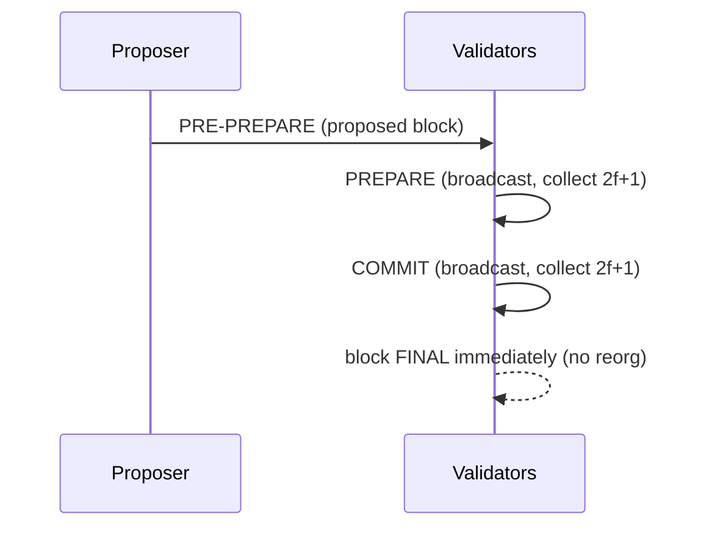
- Once a validator sees `2f+1` COMMITs, the block is **final**. No forks, no uncles.
- **Round changes** handle a faulty/offline proposer (timeout → next proposer).

### IBFT 2.0 vs QBFT
- **IBFT 2.0** — Besu/Quorum; immediate finality; validator votes to add/remove validators.
- **QBFT** — the modern successor (Besu/GoQuorum default for new nets); cleaner spec, better
  interoperability, supports validator management via smart contract or block headers.

### Clique vs IBFT vs QBFT
| | Clique | IBFT 2.0 | QBFT |
|---|---|---|---|
| Client | Geth | Besu, GoQuorum | Besu, GoQuorum |
| Finality | probabilistic | **immediate** | **immediate** |
| Fault model | crash-tolerant-ish | BFT (<1/3) | BFT (<1/3) |
| Reorgs | possible | none | none |
| Validator mgmt | header votes | header votes | header **or** contract |
| Complexity | simplest | medium | medium |
| Use when | quick private dev | enterprise finality | new enterprise nets |

### Architecture diagram
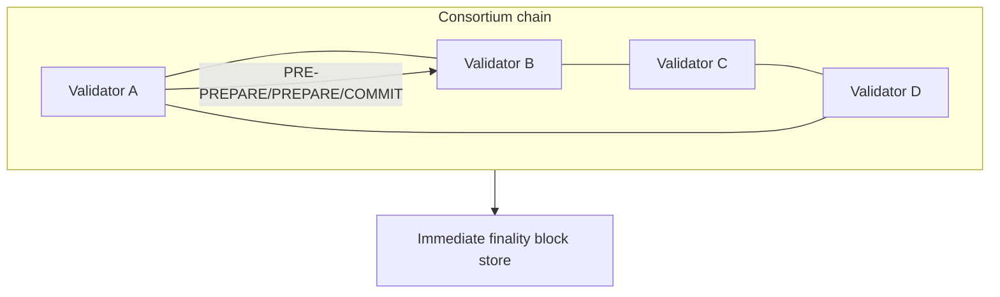

### Exercises
1. With 7 validators, how many faulty nodes can QBFT tolerate?
2. Why can't IBFT chains have uncle blocks?
3. When would you pick Clique over QBFT despite weaker finality?

### Interview questions
- **Q:** How many faults does BFT tolerate and why `3f+1`?
  **A:** Up to `f` of `3f+1`; you need `2f+1` honest votes to outvote `f` faulty + ensure quorum
  intersection.
- **Q:** Key practical difference between Clique and QBFT?
  **A:** Clique has probabilistic finality (possible reorgs); QBFT finalizes each block immediately.

---

## Section 7 — Ethereum Architecture

### Intuition first
Ethereum is a **world computer**: a single shared state machine. Transactions are inputs; the **EVM**
is the CPU; **gas** is the metered electricity bill; **storage** is the disk.

### Accounts
Two kinds:
- **EOA (Externally Owned Account):** controlled by a private key; has balance + nonce; can initiate
  transactions.
- **Contract account:** controlled by code; has balance, nonce, **code**, and **storage**; only acts
  when called.

### Transactions
EOA-initiated. Types: value transfer, contract creation (`to = null`), contract call (`data` =
function selector + args). EIP-1559 fee fields: `maxFeePerGas`, `maxPriorityFeePerGas`.

### Gas
- Every EVM op costs gas (e.g. `SSTORE` is expensive, `ADD` cheap).
- **Fee = gasUsed × gasPrice**; EIP-1559 splits into **base fee (burned)** + **priority tip
  (validator)**.
- Out-of-gas → revert (state changes undone, gas still spent).

### Storage / Memory / Stack
- **Storage:** persistent per-contract key→value (256-bit slots), in the state trie; expensive.
- **Memory:** transient, per-call, byte-addressable; cheap; cleared after the call.
- **Stack:** 1024-deep, 256-bit words; where the EVM does arithmetic.

### Logs / Receipts
- **Logs/events:** cheap append-only data emitted by contracts; indexed by **topics**; not readable
  by contracts, but perfect for off-chain indexers/explorers.
- **Receipt:** per-tx execution result: status, cumulative gas, logs, bloom filter; committed via
  `receiptsRoot`.

### Complete lifecycle
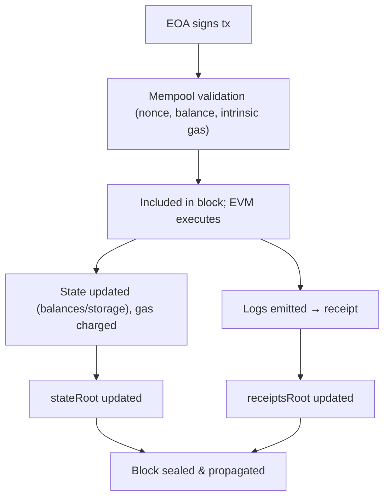

### Exercises
1. Why are events cheaper than storage, and when use each?
2. What happens to gas on an out-of-gas revert?
3. EOA vs contract account — who can start a transaction?

### Interview questions
- **Q:** Difference between storage and memory in the EVM?
  **A:** Storage is persistent and per-contract (in the state trie, expensive); memory is transient
  per-call (cheap, cleared after).
- **Q:** What does EIP-1559 do with the base fee?
  **A:** Burns it (removing it from supply); only the priority tip goes to the validator.

---

## Section 8 — Geth Internals

### Intuition first
Geth is the **engine** that stores the chain, runs the EVM, talks to peers, and serves JSON-RPC. The
same binary runs mainnet or your private Clique net — only config differs.

### Geth architecture
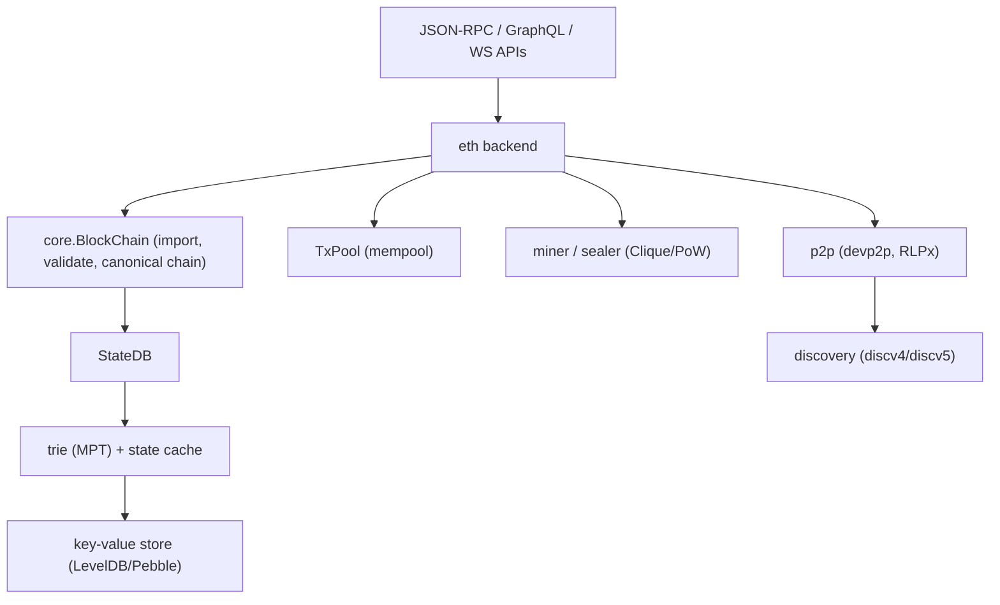

### Node startup
1. Load config + **genesis** (first run writes genesis state via `init`).
2. Open the **state database** (Pebble/LevelDB).
3. Start **p2p** networking + **discovery**.
4. Start **sync** (snap/full) and the **txpool**.
5. If sealing, start the **miner/Clique engine**; expose **RPC**.

### Genesis file
Defines block 0 + chain config (Section 9). `geth init genesis.json` writes the genesis state.

### Chain configuration
The `config` object: `chainId`, hard-fork activation blocks (`homestead…london…shanghai`),
`clique`/`ethash` engine params, `terminalTotalDifficulty` (the Merge trigger).

### State database & trie database
- **StateDB** — in-memory working state during block processing.
- **trie** — the Merkle Patricia Trie; nodes persisted in the KV store keyed by hash.
- **snap sync** — downloads state snapshots + heals the trie (much faster than full replay).

### Block propagation & peer discovery
- **devp2p/RLPx** — encrypted peer transport; **eth** wire protocol exchanges blocks/txs/headers.
- **discv4/discv5** — Kademlia-style node discovery via bootnodes/ENRs.
- New blocks: announced to a subset, full block to a few; peers request what they lack.

### Mempool
Pending/queued txs (by nonce), prioritized by fee; gossiped to peers; drained by the sealer.

### Folder structure (go-ethereum highlights)
```
go-ethereum/
├── cmd/geth/          # CLI entrypoint
├── core/              # blockchain, state, txpool, genesis, EVM glue
│   ├── types/         # Block, Header, Transaction, Receipt, DeriveSha
│   ├── state/         # StateDB
│   └── vm/            # the EVM
├── consensus/
│   ├── clique/        # PoA engine (your chain)
│   ├── ethash/        # legacy PoW
│   └── beacon/        # post-Merge PoS glue
├── trie/              # Merkle Patricia Trie
├── eth/               # protocol, sync, handlers
├── p2p/               # devp2p, discovery, RLPx
├── rpc/               # JSON-RPC framework
└── params/            # chain configs, constants
```

### Exercises
1. Trace what `geth init` does to the database.
2. Snap vs full sync — trade-offs.
3. Which package would you patch to change Clique rewards? (`consensus/clique`)

### Interview questions
- **Q:** What does `geth init` do?
  **A:** Writes the genesis block/state into the database so the node starts from the correct
  block 0 and chain config.
- **Q:** What are devp2p and discv5?
  **A:** Geth's encrypted peer-to-peer transport and its node-discovery protocol, respectively.

---

## Section 9 — Genesis Files

### Intuition first
The genesis file is the **constitution + block 0** of your chain. Every node must use the **identical**
genesis or they won't agree (genesis mismatch = no peering).

### Every field
| Field | Meaning |
|---|---|
| `config.chainId` | Unique network id (replay protection; e.g. 1337) |
| `config.<fork>Block` | Block number activating each hard fork (set 0 to enable from genesis) |
| `config.clique` | `{ period, epoch }` for PoA (block time, vote-reset interval) |
| `config.ethash` | `{}` for PoW |
| `config.terminalTotalDifficulty` | TTD at which PoW→PoS Merge triggers |
| `difficulty` | Genesis difficulty (`1` for Clique, higher for PoW) |
| `gasLimit` | Max gas per block (you choose on private nets) |
| `extradata` | Clique: vanity(32B) + signer addresses + seal(65B) |
| `alloc` | Pre-funded accounts at genesis (address → balance/code/storage) |
| `nonce`/`mixHash` | PoW seal placeholders |
| `timestamp` | Genesis time |
| `baseFeePerGas` | Initial EIP-1559 base fee (London+) |

### PoA (Clique) example
```json
{
  "config": {
    "chainId": 1337,
    "homesteadBlock": 0, "eip150Block": 0, "eip155Block": 0, "eip158Block": 0,
    "byzantiumBlock": 0, "constantinopleBlock": 0, "petersburgBlock": 0,
    "istanbulBlock": 0, "berlinBlock": 0, "londonBlock": 0,
    "clique": { "period": 5, "epoch": 30000 }
  },
  "difficulty": "1",
  "gasLimit": "30000000",
  "extradata": "0x0000000000000000000000000000000000000000000000000000000000000000<SIGNER_NO_0x>0000000000000000000000000000000000000000000000000000000000000000000000000000000000000000000000000000000000000000000000000000000000",
  "alloc": { "<SIGNER_NO_0x>": { "balance": "1000000000000000000000000" } }
}
```

### PoW example (legacy)
```json
{
  "config": { "chainId": 2020, "homesteadBlock": 0, "eip150Block": 0, "eip155Block": 0,
    "eip158Block": 0, "byzantiumBlock": 0, "constantinopleBlock": 0, "petersburgBlock": 0,
    "istanbulBlock": 0, "ethash": {} },
  "difficulty": "0x20000",
  "gasLimit": "0x1c9c380",
  "alloc": { "0xYourAddr": { "balance": "100000000000000000000" } }
}
```

### Development chain (instant blocks)
- Use `geth --dev` for a throwaway single-node Clique with `period: 0` (mines only when there are
  txs), pre-funded dev account, all forks enabled. Great for contract testing.

### Exercises
1. Encode `extradata` for two signers.
2. Why must `chainId` be unique across nets a wallet knows?
3. What changes between the PoA and PoW `config` blocks?

### Interview questions
- **Q:** Why must all nodes share an identical genesis?
  **A:** The genesis hash defines the network; any difference yields a different chain and peers
  reject each other.
- **Q:** What lives in Clique's `extradata` at genesis?
  **A:** 32-byte vanity + the concatenated initial signer addresses + a 65-byte signature seal slot.

---

## Section 10 — Building Every Type of Chain in Geth

### Clique PoA (Geth)
```bash
geth --datadir node1 account new                       # 1) signer account
# 2) write genesis.json (Section 9) with that signer in extradata
geth --datadir node1 init genesis.json                  # 3) init
geth --datadir node1 --networkid 1337 \                 # 4) run as sealer
  --http --http.api "eth,net,web3,clique,miner,admin" \
  --unlock 0xSIGNER --password pw.txt --mine --miner.etherbase 0xSIGNER --nodiscover
# 5) join a node: same genesis+init, then admin.addPeer("<enode>"),
#    then from a signer: clique.propose("0xNEW", true)
```

### IBFT (Besu)
```bash
# Besu ships a network bootstrapper; IBFT uses a genesis with an ibft2 config
besu operator generate-blockchain-config \
  --config-file=ibftConfigFile.json --to=networkFiles --private-key-file-name=key
# distribute genesis + each validator's key; start each node:
besu --data-path=node1 --genesis-file=genesis.json --rpc-http-enabled \
  --p2p-port=30303 --rpc-http-api=ETH,NET,IBFT
```
(`ibftConfigFile.json` sets `blockperiodseconds`, validator count, `chainId`, `gasLimit`.)

### QBFT (Besu)
```bash
besu operator generate-blockchain-config \
  --config-file=qbftConfigFile.json --to=networkFiles
# genesis config.qbft: { "blockperiodseconds": 2, "epochlength": 30000, "requesttimeoutseconds": 4 }
besu --data-path=node1 --genesis-file=genesis.json --rpc-http-enabled --rpc-http-api=ETH,NET,QBFT
# QBFT validator management can be header-based or via a validator smart contract
```

### PoW (legacy Geth, pre-Merge builds)
```bash
geth --datadir powdir init pow-genesis.json
geth --datadir powdir --networkid 2020 --mine --miner.threads 1 \
  --miner.etherbase 0xYourAddr --http
# modern geth removed Ethash mining; use an older release or a PoW-capable client to mine
```

### Differences
| | Clique | IBFT/QBFT | PoW |
|---|---|---|---|
| Client | Geth | Besu/Quorum | old Geth / other |
| Config key | `clique` | `ibft2`/`qbft` | `ethash` |
| Finality | probabilistic | immediate | probabilistic |
| Reward | 0 | 0 | block reward |
| Setup effort | low | medium (tooling) | medium |

### Exercises
1. Stand up a 3-signer Clique net and rotate in a 4th via `clique.propose`.
2. Generate a QBFT genesis with Besu and start two validators.
3. Why is modern Geth a poor choice for a new PoW chain?

### Interview questions
- **Q:** How do you add a validator to a running Clique vs QBFT net?
  **A:** Clique: `clique.propose(addr,true)` with >50% signer votes. QBFT: header vote or validator
  contract call — both without downtime.
- **Q:** Which clients support QBFT?
  **A:** Hyperledger Besu and GoQuorum.

---

## Section 11 — Ethereum Data Structures

### Intuition first
Ethereum needs an authenticated structure that supports **keyed lookups + cheap updates + proofs**.
Plain Merkle trees are positional; Ethereum uses the **Merkle Patricia Trie (MPT)**.

### Merkle Trees
Binary hash tree → one root commits to many leaves; *O(log n)* inclusion proofs. (Full treatment in
`merkle-tree-zero-to-hero.md`.)

### Merkle Patricia Tries
Radix-16 trie + hashing. Node types: **branch** (16 nibble slots + value), **extension** (shared key
prefix), **leaf** (key-end + value). Keyed by nibble paths; only the touched path re-hashes on update.

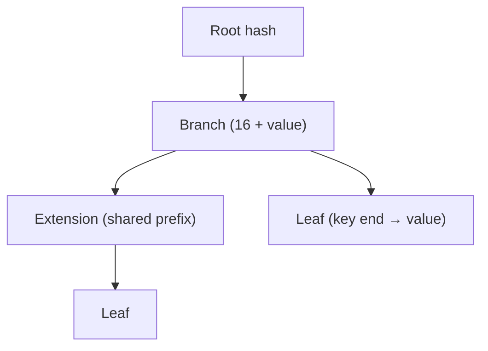

### State / Receipt / Transaction tries
- **State trie:** `keccak256(address) → RLP(account)`; root = `stateRoot`. Per-contract **storage
  trie** rooted at `account.storageRoot`.
- **Transactions trie:** `RLP(index) → RLP(tx)`; root = `transactionsRoot`.
- **Receipts trie:** `RLP(index) → RLP(receipt)`; root = `receiptsRoot`.

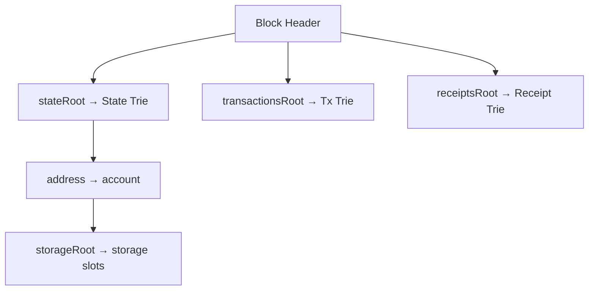

### Implement (rebuild a tx trie root)
```ts
import { Trie } from '@ethereumjs/trie';
import { RLP } from '@ethereumjs/rlp';

async function txRoot(rawTxs: Uint8Array[]): Promise<string> {
  const trie = new Trie();
  for (let i = 0; i < rawTxs.length; i++) {
    await trie.put(RLP.encode(i), rawTxs[i]);   // key=RLP(index), value=raw tx
  }
  return '0x' + Buffer.from(trie.root()).toString('hex');
}
```

### Exercises
1. Why MPT over a binary Merkle tree for Ethereum state?
2. Where does a contract's `storageRoot` live?
3. Build a small MPT and prove one key with `trie.createProof`.

### Interview questions
- **Q:** Name Ethereum's four tries and their roots.
  **A:** State (`stateRoot`), Transactions (`transactionsRoot`), Receipts (`receiptsRoot`), per-account
  Storage (`storageRoot`).
- **Q:** What are the MPT node types?
  **A:** Branch, extension, and leaf nodes.

---

## Section 12 — Block Explorer Engineering

### Intuition first
An explorer is a **read-optimized mirror** of the chain. The chain is great for consensus but bad for
queries ("all txs for address X"). An explorer **indexes** chain data into a database you can query
fast.

### How Etherscan-like explorers work
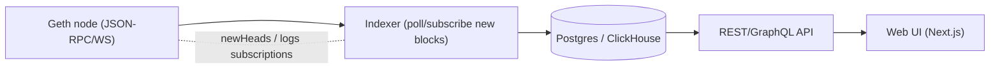

### Block / transaction / event / address indexing
- **Block indexing:** for each new block, store header fields + roots + tx hashes.
- **Transaction indexing:** store each tx (from/to/value/gas/status) keyed for lookup.
- **Event/log indexing:** decode logs via ABIs; index by `address` + `topics` for contract activity.
- **Address tracking:** maintain per-address tx lists, balances, token transfers (derive from logs).

### Build a simple explorer (indexer core, viem)
```ts
import { createPublicClient, http } from 'viem';
const client = createPublicClient({ transport: http('http://localhost:8545') });

let last = 0n;
async function indexLoop(db: any) {
  const tip = await client.getBlockNumber();
  for (let n = last + 1n; n <= tip; n++) {
    const block = await client.getBlock({ blockNumber: n, includeTransactions: true });
    await db.saveBlock({
      number: block.number, hash: block.hash, parentHash: block.parentHash,
      transactionsRoot: block.transactionsRoot, stateRoot: block.stateRoot,
      receiptsRoot: block.receiptsRoot, timestamp: block.timestamp, txCount: block.transactions.length,
    });
    for (const tx of block.transactions) {
      await db.saveTx({ hash: tx.hash, from: tx.from, to: tx.to, value: tx.value,
        blockNumber: n, nonce: tx.nonce });
    }
  }
  last = tip;
}
```
Subscribe to `newHeads`/`logs` over WebSocket for real-time; handle **reorgs** by re-indexing
orphaned heights.

### Exercises
1. Add receipt indexing (status, gasUsed, logs) to the loop.
2. Handle a reorg: detect when `parentHash` doesn't match your stored tip.
3. Add an endpoint `/address/:addr/txs`.

### Interview questions
- **Q:** Why can't you query "all txs for an address" directly from a node efficiently?
  **A:** Nodes index by block/tx hash, not by address; explorers build secondary indexes in a DB.
- **Q:** How do explorers stay real-time?
  **A:** WebSocket subscriptions (`newHeads`, `logs`) plus polling, with reorg handling.

---

## Section 13 — Transaction Verification

### Intuition first
Don't *trust* your indexer — **verify** against the chain's own commitments. Recompute roots and
check Merkle proofs so the explorer proves what it displays.

### How explorers verify
- **Transactions:** rebuild the **transactions trie** from the block's tx list; compare to
  `transactionsRoot`.
- **Receipts:** rebuild the **receipts trie**; compare to `receiptsRoot` (proves a log/event happened).
- **State roots:** use `eth_getProof` to verify an account/storage value against `stateRoot`.
- **Merkle proofs:** fold a proof up to the root and compare (binary trees) or verify MPT proofs.

### Implementations
```ts
// verify a block's tx set matches its header root
import { Trie } from '@ethereumjs/trie';
import { RLP } from '@ethereumjs/rlp';

async function verifyBlockTxRoot(block: any, rawTxs: Uint8Array[]) {
  const trie = new Trie();
  for (let i = 0; i < rawTxs.length; i++) await trie.put(RLP.encode(i), rawTxs[i]);
  const computed = '0x' + Buffer.from(trie.root()).toString('hex');
  return computed.toLowerCase() === block.transactionsRoot.toLowerCase();
}
```
```ts
// verify an account against stateRoot via eth_getProof (viem)
import { createPublicClient, http } from 'viem';
const client = createPublicClient({ transport: http('http://localhost:8545') });
const proof = await client.request({
  method: 'eth_getProof', params: ['0xAccount', [], 'latest'],
}); // verify proof.accountProof nodes hash up to the block's stateRoot
```

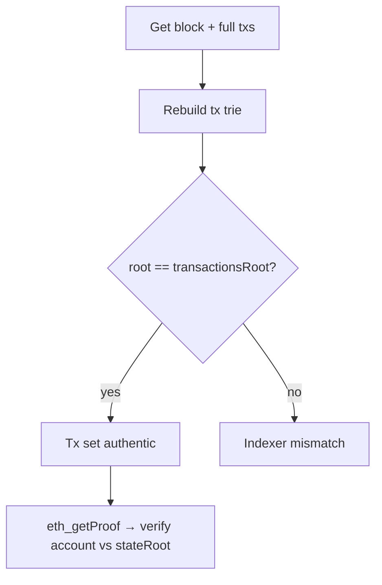

### Exercises
1. Verify `receiptsRoot` from a block's receipts.
2. Prove a contract storage slot with `eth_getProof` storage proofs.
3. Wire a "verified ✓" badge into the explorer UI.

### Interview questions
- **Q:** How does an explorer prove a tx belongs to a block?
  **A:** Rebuild the transactions trie from the tx list and check its root equals the header's
  `transactionsRoot` (secured by consensus).
- **Q:** What does `eth_getProof` return?
  **A:** An MPT proof for an account (against `stateRoot`) plus optional storage-slot proofs.

---

## Section 14 — Smart Contracts

### Intuition first
A smart contract is **code deployed to an address** that runs deterministically on every node. You
write Solidity → compile to **EVM bytecode** → deploy; users call it via its **ABI**.

### Solidity / EVM / Bytecode / ABI
- **Solidity:** the high-level language.
- **EVM:** stack machine executing bytecode; deterministic; metered by gas.
- **Bytecode:** the compiled ops stored at the contract address.
- **ABI:** JSON describing functions/events so clients encode calls (`functionSelector = first 4
  bytes of keccak256("transfer(address,uint256)")`).

### ERC20 (fungible token)
```solidity
// SPDX-License-Identifier: MIT
pragma solidity ^0.8.20;
import {ERC20} from "@openzeppelin/contracts/token/ERC20/ERC20.sol";
import {Ownable} from "@openzeppelin/contracts/access/Ownable.sol";

contract MyToken is ERC20, Ownable {
    constructor() ERC20("MyToken", "MTK") Ownable(msg.sender) {
        _mint(msg.sender, 1_000_000 ether);
    }
    function mint(address to, uint256 amt) external onlyOwner { _mint(to, amt); }
}
```

### ERC721 (NFT)
```solidity
pragma solidity ^0.8.20;
import {ERC721} from "@openzeppelin/contracts/token/ERC721/ERC721.sol";
import {Ownable} from "@openzeppelin/contracts/access/Ownable.sol";

contract MyNFT is ERC721, Ownable {
    uint256 public nextId;
    constructor() ERC721("MyNFT", "MNFT") Ownable(msg.sender) {}
    function mint(address to) external onlyOwner { _safeMint(to, nextId++); }
}
```

### Staking
```solidity
pragma solidity ^0.8.20;
import {IERC20} from "@openzeppelin/contracts/token/ERC20/IERC20.sol";

contract Staking {
    IERC20 public immutable token;
    mapping(address => uint256) public staked;
    mapping(address => uint256) public since;
    uint256 public rate = 1e16; // reward per token per second (demo)

    constructor(IERC20 t) { token = t; }

    function stake(uint256 amt) external {
        _claim();
        token.transferFrom(msg.sender, address(this), amt);
        staked[msg.sender] += amt; since[msg.sender] = block.timestamp;
    }
    function _claim() internal {
        uint256 s = staked[msg.sender];
        if (s > 0) {
            uint256 reward = s * (block.timestamp - since[msg.sender]) * rate / 1e18;
            if (reward > 0) token.transfer(msg.sender, reward);
        }
        since[msg.sender] = block.timestamp;
    }
    function unstake(uint256 amt) external {
        _claim(); staked[msg.sender] -= amt; token.transfer(msg.sender, amt);
    }
}
```

### Governance (minimal)
```solidity
pragma solidity ^0.8.20;
// Sketch: token-weighted voting. Production: use OpenZeppelin Governor + ERC20Votes.
contract MiniGovernor {
    IVotes public token; // ERC20Votes-like
    struct Proposal { uint256 yes; uint256 no; uint256 deadline; bool executed; }
    mapping(uint256 => Proposal) public proposals;
    mapping(uint256 => mapping(address => bool)) public voted;
    uint256 public count;

    constructor(IVotes t) { token = t; }
    function propose(uint256 ttl) external returns (uint256 id) {
        id = ++count; proposals[id].deadline = block.timestamp + ttl;
    }
    function vote(uint256 id, bool support) external {
        require(block.timestamp < proposals[id].deadline, "closed");
        require(!voted[id][msg.sender], "voted"); voted[id][msg.sender] = true;
        uint256 w = token.getVotes(msg.sender);
        if (support) proposals[id].yes += w; else proposals[id].no += w;
    }
}
interface IVotes { function getVotes(address) external view returns (uint256); }
```

### Exercises
1. Compute the function selector for `balanceOf(address)`.
2. Why are OpenZeppelin Governor + ERC20Votes preferred over the sketch above?
3. Deploy ERC20 to your local Clique net and read `totalSupply` via viem.

### Interview questions
- **Q:** What is the ABI and the function selector?
  **A:** The ABI describes a contract's interface; the selector is the first 4 bytes of
  `keccak256("name(types)")` used to route calls.
- **Q:** Why is the EVM deterministic?
  **A:** Every node must reach identical state from the same inputs; nondeterminism would break
  consensus.

---

## Section 15 — Rewards and Economics

### Intuition first
Rewards exist to **pay for security when security has a real cost**. Where security is "free" (trusted
signers), no reward is needed.

### Why Bitcoin miners get rewards
PoW costs **electricity**. The **block subsidy (new BTC) + fees** reimburse miners and *fund* network
security. Remove the reward → no one mines → no security. The subsidy halves every ~4 years.

### Why Ethereum validators get rewards
PoS validators **lock capital** and risk **slashing**. They earn **issuance + priority tips +
MEV** as a return on stake and a reward for honest, online attestation/proposal. The base fee is
**burned** (EIP-1559), making ETH potentially deflationary.

### Why Clique validators usually don't
Clique's **block reward is hard-zero**. Signers are **trusted parties** with **external incentives**
and **near-zero sealing cost**; a private chain wants **no valuable/inflating coin**, and gas is
**priced at 0**, so there are no fees to distribute either. Security = identity, not money. (Full
reasoning in Section 5.)

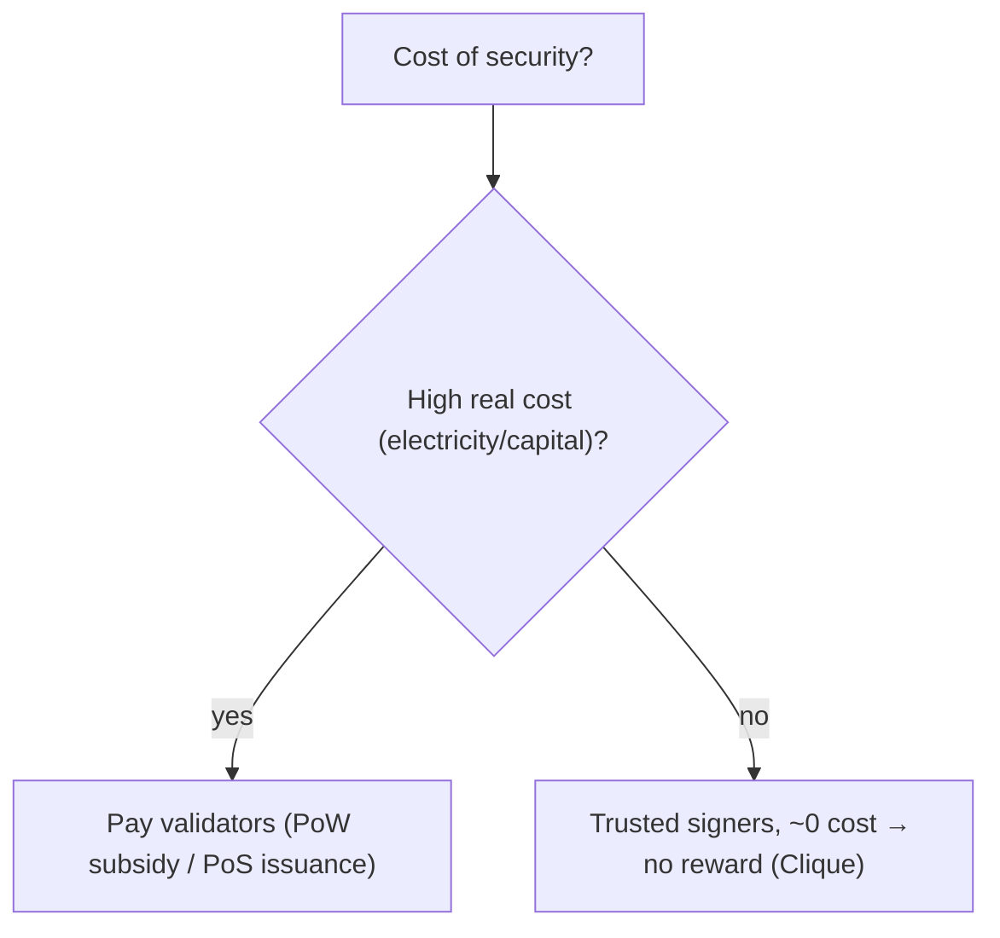

### How to create reward systems

**Block rewards (PoW/custom client):** mint a subsidy to the block author in `Finalize` (see
Section 5 custom Geth).

**Validator rewards (Clique, no fork):** a **reward smart contract** + off-chain keeper pays the
sealer per block (Section 5, `SignerRewards.sol`), or set a non-zero gas price so tips flow to
`etherbase`.

**Staking rewards (app-level):** the `Staking` contract in Section 14 accrues rewards over time —
the standard DeFi pattern, independent of consensus.

### Exercises
1. Compute Bitcoin's annual issuance after a halving (subsidy × blocks/year).
2. Why does burning the base fee matter for ETH economics?
3. Design incentives for Clique signers **without** minting a token.

### Interview questions
- **Q:** Why is there no block reward in Clique?
  **A:** It's hard-zero; trusted signers need no economic compensation and a private chain avoids an
  inflating coin.
- **Q:** Where do EIP-1559 tips go vs the base fee?
  **A:** Tips → validator; base fee → burned.

---

## Section 16 — Production Networks

| Network | Consensus | Notes |
|---|---|---|
| **Ethereum Mainnet** | PoS (Casper FFG + LMD-GHOST) | The L1; EL + CL clients; finality every 2 epochs |
| **Sepolia** | PoS testnet | Permissioned validator set; default app testnet |
| **Holesky** | PoS testnet | Large-scale staking/validator testing |
| **Polygon PoS** | PoS (Heimdall/Bor) | Ethereum-committing sidechain; cheap/fast |
| **BNB Chain** | PoSA (PoS + Authority) | 21+ validators; high throughput, more centralized |
| **Hyperledger Besu** | PoW/PoA (IBFT2/QBFT/Clique) | Enterprise Ethereum client (Apache 2.0) |
| **Quorum (GoQuorum)** | IBFT/QBFT/Raft | Privacy features; enterprise/consortium |

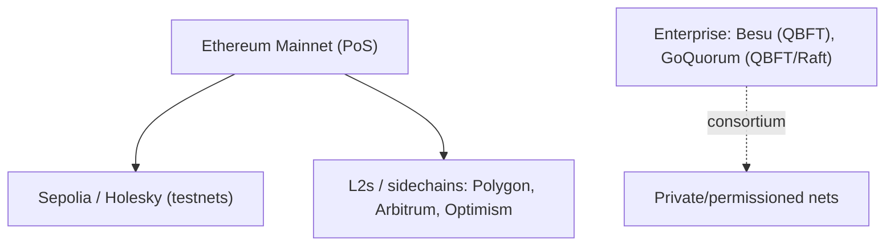

### Architecture comparison
- **Public L1 (mainnet/testnets):** open validator set, real economic security, EL+CL split.
- **Sidechains (Polygon/BNB):** own consensus + validators, bridge to Ethereum, cheaper/faster, less
  decentralized.
- **Enterprise (Besu/Quorum):** permissioned validators, instant finality (QBFT), privacy, no public
  token.

### Interview questions
- **Q:** Difference between an L2 rollup and a sidechain like Polygon PoS?
  **A:** Rollups post data/proofs to Ethereum and inherit its security; sidechains have independent
  consensus and only bridge.
- **Q:** Which clients suit enterprise consortia?
  **A:** Besu (QBFT/IBFT) and GoQuorum (QBFT/Raft).

---

## Section 17 — Enterprise Blockchain

### Intuition first
Enterprises want blockchain's **shared, tamper-evident truth** *without* a public token, anonymous
validators, or exposing data to the world. Hence **private / consortium / permissioned** networks.

### Private vs consortium vs permissioned
- **Private:** one organization runs all nodes (internal R&D, this demo).
- **Consortium:** multiple known organizations co-run validators (supply chains, banking).
- **Permissioned:** access (read/write/validate) is gated by identity/allowlist — a property both
  private and consortium nets have.

### Why companies choose Clique / IBFT / QBFT
- **Clique:** simplest, Geth-native; great for quick private nets / dev; probabilistic finality OK
  for low-stakes internal use.
- **IBFT 2.0:** immediate finality, BFT safety; mature enterprise option (Besu/Quorum).
- **QBFT:** modern default for new consortia; immediate finality + flexible validator management
  (header or contract), better interop.

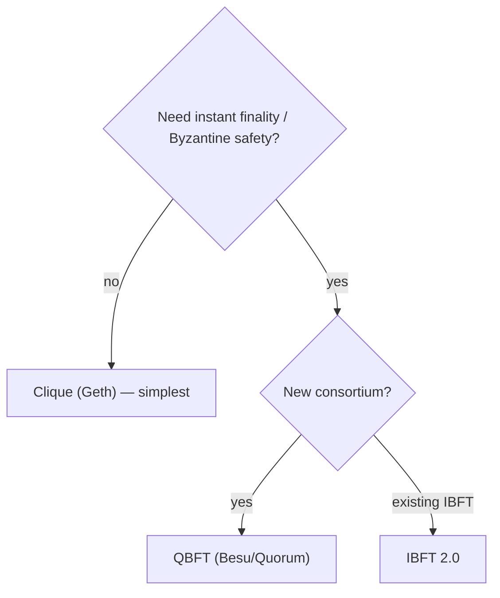

### Interview questions
- **Q:** Private vs consortium chain?
  **A:** Private = one org controls all nodes; consortium = multiple known orgs share validation.
- **Q:** Why pick QBFT for a new enterprise net?
  **A:** Immediate finality, BFT fault tolerance, and flexible (contract-based) validator management.

---

## Section 18 — Advanced Topics

### Rollups
Execute transactions **off-chain**, post compressed data + a commitment **on-chain (L1)**. Inherit
L1 security while scaling throughput. Two families:

### Optimistic Rollups
Assume txs valid; allow a **fraud-proof window** (e.g. 7 days) where anyone can challenge. Cheap,
EVM-equivalent (Arbitrum, Optimism). Withdrawals wait out the challenge period.

### zkRollups
Post a **validity proof (SNARK/STARK)** that the batch is correct — no challenge window, fast
finality, heavier proving (zkSync, StarkNet, Polygon zkEVM, Scroll).

```mermaid
graph LR
    L2["L2 sequencer executes txs"] --> C["commit batch to L1"]
    C --> OR["Optimistic: data + fraud-proof window"]
    C --> ZK["zk: data + validity proof (instant)"]
    OR --> L1["Ethereum L1 (security/DA)"]
    ZK --> L1
```

### Data Availability (DA)
For rollups to be safe, the batch **data must be available** so anyone can reconstruct/verify state.
On-chain DA (calldata/**blobs** via EIP-4844 "proto-danksharding") vs off-chain DA (validiums,
DA layers like Celestia/EigenDA) — a security/cost trade-off.

### Verkle Trees
Replace MPT hashes with **vector commitments** → much smaller witnesses → enables **stateless
clients** (validate blocks with a small witness instead of holding all state).

### Stateless Ethereum
Clients verify blocks using **witnesses** against the state root without storing the full state;
Verkle trees make witnesses small enough to be practical. Reduces node storage/sync burden.

### Interview questions
- **Q:** Optimistic vs zkRollup core difference?
  **A:** Optimistic uses fraud proofs + a challenge window; zk uses validity proofs with no window.
- **Q:** Why are Verkle trees key to stateless Ethereum?
  **A:** Their vector commitments yield tiny witnesses, making per-block stateless validation
  feasible.

---

## Section 19 — Source Code Deep Dive

> Faithful, annotated **simplifications** of go-ethereum (real names/logic, condensed for teaching).

### `consensus/clique` — sealing & signer recovery
```go
// Seal: the in-turn (or delayed out-of-turn) signer signs the header.
func (c *Clique) Seal(chain consensus.ChainHeaderReader, block *types.Block,
    results chan<- *types.Block, stop <-chan struct{}) error {
    header := block.Header()
    snap, _ := c.snapshot(chain, header.Number.Uint64()-1, header.ParentHash, nil)
    if _, ok := snap.Signers[c.signer]; !ok { return errUnauthorizedSigner } // must be a signer
    delay := time.Until(time.Unix(int64(header.Time), 0))
    if snap.inturn(header.Number.Uint64(), c.signer) == false {
        delay += wiggle(len(snap.Signers))   // out-of-turn random backoff
    }
    sighash, _ := c.signFn(header)            // sign the header hash
    copy(header.Extra[len(header.Extra)-65:], sighash) // place seal in extraData
    // after delay → push sealed block to results
    return nil
}

// ecrecover: derive the signer address from the extraData signature.
func ecrecover(header *types.Header, sigcache *sigLRU) (common.Address, error) {
    sig := header.Extra[len(header.Extra)-65:]            // last 65 bytes
    pubkey, _ := crypto.Ecrecover(SealHash(header).Bytes(), sig)
    var signer common.Address
    copy(signer[:], crypto.Keccak256(pubkey[1:])[12:])   // keccak(pub)[12:]
    return signer, nil
}
```
**Takeaways:** authorization is checked against the **snapshot** (current signer set); in-turn vs
out-of-turn governs delay & difficulty; the signer isn't stored as a field — it's **recovered** from
the `extraData` signature.

### `consensus/ethash` — PoW verification (legacy)
```go
// verifySeal: check the header's PoW satisfies the difficulty target.
func (ethash *Ethash) verifySeal(header *types.Header) error {
    // recompute the Ethash mix from (headerHash, nonce) using the DAG
    digest, result := hashimotoLight(size, cache, header.HashNoNonce().Bytes(), header.Nonce.Uint64())
    if !bytes.Equal(header.MixDigest[:], digest) { return errInvalidMixDigest }
    target := new(big.Int).Div(two256, header.Difficulty)        // target from difficulty
    if new(big.Int).SetBytes(result).Cmp(target) > 0 { return errInvalidPoW } // hash < target?
    return nil
}
```
**Takeaways:** PoW validity = `hash(header,nonce) < 2²⁵⁶ / difficulty`; Ethash is memory-hard (DAG)
for ASIC resistance.

### `core/blockchain` — inserting blocks
```go
// insertChain: validate & commit a batch of blocks, updating the canonical chain.
func (bc *BlockChain) insertChain(chain types.Blocks) (int, error) {
    for i, block := range chain {
        if err := bc.engine.VerifyHeader(bc, block.Header()); err != nil { return i, err }
        statedb, _ := state.New(parent.Root, bc.stateCache)       // load parent state
        receipts, logs, usedGas, err := bc.processor.Process(block, statedb, bc.vmConfig) // run EVM
        if err != nil { return i, err }
        if err := bc.validator.ValidateState(block, statedb, receipts, usedGas); err != nil {
            return i, err                                          // stateRoot/receiptsRoot must match
        }
        bc.writeBlockWithState(block, receipts, logs, statedb)     // persist + maybe reorg canonical
    }
    return len(chain), nil
}
```
**Takeaways:** every block is re-executed; the computed `stateRoot`/`receiptsRoot` must equal the
header's — this is how nodes independently verify, not trust.

### `trie` — insert (Patricia path update)
```go
// insert: descend by key nibbles, creating/splitting short & full nodes; only the
// touched path becomes dirty and is re-hashed at commit.
func (t *Trie) insert(n node, prefix, key []byte, value node) (bool, node, error) {
    switch nn := n.(type) {
    case *shortNode:  // extension/leaf with a shared key segment
        match := prefixLen(key, nn.Key)
        // split if the key diverges; else recurse into the child
    case *fullNode:   // branch with 16 children + value slot
        // recurse into child at key[0]; replace that slot
    case nil:
        return true, &shortNode{key, value, t.newFlag()}, nil // fresh leaf
    }
    // ...
}
```
**Takeaways:** branch (16+value) and short (extension/leaf) nodes implement the radix-16 Patricia
structure; **incremental updates** re-hash only the changed path — the reason Ethereum uses an MPT.

### Interview questions
- **Q:** In Clique, how is the block's signer determined?
  **A:** It's `ecrecover`ed from the signature stored in the last 65 bytes of `extraData`.
- **Q:** How does a node verify a block's state without trusting the producer?
  **A:** It re-executes the txs and checks the computed `stateRoot`/`receiptsRoot` match the header.

---

## Section 20 — My Current Architecture

The end-to-end target for **VoltusWave AMI** ("Private Ethereum · connected"): a Geth + Clique chain
feeding a block explorer that verifies transactions with Merkle proofs.

```mermaid
flowchart TD
    A["Private Geth Network (Clique PoA)"] --> B["Clique Validators (approved signers)"]
    B --> C["Blocks Produced (period ~5s, gas price 0)"]
    C --> D["Merkle Root Generated (transactionsRoot/stateRoot; ProvenanceRegistry mint roots)"]
    D --> E["Explorer Indexer reads blocks (viem JSON-RPC/WS)"]
    E --> F["Explorer Verifies Transactions (rebuild trie vs root / eth_getProof)"]
    F --> G["Explorer UI displays data (Next.js — this app)"]
```

### Every component explained
1. **Private Geth Network (Clique PoA)** — the chain itself: same Geth binary, custom genesis,
   `chainId` (e.g. 1337), permissioned. Why Clique: known parties, no token, fast/free blocks.
   (`chains.md` has the full setup.)
2. **Clique Validators** — the approved signer organizations (SKF + partners). They seal in a
   round-robin; the set is governed on-chain via `clique.propose`. They earn **no reward** (Section 5).
3. **Blocks Produced** — one block per `period`; each header carries `transactionsRoot`, `stateRoot`,
   `receiptsRoot`. Gas price 0 (spam stopped by permissioning).
4. **Merkle Root Generated** — Ethereum's tries produce header roots automatically; additionally, at
   **Batch Minting**, `ProvenanceRegistry.sol` stores a **Merkle root over a batch of part records**
   (see `merkle-tree-zero-to-hero.md` §21).
5. **Explorer Indexer** — a Node/TS service polling/subscribing to new blocks via **viem**, writing
   to Postgres/ClickHouse, handling reorgs (Section 12).
6. **Explorer Verifies Transactions** — recomputes `transactionsRoot` from the tx list and/or uses
   `eth_getProof` against `stateRoot`; the provenance scan's `merkle_proof_valid` check becomes a
   **real** Merkle verification (Section 13, and `lib/store/provenance.ts`).
7. **Explorer UI** — this **Next.js app**: block pages show roots, tx pages show an "inclusion
   verified ✓" badge, and the SKF screens drive the counterfeit→DAO flow on real on-chain data.

### Mapping to this repo
- UI/screens: `components/screens/`, `components/skf/`, `app/(app)/...` (see `project.md`).
- Provenance verification to make real: `lib/store/provenance.ts` (`scanServiceRequest`,
  `merkle_proof_valid`).
- Chain connection to add: a `lib/chain/viem-client.ts` + `lib/merkle.ts` (per the merkle plan).

### Exercises
1. List which repo files change to connect the UI to a real Geth node.
2. Where would the indexer store data, and what's the schema for blocks/txs?
3. How does `merkle_proof_valid` go from mock to real in this architecture?

---

## Section 21 — Troubleshooting

### Validator not producing blocks
- Account **not unlocked** / wrong `--miner.etherbase`; not started with `--mine`.
- Signer **not in the snapshot** (never voted in). Check `clique.getSigners()`.
- System **clock skew** — Clique enforces `period`; future-timestamped blocks are rejected.
- **No peers** → out-of-turn signer waits; check `admin.peers`.

### Wrong signer
- `extradata` in genesis lists the wrong/misformatted address (needs no `0x`, correct 20 bytes).
- Recovered signer ≠ expected → check key/password and `SealHash` version (fork mismatch).
- Verify with `clique.getSigner(blockNumber)` / `clique.getSnapshot()`.

### Chain split (fork)
- **Inconsistent genesis** or different **chainId** → nodes build separate chains.
- Mixed client **versions / hard-fork config** → divergent state. Align binaries + `config` forks.
- A custom-reward Geth fork on **some** nodes only → state-root mismatch → split (Section 5 caveat).

### Genesis mismatch
- Different genesis files → different genesis hash → peers refuse to connect.
- Fix: distribute the **exact same** `genesis.json`; re-`init` after wiping `--datadir` chaindata.

### Peer connection issues
- Bootnode/enode wrong or unreachable; firewall on `30303` (TCP+UDP).
- `--nodiscover` set but no manual `admin.addPeer`. NAT issues → set `--nat extip:<ip>`.
- `networkid` mismatch (separate from chainId) prevents peering.

### Explorer sync issues
- Indexer behind tip → check RPC endpoint, increase batch size, backfill gaps.
- **Reorgs** not handled → stale/duplicate rows; detect via `parentHash` mismatch and re-index.
- WebSocket drops → add reconnect + resume from last indexed height.
- Root verification fails → tx **RLP re-encoding** wrong for typed txs (use `@ethereumjs/tx`).

```mermaid
flowchart TD
    A["No new blocks?"] --> B{"clique.getSigners shows you?"}
    B -- no --> F1["Vote signer in (propose)"]
    B -- yes --> C{"Account unlocked + --mine?"}
    C -- no --> F2["Unlock + start sealing"]
    C -- yes --> D{"Peers connected + clock synced?"}
    D -- no --> F3["Fix peers/NAT/NTP"]
    D -- yes --> F4["Check logs: extradata/genesis/fork config"]
```

### Interview questions
- **Q:** Two nodes won't peer — what do you check first?
  **A:** Identical genesis (hash), same `networkid`/`chainId`, reachable enode/bootnode, open p2p
  port.
- **Q:** Clique signer authorized but no blocks — likely cause?
  **A:** Account not unlocked / not started with `--mine`, clock skew, or no peers for out-of-turn
  sealing.

---

## Section 22 — Interview Preparation (400 Q&A)

> 100 Blockchain · 100 Ethereum · 100 Geth · 100 Consensus. Answers are concise on purpose — use
> them as flashcards; expand from the relevant section when you need depth.

### Part A — 100 Blockchain Questions

1. **What is a blockchain?** An append-only, tamper-evident, distributed ledger of hash-linked blocks.
2. **What problem did Bitcoin solve?** Double-spending without a trusted central party.
3. **What is double-spending?** Spending the same digital coin twice.
4. **What is a block?** A header + a set of transactions, linked to the previous block by hash.
5. **What links blocks?** Each header stores the previous block's hash (`parentHash`).
6. **What is a genesis block?** The first block (block 0) defined by the genesis file.
7. **What is a hash?** A one-way fixed-size fingerprint of data.
8. **Key hash properties?** Deterministic, collision-resistant, avalanche, irreversible.
9. **What is immutability here?** Past data can't be changed without changing all later hashes.
10. **What is decentralization?** No single controlling party; many nodes hold the ledger.
11. **What is a node?** A computer running the protocol and storing/validating the chain.
12. **Full vs light node?** Full validates everything; light uses headers + proofs.
13. **What is consensus?** The rule by which nodes agree on the next valid block.
14. **What is a 51% attack?** Controlling majority hashpower/stake to rewrite recent history.
15. **What is a fork?** A divergence into two chains (temporary or by rule change).
16. **Soft vs hard fork?** Soft = backward-compatible rule tightening; hard = non-compatible change.
17. **What is finality?** The point a block can't be reverted (probabilistic or absolute).
18. **What is a Merkle tree?** A hash tree committing many items to one root.
19. **What is the Merkle root?** The single hash summarizing all transactions in a block.
20. **Why Merkle roots in headers?** Compact, tamper-evident commitment enabling light-client proofs.
21. **What is a Merkle proof?** Sibling hashes proving a leaf is under the root.
22. **What is a digital signature?** Cryptographic proof of authorship + integrity.
23. **What is a public/private keypair?** Secret signing key + shareable verification key.
24. **What is an address?** A short identifier derived from a public key.
25. **What is a transaction?** A signed state-changing instruction.
26. **What is the mempool?** The pool of pending unconfirmed transactions.
27. **What is a UTXO?** An unspent transaction output (Bitcoin's coin model).
28. **Account vs UTXO model?** Mutable balances per address vs discrete spendable outputs.
29. **What is a nonce (account)?** Per-account tx counter preventing replay/ordering issues.
30. **What is a nonce (PoW)?** The value miners vary to find a valid block hash.
31. **What is mining?** Searching for a nonce making the block hash meet the difficulty target.
32. **What is difficulty?** A parameter tuning how hard it is to find a valid block.
33. **What is a block reward?** New coins (+fees) paid to the block producer.
34. **What is proof of work?** Security via expended computation.
35. **What is proof of stake?** Security via staked capital + slashing.
36. **What is proof of authority?** Security via known, approved validators.
37. **What is BFT?** Tolerance of arbitrary/malicious node behavior.
38. **How many faults can BFT tolerate?** Up to `f` of `3f+1` validators.
39. **What is a smart contract?** Code deployed on-chain that runs deterministically.
40. **What is a token?** A digital asset tracked by a contract (ERC20/721/1155).
41. **Fungible vs non-fungible?** Interchangeable units vs unique items.
42. **What is gas?** A unit measuring computational work charged per transaction.
43. **What is a wallet?** Software managing keys and signing transactions.
44. **Custodial vs non-custodial?** Third party holds keys vs you hold keys.
45. **What is a seed phrase?** Human-readable backup deriving your private keys (BIP-39).
46. **What is cold vs hot storage?** Offline vs online key storage.
47. **What is a confirmation?** A block built on top of the one containing your tx.
48. **Why wait for confirmations?** To reduce reorg risk before treating a tx as final.
49. **What is a reorg?** Replacing the chain tip with a heavier competing branch.
50. **What is censorship resistance?** No party can block valid transactions unilaterally.
51. **What is a public chain?** Open to anyone to read/validate/transact.
52. **What is a private chain?** Controlled by one organization.
53. **What is a consortium chain?** Shared by multiple known organizations.
54. **What is permissioning?** Gating who may read/write/validate.
55. **What is a sidechain?** An independent chain bridged to a main chain.
56. **What is a bridge?** A protocol moving assets/data between chains.
57. **What is a layer 2?** A scaling system settling to an L1.
58. **What is a rollup?** L2 batching txs and committing data/proofs to L1.
59. **Optimistic vs zk rollup?** Fraud proofs + window vs validity proofs, no window.
60. **What is data availability?** Guarantee that block data can be retrieved/verified.
61. **What is an oracle?** A service bringing off-chain data on-chain.
62. **What is the oracle problem?** Trusting external data feeds in a trustless system.
63. **What is MEV?** Value extractable by ordering/including/excluding txs.
64. **What is a validator?** A node authorized to produce/attest blocks.
65. **What is staking?** Locking funds to participate in PoS.
66. **What is slashing?** Penalizing validators for provable misbehavior.
67. **What is a DAO?** An organization governed by on-chain voting.
68. **What is governance?** The process for changing protocol/parameters.
69. **What is a hash pointer?** A reference to data plus its hash.
70. **What is tamper evidence?** Any change is detectable via hashes.
71. **What is a coinbase tx?** The block's first tx that pays the producer.
72. **What is block time?** Average interval between blocks.
73. **What is throughput (TPS)?** Transactions processed per second.
74. **What is scalability?** Capacity to grow throughput without losing security/decentralization.
75. **What is the blockchain trilemma?** Trade-off among security, decentralization, scalability.
76. **What is a light client?** A client verifying via headers + proofs (e.g. SPV).
77. **What is SPV?** Simplified Payment Verification using Merkle proofs + headers.
78. **What is a bootnode?** A well-known node helping peers discover the network.
79. **What is peer discovery?** Finding other nodes to connect to.
80. **What is gossip/propagation?** Spreading blocks/txs across the network.
81. **What is a chain ID?** A unique network identifier for replay protection.
82. **What is replay protection?** Preventing a tx valid on one chain from replaying on another.
83. **What is a state machine (blockchain)?** A system transitioning state via transactions.
84. **What is world state?** The current value of all accounts/storage.
85. **What is a snapshot?** A captured state at a point (for sync/validator sets).
86. **What is pruning?** Discarding old state/history to save space.
87. **What is archive node?** A node retaining all historical state.
88. **What is determinism (consensus)?** Same inputs → same state on every node.
89. **What is a fee market?** Mechanism allocating scarce block space by price.
90. **What is base fee?** EIP-1559's burned, protocol-set portion of the fee.
91. **What is a priority fee/tip?** Extra paid to the validator for inclusion.
92. **What is hashrate?** Total mining computation per second on a PoW network.
93. **What is a halving?** Periodic halving of Bitcoin's block subsidy.
94. **What is decentralized identity (DID)?** A self-owned, cryptographic identifier.
95. **What is a verifiable credential (VC)?** A signed, tamper-evident claim.
96. **What is IPFS?** A content-addressed P2P storage network using Merkle DAGs.
97. **What is content addressing?** Referencing data by its hash (CID).
98. **What is a Merkle DAG?** A hash-linked directed acyclic graph (Git/IPFS).
99. **What is Certificate Transparency?** Public append-only Merkle logs of TLS certs.
100. **Why are blockchains "trustless"?** Trust shifts from institutions to verifiable math + incentives.

### Part B — 100 Ethereum Questions

1. **What is Ethereum?** A programmable blockchain / world computer with smart contracts.
2. **What is the EVM?** The stack-based virtual machine executing contract bytecode.
3. **EOA vs contract account?** Key-controlled vs code-controlled account.
4. **What fields define an account?** nonce, balance, storageRoot, codeHash.
5. **What is gas?** Metered cost of EVM operations.
6. **What is gas limit?** Max gas a tx/block may consume.
7. **What is gas price?** Price per gas unit paid by the sender.
8. **What is EIP-1559?** Fee reform: base fee (burned) + priority tip.
9. **Where does the base fee go?** It's burned.
10. **Where does the tip go?** To the validator.
11. **What is a transaction's `data` field?** Calldata: function selector + encoded args.
12. **What is a function selector?** First 4 bytes of `keccak256("fn(types)")`.
13. **What is the ABI?** JSON spec of a contract's functions/events for encoding.
14. **What is bytecode?** Compiled EVM instructions stored at a contract address.
15. **Storage vs memory vs stack?** Persistent KV, transient per-call bytes, 256-bit operand stack.
16. **What is `SSTORE` cost about?** Writing persistent storage; expensive.
17. **What is a log/event?** Cheap indexed data emitted for off-chain consumption.
18. **What is a receipt?** Per-tx result: status, gas used, logs, bloom.
19. **What is `logsBloom`?** A bloom filter over logs for quick membership checks.
20. **What is the state trie?** MPT mapping addresses to accounts; root = `stateRoot`.
21. **What is a storage trie?** Per-contract MPT of storage slots; root in the account.
22. **What is the transactions trie?** Per-block MPT of txs; root = `transactionsRoot`.
23. **What is the receipts trie?** Per-block MPT of receipts; root = `receiptsRoot`.
24. **Why MPT not binary Merkle?** Keyed access + cheap updates + proofs.
25. **MPT node types?** Branch, extension, leaf.
26. **What is RLP?** Recursive Length Prefix — Ethereum's serialization format.
27. **What is keccak-256?** Ethereum's hash function (SHA-3 variant).
28. **How is an address derived?** `keccak256(pubkey)` last 20 bytes.
29. **What is EIP-55?** Mixed-case address checksum.
30. **What is `ecrecover`?** Recovering a signer address from a message + signature.
31. **What is a contract creation tx?** A tx with `to = null` deploying bytecode.
32. **What is `CREATE2`?** Deterministic contract address from salt + initcode.
33. **What is a fallback/receive function?** Default handlers for plain calls/ether.
34. **What is `delegatecall`?** Calling code in another contract using the caller's storage.
35. **What is a proxy pattern?** Upgradeable contracts via `delegatecall` to logic contracts.
36. **What is reentrancy?** A callee re-entering the caller before state updates; a vuln.
37. **How prevent reentrancy?** Checks-Effects-Interactions + reentrancy guards.
38. **What is `msg.sender`?** The immediate caller of the current function.
39. **What is `tx.origin`?** The original EOA that started the tx (avoid for auth).
40. **What is `view`/`pure`?** No state writes / no state access functions.
41. **What is `payable`?** A function that can receive Ether.
42. **What is wei/gwei/ether?** 1 ETH = 1e9 gwei = 1e18 wei.
43. **What is an ERC20?** Fungible-token standard (transfer/approve/allowance).
44. **What is `approve`/`transferFrom`?** Delegated-spend pattern for ERC20.
45. **What is ERC721?** Non-fungible token standard.
46. **What is ERC1155?** Multi-token (fungible + NFT) standard.
47. **What is OpenZeppelin?** Audited reusable contract library.
48. **What is `AccessControl`?** Role-based permissions library.
49. **What is `Ownable`?** Single-owner access control.
50. **What is a Merkle airdrop?** Distribute tokens by storing a root + verifying claim proofs.
51. **What is the gas refund?** (Reduced) refunds for clearing storage.
52. **What is an out-of-gas error?** Execution halts and reverts; gas is still spent.
53. **What is `revert`?** Abort + undo state, optionally with a reason.
54. **What is a custom error?** Cheaper revert reason via `error` types.
55. **What is the difference between `call` and `send`/`transfer`?** Flexible low-level call vs
    fixed-gas transfers (prefer `call` with checks now).
56. **What is the Merge?** Ethereum's switch from PoW to PoS (Sept 2022).
57. **EL vs CL?** Execution layer (EVM/Geth) vs consensus layer (beacon clients).
58. **What is the Engine API?** The interface between EL and CL clients.
59. **What is a slot/epoch?** 12s slot; 32 slots = an epoch.
60. **What is a validator (Ethereum PoS)?** A 32-ETH staking entity proposing/attesting.
61. **What is attestation?** A validator's vote on the head/checkpoint.
62. **What is Casper FFG?** The finality gadget finalizing epoch checkpoints.
63. **What is LMD-GHOST?** The fork-choice rule selecting the head.
64. **What is slashing in Ethereum?** Burning stake for double-voting/surround votes.
65. **What is the beacon chain?** The PoS coordination chain.
66. **What is withdrawal (staking)?** Exiting/claiming staked ETH + rewards.
67. **What is MEV-Boost?** Outsourcing block building to a market of builders.
68. **What is a blob (EIP-4844)?** Cheap, ephemeral data for rollups (proto-danksharding).
69. **What is danksharding?** Scaling DA via many blobs + data availability sampling.
70. **What is account abstraction (ERC-4337)?** Smart-contract wallets with custom validation.
71. **What is a user operation?** ERC-4337's tx-like object handled by bundlers.
72. **What is a paymaster?** A contract sponsoring gas for users.
73. **What is `eth_call`?** A read-only contract call (no state change, no gas paid).
74. **What is `eth_getProof`?** Returns an MPT proof for an account/storage.
75. **What is `eth_getLogs`?** Query logs by address/topics/range.
76. **What is a topic in logs?** Indexed event parameters for filtering.
77. **What is an indexed event param?** A field stored as a topic (filterable).
78. **What is `chainId` in a tx (EIP-155)?** Replay protection across chains.
79. **What is an access list (EIP-2930)?** Pre-declared storage keys for gas savings.
80. **What is the difference between legacy and type-2 txs?** Gas-price vs EIP-1559 fee fields.
81. **What is the stateRoot's role?** Commitment to all account state for verification.
82. **What is a stateless client?** Validates with witnesses instead of full state.
83. **What are Verkle trees?** Vector-commitment trees enabling small witnesses.
84. **What is `selfdestruct`?** (Deprecated) removing a contract and sending its balance.
85. **What is a flash loan?** Uncollateralized loan repaid within one tx.
86. **What is a sandwich attack?** MEV bots front/back-run a victim trade.
87. **What is a nonce gap?** Missing sequential nonce blocking later txs.
88. **What is `gasUsed` vs `gasLimit`?** Actual vs maximum gas for a tx/block.
89. **What is intrinsic gas?** Base cost before execution (21000 + calldata).
90. **What is calldata cost?** Gas charged per byte of input data.
91. **What is a precompile?** A built-in contract at a fixed address (e.g. ecrecover, sha256).
92. **What is the difference between `keccak256` and `sha256` in Solidity?** Different hash
    functions; keccak256 is native/cheaper.
93. **What is the upgrade/hard-fork process?** EIPs → client implementation → coordinated activation.
94. **What is an EIP?** Ethereum Improvement Proposal.
95. **What is an ERC?** Application-level standard (a category of EIPs).
96. **What is a testnet (Sepolia/Holesky)?** A PoS test network for development.
97. **What is a faucet?** A service dispensing testnet ETH.
98. **What is Hardhat/Foundry?** Smart-contract dev/test frameworks.
99. **What is a fork test?** Testing against a copy of mainnet state.
100. **Why is the EVM deterministic?** Consensus requires identical results across all nodes.

### Part C — 100 Geth Questions

1. **What is Geth?** The Go implementation of an Ethereum execution client.
2. **Is Geth full or light?** Primarily a full/archive execution client (light mode deprecated).
3. **What does `geth init` do?** Writes the genesis block/state into the datadir.
4. **What is `--datadir`?** The directory storing chaindata, keystore, and node state.
5. **What is the keystore?** Encrypted JSON files holding account private keys.
6. **How create an account?** `geth account new --datadir DIR`.
7. **What is `--networkid`?** The P2P network identifier (must match peers).
8. **networkid vs chainId?** networkid gates peering; chainId is in-tx replay protection.
9. **What is `--http`?** Enables the HTTP JSON-RPC server.
10. **What is `--http.api`?** The list of RPC namespaces to expose (eth,net,web3,clique…).
11. **What is `--ws`?** Enables WebSocket RPC (for subscriptions).
12. **What is `--ipcpath`?** The local IPC socket for `geth attach`.
13. **How attach a console?** `geth attach <ipc|http>`.
14. **What is `--mine`?** Starts sealing (Clique) / mining (legacy PoW).
15. **What is `--miner.etherbase`?** The address credited fees / used as sealer.
16. **What is `--unlock`?** Unlocks an account for sealing/signing.
17. **What is `--allow-insecure-unlock`?** Permits unlock over HTTP (dev only).
18. **What is `--nodiscover`?** Disables auto peer discovery (manual peers only).
19. **What is `--bootnodes`?** Enode URLs used to discover peers.
20. **What is an enode?** A node's P2P URL (pubkey@ip:port).
21. **What is an ENR?** Ethereum Node Record — signed node metadata for discovery.
22. **What is `admin.addPeer`?** Manually connect to a peer by enode.
23. **What is `admin.nodeInfo`?** Returns this node's enode/identity info.
24. **What is `admin.peers`?** Lists connected peers.
25. **What is snap sync?** Fast sync downloading state snapshots + healing.
26. **What is full sync?** Replaying all blocks from genesis.
27. **What is archive mode (`--gcmode archive`)?** Retain all historical state.
28. **What KV store does Geth use?** Pebble (default) / LevelDB.
29. **Where is the EVM in Geth?** `core/vm`.
30. **Where is Clique?** `consensus/clique`.
31. **Where is the trie?** The `trie` package.
32. **What is `core.BlockChain`?** Manages import/validation/canonical chain.
33. **What is the txpool?** Geth's mempool of pending/queued txs.
34. **What is `--txpool.pricelimit`?** Minimum gas price to accept a tx.
35. **What is `--miner.gasprice`?** Minimum gas price the sealer accepts (0 for free chains).
36. **What is `--gpo`?** Gas price oracle settings.
37. **What RPC returns a block?** `eth_getBlockByNumber` / `…ByHash`.
38. **What RPC returns a tx?** `eth_getTransactionByHash`.
39. **What RPC returns a receipt?** `eth_getTransactionReceipt`.
40. **What RPC returns logs?** `eth_getLogs`.
41. **What RPC sends a raw tx?** `eth_sendRawTransaction`.
42. **What RPC reads state proof?** `eth_getProof`.
43. **What is `clique.getSigners`?** Lists current authorized signers.
44. **What is `clique.propose`?** Votes to add/remove a signer.
45. **What is `clique.getSnapshot`?** Returns the signer/vote state at a block.
46. **What is `clique.getSigner`?** Recovers the signer of a given block.
47. **How rotate a Clique signer?** `clique.propose(addr, true/false)` with >50% votes.
48. **What is `--syncmode`?** snap/full sync selection.
49. **What is `--http.corsdomain`?** Allowed CORS origins for RPC.
50. **What is `--http.vhosts`?** Allowed Host headers for RPC.
51. **What is `--authrpc.jwtsecret`?** JWT for the Engine API (EL↔CL).
52. **Why does Geth need a CL post-Merge?** It no longer drives consensus alone.
53. **What is `--dev` mode?** A single-node throwaway Clique dev chain.
54. **What is `--dev.period`?** Block interval in dev mode (0 = on demand).
55. **What is `personal_` namespace?** Account/sign methods (deprecated/insecure).
56. **What is `debug_traceTransaction`?** Step-level execution trace of a tx.
57. **What is `--metrics`?** Enables Prometheus metrics.
58. **What is `--verbosity`?** Log level (0–5).
59. **What is `--maxpeers`?** Max P2P connections.
60. **What port is P2P?** 30303 (TCP+UDP) by default.
61. **What port is HTTP RPC?** 8545 by default.
62. **What port is WS RPC?** 8546 by default.
63. **What is `--nat`?** NAT traversal config (e.g. `extip:1.2.3.4`).
64. **What is a chain config mismatch?** Different fork blocks → split/refuse.
65. **What is `terminalTotalDifficulty`?** TTD triggering the PoW→PoS transition.
66. **How wipe chaindata?** `geth removedb` or delete the datadir's chaindata.
67. **What is `extraData` in Clique genesis?** vanity(32B) + signers + seal(65B).
68. **Why must genesis be identical?** Same genesis hash defines the network.
69. **What is `geth dumpgenesis`?** Prints the chain's genesis config.
70. **What is `geth export/import`?** Export/import blocks to/from a file.
71. **What is `DeriveSha`?** Computes tx/receipt trie roots in `core/types`.
72. **What is `StateDB`?** The in-memory working state during block processing.
73. **What is `IntermediateRoot`?** Computes the current state root mid-processing.
74. **What is `VerifyHeader`?** Engine check that a header obeys consensus rules.
75. **What is `Finalize`/`FinalizeAndAssemble`?** Apply rewards/finalize state in the engine.
76. **Where would you add Clique rewards?** A custom `Finalize` in `consensus/clique`.
77. **What is `SealHash`?** The header hash signed by a Clique signer (excludes the seal).
78. **What is the snapshot in Clique?** Cached signer set + recent signers + votes.
79. **What is the in-turn difficulty value?** 2 (DIFF_INTURN); out-of-turn = 1.
80. **What is wiggle time?** Random out-of-turn sealing delay to avoid clashes.
81. **What is `--rpc.allow-unprotected-txs`?** Allow non-EIP-155 (no chainId) txs.
82. **What is `--gcmode`?** full vs archive state retention.
83. **What is state pruning in Geth?** Discarding old trie nodes to save disk.
84. **What is `--cache`?** Memory allocated to DB/trie caches.
85. **What is `les` (light server)?** Light Ethereum Subprotocol (largely deprecated).
86. **What is block propagation in Geth?** Announce to subset, send full to a few peers.
87. **What is `eth/68`?** A version of the eth wire protocol.
88. **What is RLPx?** Geth's encrypted P2P transport.
89. **What is discv4/discv5?** Node discovery protocols.
90. **How to run a second signer?** Same genesis+init, peer up, then `clique.propose`.
91. **Why won't two nodes peer?** Genesis/chainId/networkid mismatch or network/port issues.
92. **How check sync status?** `eth.syncing` / `eth_syncing`.
93. **How get block number?** `eth.blockNumber`.
94. **How read balance?** `eth.getBalance(addr)`.
95. **What is `--ethstats`?** Reports node stats to an ethstats dashboard.
96. **What is the keystore password file?** `--password file` for non-interactive unlock.
97. **What is `clef`?** Geth's external signer for safer key management.
98. **What is `--rpc.batch-request-limit`?** Caps JSON-RPC batch sizes.
99. **What's a common cause of "unauthorized signer"?** Account not in the signer snapshot.
100. **What's a common cause of no blocks in Clique?** Not unlocked / not `--mine` / clock skew / no peers.

### Part D — 100 Consensus Questions

1. **What is consensus?** Agreement on the canonical chain across nodes.
2. **Why is consensus hard?** Faults, asynchrony, and adversaries (Byzantine).
3. **What is the FLP impossibility?** No guaranteed async consensus with one faulty node.
4. **What is the CAP theorem?** Under partition, choose consistency or availability.
5. **What is Byzantine fault tolerance?** Tolerating arbitrary/malicious nodes.
6. **What's the BFT fault bound?** `< 1/3` faulty (`3f+1` total).
7. **What is liveness?** The system keeps making progress.
8. **What is safety?** Nothing bad happens (no two conflicting finalized blocks).
9. **What is PoW?** Security via computational work.
10. **What is a PoW target?** `2²⁵⁶ / difficulty`; valid if `hash < target`.
11. **What is the nonce's role in PoW?** The variable searched to meet the target.
12. **What is difficulty adjustment?** Retuning target to hold block time steady.
13. **What is the longest-chain rule?** Follow the chain with most cumulative work.
14. **Why most-work, not most-blocks?** Work resists cheap fake-history attacks.
15. **What is a 51% attack?** Majority hashpower rewriting recent blocks/double-spending.
16. **What are uncle/ommer blocks?** Valid stale blocks rewarded to reduce centralization.
17. **What is selfish mining?** Withholding blocks to gain disproportionate reward.
18. **What is Ethash?** Ethereum's memory-hard PoW (ASIC-resistant).
19. **What is a DAG (Ethash)?** Large dataset miners use; memory-hardness source.
20. **What is PoS?** Security via staked capital + slashing.
21. **How are PoS proposers chosen?** Pseudo-randomly weighted by stake (RANDAO).
22. **What is RANDAO?** Ethereum's on-chain randomness from validator contributions.
23. **What is an attestation?** A validator vote on head + checkpoints.
24. **What is a committee?** A subset of validators assigned per slot.
25. **What is Casper FFG?** A finality gadget on epoch checkpoints.
26. **What is justification vs finalization?** A checkpoint voted once vs twice (final).
27. **What is LMD-GHOST?** Latest-message fork choice picking the head.
28. **What is economic finality?** Reverting costs ≥1/3 of total stake (slashing).
29. **What is slashing?** Burning stake for double/surround voting.
30. **What is inactivity leak?** Bleeding stake from offline validators to restore finality.
31. **What is a slot/epoch?** 12s slot; 32 slots/epoch on Ethereum.
32. **What is finality in PoW?** Probabilistic (deeper = safer).
33. **What is finality in BFT?** Immediate/absolute once committed.
34. **What is DPoS?** Token holders elect a small set of block producers.
35. **Examples of DPoS?** EOS, TRON.
36. **DPoS trade-off?** Speed/throughput vs centralization.
37. **What is PoA?** Security via known approved validators.
38. **What is Clique?** Geth's PoA engine (EIP-225).
39. **How does Clique pick the sealer?** Round-robin; in-turn = `number % nSigners`.
40. **What is an out-of-turn signer?** A backup sealer that waits a random delay.
41. **How does Clique change signers?** `propose` votes; >50% majority; epoch snapshots.
42. **What is a Clique epoch block?** Checkpoint clearing votes + listing signers.
43. **Why no Clique reward?** Trusted signers, ~0 cost, no token wanted → reward hard-zero.
44. **What is IBFT?** PBFT-style PoA with immediate finality.
45. **What is QBFT?** Modern IBFT successor; immediate finality + flexible validator mgmt.
46. **IBFT/QBFT phases?** Pre-prepare, prepare, commit.
47. **How many votes to commit (BFT)?** `2f+1` of `3f+1`.
48. **What is a round change?** Switching proposer on timeout/faulty proposer.
49. **Can IBFT/QBFT reorg?** No — blocks finalize immediately.
50. **What is Raft (Quorum)?** Crash-fault-tolerant (not Byzantine) fast consensus.
51. **Raft vs QBFT?** Raft assumes no malicious nodes; QBFT tolerates Byzantine faults.
52. **What is PBFT?** Practical Byzantine Fault Tolerance (the BFT ancestor).
53. **What is Tendermint?** BFT consensus with instant finality (Cosmos).
54. **What is HotStuff?** Pipelined BFT used by modern chains.
55. **What is finality gadget?** A layer adding finality atop a fork-choice.
56. **What is a fork-choice rule?** How nodes pick the canonical head.
57. **What is weak subjectivity?** New PoS nodes need a recent trusted checkpoint.
58. **What is nothing-at-stake?** PoS risk of validators voting on all forks (mitigated by slashing).
59. **What is long-range attack?** Rewriting deep history with old keys (mitigated by checkpoints).
60. **What is grinding attack?** Manipulating randomness to bias proposer selection.
61. **What is a validator set?** The current authorized block producers/attesters.
62. **How does PoW resist Sybil?** Cost of hashpower per identity.
63. **How does PoS resist Sybil?** Cost of stake per identity.
64. **How does PoA resist Sybil?** Permissioned identities (no anonymous validators).
65. **What is block time's effect on security?** Shorter time → more orphans/uncles.
66. **What is an orphan/stale block?** A valid block not on the canonical chain.
67. **What is propagation delay's role?** Causes temporary forks; affects safe block time.
68. **What is GHOST?** Greedy Heaviest Observed Sub-Tree fork choice (counts uncles).
69. **What is checkpointing?** Periodically fixing agreed points to bound reorgs.
70. **What is a quorum?** Minimum votes for a decision to count.
71. **What is simple vs super majority?** >50% vs a higher threshold (e.g. 2/3).
72. **Why super-majority for some actions?** Stronger safety for irreversible/critical changes.
73. **What is leader-based consensus?** A proposer per round drives agreement.
74. **What is leaderless consensus?** Agreement without a fixed proposer (e.g. some DAGs).
75. **What is a DAG-based consensus?** Ordering via a directed acyclic graph of blocks.
76. **What is probabilistic finality's risk?** Shallow blocks can be reorged.
77. **How many confirmations is "safe" on Bitcoin?** ~6 by convention.
78. **Why does Ethereum PoS finalize in ~2 epochs?** Two checkpoint votes justify→finalize.
79. **What is the cost of attacking PoS?** Slashable stake (≥1/3) — economic finality.
80. **What is MEV's relation to consensus?** Proposers order txs, enabling value extraction.
81. **What is proposer-builder separation?** Splitting block building from proposing.
82. **What is censorship resistance in consensus?** No single proposer can permanently exclude txs.
83. **Why is decentralization a security property?** Harder to collude/coerce many independents.
84. **What is the blockchain trilemma in consensus terms?** Balancing safety, liveness, decentralization/scale.
85. **What is the difference between consensus and execution?** Agreeing on order vs computing state.
86. **What is deterministic execution's role?** Lets all nodes verify the agreed order identically.
87. **What is a sync committee (Ethereum)?** Validators aiding light-client header verification.
88. **What is finality from a light client's view?** Trusting finalized checkpoints + proofs.
89. **What is a reorg limit?** Max depth nodes will reorganize.
90. **What is equivocation?** Producing two conflicting messages/blocks; slashable.
91. **Why does Clique limit re-signing?** Prevent a signer dominating (`len/2+1` spacing).
92. **What does in-turn difficulty (2) achieve?** Fork-choice prefers in-turn blocks.
93. **What is consensus client diversity?** Running multiple implementations to avoid bugs causing splits.
94. **Why is client diversity important?** A bug in a majority client could finalize bad blocks.
95. **What is a validator's slashing condition (double vote)?** Two different votes for the same target.
96. **What is a surround vote?** A vote that surrounds another; slashable.
97. **What consensus does BNB Chain use?** PoSA (PoS + Authority).
98. **What consensus does Polygon PoS use?** Heimdall (PoS) + Bor (block production).
99. **Which consensus gives instant finality for enterprises?** IBFT 2.0 / QBFT.
100. **One-line: why do Clique validators get no reward but PoW/PoS do?** PoW/PoS pay anonymous
     validators to offset real costs; Clique signers are trusted with ~0 cost, so security needs no
     payment and none is minted.

---

## Final Goal — What You Can Now Do

After working through this file (plus its companions) you can:

- ✅ **Build PoA chains** — Clique genesis, signers, sealing, on-chain signer rotation (§5, §9, §10).
- ✅ **Build PoW chains** — Ethash genesis + mining setup and its trade-offs (§4, §10).
- ✅ **Understand PoS** — validators, staking, slashing, epochs, finality, EL/CL split (§4).
- ✅ **Configure Geth** — datadir, init, RPC, sealing, sync modes, peering (§8, §10).
- ✅ **Understand Clique deeply** — rotation, voting, epochs, sealing, the reward model (§5).
- ✅ **Explain validator rewards** — why PoW/PoS pay and Clique doesn't, and how to add rewards (§5, §15).
- ✅ **Build blockchain explorers** — index blocks/txs/events; serve an API + UI (§12).
- ✅ **Verify transactions with Merkle proofs** — rebuild roots, `eth_getProof`, MPT verification (§11, §13).
- ✅ **Read Geth source** — clique, ethash, blockchain, trie key functions (§19).
- ✅ **Design enterprise networks** — Clique vs IBFT vs QBFT, private/consortium choices (§6, §16, §17).
- ✅ **Explain architecture in interviews** — 400 Q&A + diagrams + the end-to-end picture (§20, §22).

```mermaid
mindmap
  root((Blockchain Engineer))
    Foundations
      Crypto (hash, ECDSA, secp256k1)
      Distributed systems / BFT
    Internals
      Blocks / state / tries
      Transaction lifecycle
    Consensus
      PoW / PoS / DPoS
      PoA (Clique / IBFT / QBFT)
    Operations
      Geth nodes & genesis
      Private/consortium nets
      Troubleshooting
    Apps
      Smart contracts (ERC20/721/Gov)
      Merkle airdrops/whitelists
    Tooling
      Explorers & indexers
      Merkle verification
```

---

*This document is the spine; for depth, branch into [`merkle-tree-zero-to-hero.md`](./merkle-tree-zero-to-hero.md),
[`chains.md`](./chains.md), [`project.md`](./project.md), and [`blockchain.md`](./blockchain.md). Build a
Clique net, index it, verify a tx against its root, and you'll have done — not just read — every layer
in this guide.*

---

## Section 23 — Deep Dive Into Blockchain Implementations

> For each chain type, the **same 14-point template**: (1) concept, (2) consensus, (3) validator/miner
> selection, (4) rewards, (5) finality, (6) security assumptions, (7) network architecture, (8) Geth
> support, (9) buildable on vanilla Geth?, (10) modifications needed, (11) setup, (12) production use,
> (13) pros/cons, (14) source locations. Answers are tight on purpose — expand from the earlier
> sections when you need more.

### Bitcoin-Style Chain (PoW)

**Teach — Nakamoto Consensus:** the longest (most-work) valid chain is truth; miners extend it,
nodes converge probabilistically. **Mining:** vary the nonce until `dSHA256(header) < target`.
**Difficulty adjustment:** retarget every 2016 blocks to hold ~10-min spacing. **Coinbase tx:** the
first tx in a block, with no inputs, paying the miner `subsidy + fees`. **Block reward = subsidy +
fees.** **Halving:** subsidy halves every 210,000 blocks (~4 years), 50→25→12.5→… → 0.

1. **Concept:** UTXO ledger; PoW orders blocks; heaviest chain wins.
2. **Consensus:** Nakamoto PoW (double-SHA256).
3. **Selection:** open competition — whoever finds a valid nonce first.
4. **Rewards:** coinbase subsidy + tx fees to the winning miner.
5. **Finality:** probabilistic (~6 confirmations convention).
6. **Security:** honest majority of hashpower; 51% attack is the threat.
7. **Network:** P2P gossip; UTXO mempool; SPV light clients via Merkle proofs.
8. **Geth support:** none — Geth is account/EVM-based, not UTXO/Script.
9. **Vanilla Geth?** No.
10. **Modifications:** you'd need a different client entirely (Bitcoin Core / btcd) — UTXO model,
    Script, double-SHA256 PoW, no EVM.
11. **Setup:** run `bitcoind` (regtest for local: `bitcoind -regtest`), `bitcoin-cli generatetoaddress`.
12. **Production:** digital gold / store of value, settlement.
13. **Pros:** battle-tested, simple, robust security. **Cons:** slow, energy-heavy, no rich smart
    contracts.
14. **Source:** Bitcoin Core `src/validation.cpp`, `src/pow.cpp`, `src/consensus/`.

**Mining process (Bitcoin-like, JS):**
```js
const { createHash } = require('crypto');
const dsha = b => createHash('sha256').update(createHash('sha256').update(b).digest()).digest('hex');
function mine(header, targetZeros) {
  let nonce = 0;
  const prefix = '0'.repeat(targetZeros);
  while (true) { const h = dsha(Buffer.from(header + nonce)); if (h.startsWith(prefix)) return { nonce, h }; nonce++; }
}
```
**Network architecture:**
```mermaid
graph TD
    M["Miners (hashpower)"] --> P["P2P gossip network"]
    P --> N["Full nodes (UTXO set, validate)"]
    N --> SPV["SPV wallets (headers + Merkle proofs)"]
```
**Why Geth cannot run Bitcoin consensus:** Geth assumes the **account/EVM** model, **keccak** hashing,
and **Ethereum block/tx formats**. Bitcoin uses **UTXO + Script**, **double-SHA256 PoW**, and a
different block structure. Required changes amount to rewriting the client → use Bitcoin Core instead.

---

### Ethereum PoW (Ethash) — legacy

**Teach — Ethash:** a memory-hard PoW (ASIC-resistant) using a large **DAG**. **DAG generation:** a
~1GB+ dataset regenerated each epoch (30000 blocks) from a seed; miners need it in memory.
**Mining:** `hashimoto(headerHash, nonce, DAG)` → check against target. **Difficulty bomb:** an
intentionally rising difficulty ("ice age") to push the network off PoW toward PoS.

1. **Concept:** EVM/account chain secured by memory-hard PoW (pre-Merge Ethereum).
2. **Consensus:** Ethash PoW + GHOST fork choice (rewards uncles).
3. **Selection:** open miners; first valid mix/nonce wins.
4. **Rewards:** block reward (2 ETH late-PoW) + fees + uncle rewards.
5. **Finality:** probabilistic.
6. **Security:** honest hashpower majority; memory-hardness limits ASIC centralization.
7. **Network:** devp2p; EVM execution; same trie/state as today.
8. **Geth support:** historically yes (`consensus/ethash`), **mining now removed/deprecated** post-Merge.
9. **Vanilla Geth?** Only with an **older release** (pre-Merge) — current Geth won't seal PoW.
10. **Modifications:** use a legacy Geth (e.g. v1.10.x) or a maintained PoW fork; genesis with `ethash`.
11. **Setup (legacy):**
```bash
geth --datadir pow init pow-genesis.json     # config.ethash {}
geth --datadir pow --networkid 2020 --mine --miner.threads 1 \
     --miner.etherbase 0xYou --http
```
12. **Production:** pre-2022 Ethereum; some ETH-classic-style PoW forks.
13. **Pros:** permissionless, proven. **Cons:** energy, deprecated on Ethereum, ASIC pressure.
14. **Source:** `consensus/ethash/{consensus.go,algorithm.go,sealer.go}`.

**`consensus/ethash` walkthrough (annotated, simplified):**
```go
// verifySeal: PoW valid iff hashimoto output < target(difficulty)
func (ethash *Ethash) verifySeal(header *types.Header) error {
    digest, result := hashimotoLight(size, cache, header.HashNoNonce().Bytes(), header.Nonce.Uint64())
    if !bytes.Equal(header.MixDigest[:], digest) { return errInvalidMixDigest } // mix must match
    target := new(big.Int).Div(two256, header.Difficulty)
    if new(big.Int).SetBytes(result).Cmp(target) > 0 { return errInvalidPoW }   // hash < target?
    return nil
}
// Finalize: credit block reward + uncle rewards to coinbase (why PoW pays).
func accumulateRewards(state *state.StateDB, header *types.Header, uncles []*types.Header) {
    reward := FrontierBlockReward // then Byzantium/Constantinople reductions
    state.AddBalance(header.Coinbase, reward) // <-- the miner reward
    // + uncle inclusion + uncle miner rewards
}
```

---

### Ethereum PoS

**Teach — Beacon Chain:** the PoS coordination chain. **Validators:** 32-ETH stakers.
**Attestations:** votes on head + checkpoints. **Proposers:** one per 12s slot (RANDAO-selected).
**Epochs:** 32 slots = 6.4 min. **Checkpoints:** epoch-boundary blocks. **Finality:** Casper FFG
finalizes after two justified checkpoints (~2 epochs).

1. **Concept:** EVM execution + PoS consensus run by two cooperating clients.
2. **Consensus:** Casper FFG (finality) + LMD-GHOST (fork choice).
3. **Selection:** pseudo-random by stake (RANDAO).
4. **Rewards:** issuance + priority tips + MEV; base fee burned; slashing penalizes faults.
5. **Finality:** economic finality every ~2 epochs.
6. **Security:** ≥2/3 honest stake; attacks cost ≥1/3 stake (slashed).
7. **Network:** **Execution Layer (Geth)** + **Consensus Layer** over the **Engine API**.
8. **Geth support:** Geth is the **execution** client only.
9. **Vanilla Geth?** **No — Geth alone cannot run PoS**; it needs a consensus client.
10. **Modifications:** pair Geth with a CL client; provide a JWT secret for the Engine API.
11. **Setup (local PoS, e.g. via Kurtosis `ethereum-package` or manual EL+CL):**
```bash
# EL: Geth with engine API
geth --datadir el --authrpc.jwtsecret jwt.hex --authrpc.port 8551 --http
# CL: e.g. Lighthouse beacon + validator pointed at the EL engine endpoint
lighthouse bn --execution-endpoint http://localhost:8551 --execution-jwt jwt.hex
lighthouse vc # runs validators
```
12. **Production:** Ethereum Mainnet, Sepolia, Holesky.
13. **Pros:** energy-light, strong finality, decentralized. **Cons:** complex (two clients), 32-ETH
    barrier, slashing risk.
14. **Source:** Geth `consensus/beacon`, `eth/catalyst` (Engine API); CL clients are separate repos.

**Architecture:**
```mermaid
graph TD
    CL["Consensus Layer (Lighthouse/Prysm/Teku/Nimbus)"] -->|engine_newPayload / forkchoiceUpdated| EL["Execution Layer (Geth)"]
    EL -->|payload, state| CL
    CL --> FFG["Casper FFG finality"]
    CL --> GHOST["LMD-GHOST fork choice"]
```
**CL clients:** **Lighthouse** (Rust), **Prysm** (Go), **Teku** (Java), **Nimbus** (Nim) — client
diversity reduces the risk of a single bug finalizing bad blocks.

---

### Clique PoA

**Deep dive (recap of §5):** **Signers** seal in round-robin; **epochs** snapshot the signer set +
reset votes; **rotation/voting** via `clique.propose` (>50%); **sealing** signs the header with the
signature in `extraData`.

1. **Concept:** permissioned PoA on Geth for private/consortium nets.
2. **Consensus:** Clique (EIP-225), in-turn/out-of-turn round-robin.
3. **Selection:** approved signer set; in-turn = `number % nSigners`.
4. **Rewards:** **none (hard-zero)**; gas usually 0. (Why: §5.)
5. **Finality:** probabilistic (short reorgs possible).
6. **Security:** trusted, identifiable signers; **permissioning**, not economics.
7. **Network:** standard devp2p; gas-free; small known validator set.
8. **Geth support:** **native** (`consensus/clique`).
9. **Vanilla Geth?** **Yes** — the canonical private-chain option.
10. **Modifications:** none for basic use; optional custom `Finalize` only if you want rewards.
11. **Setup:** see §10 / `chains.md` (account → genesis `extradata` → init → `--mine`).
12. **Production:** internal/dev nets, simple consortia, this repo's "Private Ethereum."
13. **Pros:** simplest, native, fast, free. **Cons:** weaker finality than BFT; not Byzantine-safe.
14. **Source:** `consensus/clique/{clique.go,snapshot.go,api.go}`.

**Production-ready Clique tips:** ≥3 signers (tolerate one offline), `period` 2–5s, gas price 0,
monitor `clique.getSigners`, document the vote process, back up keystores, use `clef`/HSM for signer
keys, and pin the **exact** genesis across all nodes.

---

### IBFT (IBFT 2.0)

**Teach — BFT:** tolerate `< 1/3` malicious validators. **Pre-prepare:** proposer broadcasts the
block. **Prepare:** validators broadcast agreement; collect `2f+1`. **Commit:** broadcast commit;
collect `2f+1` → block **final immediately**.

1. **Concept:** PBFT-style PoA with instant finality.
2. **Consensus:** IBFT 2.0 (3-phase voting).
3. **Selection:** approved validator set; rotating proposer; round-change on timeout.
4. **Rewards:** none by default (permissioned).
5. **Finality:** immediate (no reorgs).
6. **Security:** `< 1/3` Byzantine validators.
7. **Network:** Besu/Quorum validators voting each block.
8. **Geth support:** **not in vanilla Geth** (Besu/GoQuorum only).
9. **Vanilla Geth?** No.
10. **Modifications:** use Besu or GoQuorum; IBFT genesis (`config.ibft2`).
11. **Setup (Besu):**
```bash
besu operator generate-blockchain-config --config-file=ibftConfig.json --to=net
besu --data-path=node1 --genesis-file=net/genesis.json --rpc-http-enabled --rpc-http-api=ETH,NET,IBFT
```
12. **Production:** enterprise consortia needing finality.
13. **Pros:** instant finality, BFT safety. **Cons:** more messaging, validator-count limits.
14. **Source:** Besu `consensus/ibft`, `consensus/ibftlegacy`.

**Compare with Clique:** Clique = simplest, Geth-native, probabilistic finality, reorgs possible;
IBFT = immediate finality, Byzantine-safe, but needs Besu/Quorum and more inter-validator messaging.

---

### QBFT

**Teach — improvements over IBFT:** cleaner spec, better client interoperability, **flexible
validator management** (block-header votes **or** a validator smart contract), improved round-change
robustness. **Enterprise usage:** the recommended default for new Besu/GoQuorum consortia.

1. **Concept:** modern BFT PoA, IBFT's successor.
2. **Consensus:** QBFT (3-phase, like IBFT, refined).
3. **Selection:** approved validators; header-vote or contract-managed.
4. **Rewards:** none by default.
5. **Finality:** immediate.
6. **Security:** `< 1/3` Byzantine.
7. **Network:** Besu/GoQuorum validators.
8. **Geth support:** not in vanilla Geth.
9. **Vanilla Geth?** No.
10. **Modifications:** Besu/GoQuorum; QBFT genesis (`config.qbft`).
11. **Setup (Besu):**
```bash
besu operator generate-blockchain-config --config-file=qbftConfig.json --to=net
besu --data-path=node1 --genesis-file=net/genesis.json --rpc-http-enabled --rpc-http-api=ETH,NET,QBFT
```
12. **Production:** large enterprise consortia, regulated industries.
13. **Pros:** finality + flexible governance + interop. **Cons:** still permissioned, validator
    scaling limits (~tens).
14. **Source:** Besu `consensus/qbft`.

**Clique vs IBFT vs QBFT:**
| | Clique | IBFT 2.0 | QBFT |
|---|---|---|---|
| Client | Geth | Besu/Quorum | Besu/Quorum |
| Finality | probabilistic | immediate | immediate |
| Validator mgmt | header votes | header votes | header **or** contract |
| Interop | — | limited | **better** |
| Best for | dev/simple | enterprise | **new enterprise** |

**Why enterprises choose QBFT:** immediate finality (no reorgs for audits/settlement), Byzantine
safety, contract-based validator governance, and cross-client interoperability.

---

### Hyperledger Fabric

**Teach:** **Orderers** order transactions into blocks (consensus, e.g. Raft). **Peers** execute
chaincode + hold ledger state. **Channels** are private sub-ledgers between subsets of members.
**Chaincode** = smart contracts (Go/Java/Node), run in Docker, not EVM.

1. **Concept:** modular, permissioned DLT with **execute-order-validate** (not order-execute).
2. **Consensus:** pluggable ordering service (Raft today); endorsement policies, not global PoW/PoS.
3. **Selection:** orderers (CFT/Raft); endorsing peers per policy.
4. **Rewards:** none (no token by default).
5. **Finality:** immediate (ordering service decides).
6. **Security:** permissioned identities via **MSP** + CAs; channel isolation.
7. **Network:** orderers + peers + CAs + channels.
8. **Geth support:** none.
9. **Vanilla Geth?** **No** — not Ethereum at all.
10. **Modifications:** entirely different stack (Fabric); no EVM, no accounts, no keccak chain.
11. **Setup:** Fabric `test-network` via `network.sh up createChannel`, deploy chaincode.
12. **Production:** supply chain, trade finance, healthcare consortia.
13. **Pros:** privacy (channels), no token, modular. **Cons:** complex ops, no public token economy.
14. **Source:** `hyperledger/fabric` (`orderer/`, `core/`, `core/chaincode/`).

**Why Geth cannot run Fabric:** Fabric isn't an Ethereum network — different identity model (MSP/CA),
data model (key-value world state per channel), execution (chaincode in containers), and consensus
(ordering service). There is no shared protocol with Geth.

```mermaid
graph TD
    CA["CA / MSP (identities)"] --> Peers
    Client --> Endorse["Endorsing peers (run chaincode)"]
    Endorse --> Orderer["Ordering service (Raft)"]
    Orderer --> Commit["Committing peers (validate + write)"]
    Commit --> Ledger["Channel ledger (per-channel state)"]
```

---

### Hyperledger Besu

**Teach — architecture:** an Apache-2.0 **Java** Ethereum client (EVM-compatible) supporting public
and private networks; ships **IBFT 2.0** and **QBFT** PoA engines (plus Clique/Ethash).

1. **Concept:** enterprise-grade EVM client with BFT consensus options.
2. **Consensus:** QBFT/IBFT2/Clique/Ethash (configurable).
3. **Selection:** per engine (BFT validators / PoA signers).
4. **Rewards:** none for PoA/BFT; configurable.
5. **Finality:** immediate (QBFT/IBFT) or probabilistic (Clique).
6. **Security:** per engine; permissioning + privacy options.
7. **Network:** standard devp2p; EVM; pluggable consensus.
8. **Geth support:** N/A (Besu *is* an alternative client).
9. **Vanilla Geth?** Besu replaces Geth for BFT chains.
10. **Modifications:** none — use Besu's native QBFT/IBFT.
11. **Setup:** `besu operator generate-blockchain-config …` then run validators (above).
12. **Production:** banks, consortia, regulated EVM networks.
13. **Pros:** BFT finality, EVM-compatible, enterprise features. **Cons:** heavier (JVM), different
    ops than Geth.
14. **Source:** `hyperledger/besu` (`consensus/`, `ethereum/`).

**Besu vs Geth:** Besu = Java, BFT engines (QBFT/IBFT), enterprise/privacy focus, Apache-2.0; Geth =
Go, mainnet execution client, Clique-only PoA, the most widely deployed. For **mainnet/private
Clique** → Geth; for **BFT consortia** → Besu.

---

### Quorum (GoQuorum)

**Teach:** a **Geth fork** for enterprise. **Private transactions:** payloads kept off the public
state, shared only with intended parties. **Tessera:** the off-chain **private transaction manager**
that stores/distributes encrypted payloads. **Enterprise Ethereum:** QBFT/IBFT/Raft consensus +
permissioning + privacy.

1. **Concept:** privacy-enabled, permissioned Ethereum (forked from Geth).
2. **Consensus:** QBFT / IBFT / **Raft** (crash-fault-tolerant).
3. **Selection:** validators (BFT) or Raft leader.
4. **Rewards:** none by default.
5. **Finality:** immediate (QBFT/IBFT/Raft).
6. **Security:** permissioning + private state via Tessera; BFT or CFT.
7. **Network:** GoQuorum nodes + Tessera enclaves.
8. **Geth support:** it *is* a Geth fork (diverged).
9. **Vanilla Geth?** **No** for privacy/Raft — needs GoQuorum + Tessera.
10. **Modifications:** run GoQuorum + Tessera; enable privacy/permissioning.
11. **Setup:** `quorum-dev-quickstart` scaffolds a QBFT GoQuorum + Tessera network.
12. **Production:** finance/banking consortia needing private txs.
13. **Pros:** private transactions, enterprise consensus. **Cons:** added Tessera complexity; fork
    lag behind upstream Geth.
14. **Source:** `ConsenSys/quorum`, `ConsenSys/tessera`.

```mermaid
graph TD
    A["GoQuorum node A"] <--> TA["Tessera A (private payloads)"]
    B["GoQuorum node B"] <--> TB["Tessera B"]
    TA <-->|encrypted private tx| TB
    A <-->|public state via QBFT| B
```

---

### Polygon (PoS)

**Teach:** **Heimdall** = the PoS validator/consensus layer (Tendermint-based) managing staking +
**checkpoints**. **Bor** = the block-producer layer (a Geth fork) creating blocks. **Checkpoints:**
periodic Merkle snapshots of Bor blocks submitted to **Ethereum L1** for security.

1. **Concept:** Ethereum-committing PoS sidechain/commit-chain; cheap, fast EVM.
2. **Consensus:** Heimdall (Tendermint PoS) + Bor (block production).
3. **Selection:** staked validators chosen by Heimdall; rotating Bor producers.
4. **Rewards:** MATIC/POL staking rewards + fees.
5. **Finality:** fast on Polygon; L1-anchored via checkpoints.
6. **Security:** own validator set + periodic Ethereum checkpoints.
7. **Network:** Heimdall nodes + Bor nodes + L1 contracts.
8. **Geth support:** Bor is a **Geth fork**.
9. **Vanilla Geth?** No (needs Bor + Heimdall).
10. **Modifications:** run Bor (modified Geth) alongside Heimdall.
11. **Setup:** run `heimdalld` + `bor` per Polygon docs (or use public RPCs).
12. **Production:** high-volume dApps, payments, gaming.
13. **Pros:** cheap/fast, EVM, L1 security anchoring. **Cons:** more centralized than L1; bridge risk.
14. **Source:** `maticnetwork/bor`, `maticnetwork/heimdall`.

**How Polygon extends Ethereum:** it runs an independent fast EVM chain (Bor) and periodically posts
**Merkle checkpoints** of its state to Ethereum L1 (via Heimdall), borrowing L1 security for
settlement while keeping execution cheap off-L1.

---

### Avalanche

**Teach — Avalanche consensus:** a **leaderless, repeated-subsampled-voting** family — each node
randomly samples small peer subsets repeatedly; confidence builds to irreversible agreement.
**Snowman:** the linear (totally-ordered) variant for the contract chain (C-Chain).

1. **Concept:** three chains (X/P/C); C-Chain is EVM-compatible.
2. **Consensus:** Avalanche/Snowman (metastable, subsampled voting).
3. **Selection:** PoS validators; randomly sampled each round.
4. **Rewards:** AVAX staking rewards + fees.
5. **Finality:** sub-second probabilistic → effectively final fast.
6. **Security:** `< ~1/5–1/3` adversary (parametrized); honest-majority stake.
7. **Network:** subnets; primary network (X/P/C chains).
8. **Geth support:** C-Chain uses **coreth/subnet-evm** (Geth-derived EVM) but **Avalanche consensus
   is not Geth's**.
9. **Vanilla Geth?** **No** — Geth has no Snowman/Avalanche engine.
10. **Modifications:** run AvalancheGo; the EVM is reused but consensus is replaced entirely.
11. **Setup:** `avalanchego` node, or `avalanche-cli` to spin a local subnet.
12. **Production:** DeFi, app-specific subnets.
13. **Pros:** fast finality, subnets, EVM C-Chain. **Cons:** different consensus to operate; newer.
14. **Source:** `ava-labs/avalanchego`, `ava-labs/coreth`/`subnet-evm`.

**Why Geth can't implement Avalanche directly:** Geth implements Nakamoto/Clique/beacon-driven
consensus, not **repeated random subsampling (Snowball/Snowman)**. The fork-choice, message pattern,
and finality logic are fundamentally different — only the EVM layer is reusable.

---

### Cosmos

**Teach:** **Tendermint (CometBFT)** = a BFT consensus + networking engine with instant finality.
**Cosmos SDK** = a framework to build app-specific chains in Go, connected via **IBC**.
**Validators:** bonded PoS set running Tendermint.

1. **Concept:** "internet of blockchains" — sovereign app-chains via the SDK + IBC.
2. **Consensus:** Tendermint/CometBFT (PBFT-style, instant finality).
3. **Selection:** bonded PoS validators (top-N by stake); proposer round-robin by voting power.
4. **Rewards:** staking rewards + fees; slashing for faults.
5. **Finality:** immediate (`2/3` precommits).
6. **Security:** `< 1/3` Byzantine voting power.
7. **Network:** independent chains + **IBC** relayers.
8. **Geth support:** none (not EVM by default; EVM via Ethermint/Evmos modules).
9. **Vanilla Geth?** No.
10. **Modifications:** use Cosmos SDK + CometBFT; EVM only via add-on modules.
11. **Setup:** `ignite scaffold chain …` then `ignite chain serve`.
12. **Production:** Cosmos Hub, Osmosis, dYdX v4, app-chains.
13. **Pros:** sovereign chains, instant finality, IBC interop. **Cons:** smaller per-chain security;
    Go/SDK learning curve.
14. **Source:** `cometbft/cometbft`, `cosmos/cosmos-sdk`.

**How Cosmos differs from Ethereum:** Ethereum = one shared global EVM chain; Cosmos = many
**sovereign** app-specific chains each running their own validators + Tendermint, interoperating via
IBC. Instant finality vs Ethereum's epoch finality; app logic in SDK modules vs EVM contracts.

---

### Solana

**Teach — Proof of History (PoH):** a verifiable delay function creating a cryptographic **clock**
(a hash sequence) so nodes agree on time/order **before** consensus — enabling massive throughput.
**Tower BFT:** a PoH-optimized PBFT where the PoH clock acts as a source of time for votes.

1. **Concept:** ultra-high-throughput L1; PoH clock + PoS + Tower BFT.
2. **Consensus:** PoH (ordering) + Tower BFT (PoS voting).
3. **Selection:** stake-weighted leader schedule (rotating leader per slot).
4. **Rewards:** SOL staking rewards + fees (+ priority fees).
5. **Finality:** fast (optimistic confirmation → finality in seconds).
6. **Security:** `< 1/3` Byzantine stake; honest supermajority.
7. **Network:** single global state; Gulf Stream/Turbine propagation; Sealevel parallel execution.
8. **Geth support:** none.
9. **Vanilla Geth?** **No** — not EVM, not account-nonce model, different runtime (BPF/Sealevel).
10. **Modifications:** entirely different client (Agave/`solana-validator`).
11. **Setup:** `solana-test-validator` for a local node.
12. **Production:** high-frequency DeFi, payments, NFTs.
13. **Pros:** very high TPS, low fees, fast finality. **Cons:** hardware-heavy validators, history of
    outages, more centralized.
14. **Source:** `anza-xyz/agave` (formerly `solana-labs/solana`).

**Why Solana's architecture is completely different & Solana vs Ethereum:**
| | Ethereum | Solana |
|---|---|---|
| Order/time | consensus orders blocks | **PoH clock orders first**, then vote |
| Execution | EVM (sequential) | Sealevel (**parallel**, BPF programs) |
| Throughput | ~15–100 TPS (L1) | thousands of TPS |
| Finality | ~2 epochs | seconds |
| Accounts | nonce-based, contract storage | account model with rent, programs separate from data |
| Hardware | modest | high-end (fast CPU/NVMe/bandwidth) |

---

### Rollups

**Teach — Optimistic:** execute off-chain, post data + assume validity, allow a **fraud-proof
window** (e.g. 7 days). **zk:** post a **validity proof (SNARK/STARK)** — correctness is proven, no
window.

1. **Concept:** L2 execution that settles to Ethereum L1.
2. **Consensus:** usually a centralized **sequencer** (decentralizing over time); security from L1.
3. **Selection:** sequencer (operator); provers/challengers.
4. **Rewards:** sequencer fees; (token incentives vary).
5. **Finality:** soft instantly; hard on L1 after challenge window (optimistic) or proof verification (zk).
6. **Security:** **inherited from Ethereum** + correct fraud/validity proofs + data availability.
7. **Network:** sequencer + L1 contracts (inbox/rollup/verifier) + DA.
8. **Geth support:** rollup nodes are often **Geth forks** (e.g. op-geth) for execution.
9. **Vanilla Geth?** Partially — execution reuses Geth; the rollup/settlement layer is extra.
10. **Modifications:** add a rollup stack (OP Stack / Arbitrum Nitro / zk prover + L1 contracts).
11. **Setup:** OP Stack devnet (`op-geth` + `op-node` + L1) or Arbitrum Nitro local node.
12. **Production:** Optimism, Base, Arbitrum (optimistic); zkSync, StarkNet, Scroll, Polygon zkEVM (zk).
13. **Pros:** cheap, scalable, L1 security. **Cons:** sequencer centralization, withdrawal delays
    (optimistic), proving cost (zk).
14. **Source:** `ethereum-optimism/optimism` (op-geth/op-node), `OffchainLabs/nitro`.

**How they interact with Ethereum:**
```mermaid
graph TD
    U["Users"] --> SEQ["L2 Sequencer (op-geth/Nitro)"]
    SEQ --> BATCH["Batch txs + state root"]
    BATCH --> L1["L1 contracts (Ethereum)"]
    BATCH --> DA["Data availability (blobs / calldata)"]
    L1 --> OPT["Optimistic: fraud-proof window"]
    L1 --> ZK["zk: verify validity proof"]
```

---

## Section 24 — Consensus Comparison Matrix

| Consensus | Rewards | Finality | Speed (typical) | Geth Support | Enterprise Use |
|---|---|---|---|---|---|
| **PoW (Bitcoin/Ethash)** | Block subsidy + fees (+ uncles for Ethash) | Probabilistic | Bitcoin ~10 min; Ethash ~13 s | Ethash: legacy Geth only (mining removed); Bitcoin: none | Rare (public money only) |
| **PoS (Ethereum)** | Issuance + tips + MEV; base fee burned | Economic, ~2 epochs (~12 min) | ~12 s slots | EL only (needs CL) | Public L1; rarely private |
| **Clique (PoA)** | **None** (hard-zero) | Probabilistic | period (e.g. 2–5 s) | **Native** | Common (simple private/consortium) |
| **IBFT 2.0 (BFT PoA)** | None by default | **Immediate** | ~1–5 s | No (Besu/Quorum) | Common (consortia) |
| **QBFT (BFT PoA)** | None by default | **Immediate** | ~1–5 s | No (Besu/Quorum) | **Very common** (modern consortia) |
| **Tendermint/CometBFT** | Staking rewards + fees | **Immediate** (`2/3`) | ~1–6 s | No (Cosmos SDK) | App-chains, some consortia |
| **Avalanche/Snowman** | Staking rewards + fees | Sub-second probabilistic | < 1–2 s | No (AvalancheGo; EVM reused) | Subnets, app-specific |
| **Solana (PoH + Tower BFT)** | Staking rewards + fees | Seconds | very high TPS | No (Agave) | High-throughput public |
| **DPoS (EOS/TRON)** | Block rewards + fees | Fast/near-immediate | ~0.5–3 s | No | Public high-throughput |

**Quick reading:**
- **Want native + simplest private chain?** → Clique (Geth).
- **Want immediate finality for a consortium?** → QBFT (Besu/Quorum).
- **Want public, decentralized, energy-light?** → PoS (Ethereum).
- **Need extreme throughput?** → Solana / Avalanche (different stacks entirely).

```mermaid
quadrantChart
    title Finality vs Decentralization
    x-axis "Permissioned" --> "Permissionless"
    y-axis "Probabilistic" --> "Immediate Finality"
    quadrant-1 "Public + Final"
    quadrant-2 "Enterprise + Final"
    quadrant-3 "Enterprise + Probabilistic"
    quadrant-4 "Public + Probabilistic"
    "Clique": [0.2, 0.25]
    "QBFT": [0.25, 0.9]
    "IBFT": [0.27, 0.88]
    "Tendermint": [0.55, 0.92]
    "Avalanche": [0.7, 0.7]
    "Solana": [0.65, 0.75]
    "Ethereum PoS": [0.8, 0.78]
    "PoW": [0.9, 0.2]
```

---

## Section 25 — Implementing Consensus In Geth

Geth abstracts consensus behind the **`consensus.Engine`** interface, so PoW (ethash), PoA (clique),
and PoS (beacon) all plug into the same block-processing pipeline.

### The packages
```mermaid
graph TD
    ENG["consensus/ (Engine interface: clique, ethash, beacon)"] --> CORE["core/ (BlockChain, StateProcessor, validators)"]
    MIN["miner/ (assembles + seals blocks)"] --> ENG
    ETH["eth/ (sync, handlers, txpool wiring, catalyst/Engine API)"] --> CORE
    CORE --> VM["core/vm (EVM)"]
    CORE --> TRIE["trie (state commitments)"]
```

### The `consensus.Engine` interface (the contract every consensus implements)
```go
type Engine interface {
    Author(header *types.Header) (common.Address, error)              // who made this block
    VerifyHeader(chain ChainHeaderReader, header *types.Header) error // is the header valid?
    VerifyUncles(chain ChainReader, block *types.Block) error
    Prepare(chain ChainHeaderReader, header *types.Header) error      // fill consensus fields
    Finalize(chain ChainHeaderReader, header *types.Header, state *state.StateDB,
        txs []*types.Transaction, uncles []*types.Header, ...)        // apply rewards / state
    FinalizeAndAssemble(...) (*types.Block, error)
    Seal(chain ChainHeaderReader, block *types.Block, results chan<- *types.Block,
        stop <-chan struct{}) error                                  // produce/sign the block
    CalcDifficulty(chain ChainHeaderReader, time uint64, parent *types.Header) *big.Int
    // ...
}
```

### How Geth decides **who produces a block**
- **`Seal`** is the producer hook. **Clique:** checks the snapshot — only an authorized signer may
  seal, in-turn immediately / out-of-turn after `wiggle` delay (`consensus/clique/clique.go`).
  **Ethash:** any miner that finds a valid nonce (`consensus/ethash/sealer.go`). **Beacon (PoS):**
  block payloads come from the **CL** via the Engine API (`eth/catalyst`), so Geth doesn't choose the
  proposer — the consensus client does.

### How Geth decides **when a block is valid**
- **`VerifyHeader`** enforces consensus rules (difficulty, signer authorization, timestamps).
- **`core.StateProcessor.Process`** re-executes every tx on the EVM; **`core.BlockValidator.ValidateState`**
  requires the computed `stateRoot`/`receiptsRoot`/`gasUsed` to equal the header's. Mismatch → reject.
```go
// core/state_processor.go (simplified)
func (p *StateProcessor) Process(block *types.Block, statedb *state.StateDB, cfg vm.Config)
    (types.Receipts, []*types.Log, uint64, error) {
    for i, tx := range block.Transactions() {
        receipt, err := applyTransaction(msg, p.config, gp, statedb, blockNumber, blockHash, tx, ...)
        // accumulate receipts, logs, gas
    }
    p.engine.Finalize(p.bc, header, statedb, block.Transactions(), block.Uncles()) // rewards
    return receipts, allLogs, *usedGas, nil
}
```

### How Geth distributes **rewards**
- Rewards are applied in **`Finalize`/`FinalizeAndAssemble`**. **Ethash** adds the block reward +
  uncle rewards to `header.Coinbase` (`accumulateRewards`). **Clique's `Finalize` adds nothing** —
  that's literally why Clique pays no reward. **PoS** issuance is handled by the **CL**; the EL only
  credits priority tips during execution.
```go
// consensus/clique/clique.go — Finalize: NO reward (the reason signers earn nothing)
func (c *Clique) Finalize(chain consensus.ChainHeaderReader, header *types.Header,
    state *state.StateDB, txs []*types.Transaction, uncles []*types.Header) {
    // No block rewards in PoA, so the state remains as is.
    header.Root = state.IntermediateRoot(chain.Config().IsEIP158(header.Number))
}
```

### Exercises
1. Trace a block from `miner.worker` → `engine.Seal` → `BlockChain.insertChain`.
2. Find where `ValidateState` compares roots; what error fires on mismatch?
3. Show the one-line difference between Clique's and Ethash's `Finalize` re: rewards.

### Interview questions
- **Q:** What interface unifies PoW/PoA/PoS in Geth?
  **A:** `consensus.Engine` — `Prepare`/`VerifyHeader`/`Finalize`/`Seal`/`CalcDifficulty`.
- **Q:** Where exactly do block rewards get applied?
  **A:** In the engine's `Finalize`/`FinalizeAndAssemble`; Clique's is empty, Ethash's credits the
  coinbase.

---

## Section 26 — Building Custom Consensus

Goal: implement `MyOwnConsensus` — a PoA-style engine with **custom validator selection**, **custom
rewards**, and **custom block production** — by implementing `consensus.Engine` in a Geth fork.

### Skeleton (`consensus/myconsensus/myconsensus.go`)
```go
package myconsensus

import (
    "math/big"
    "github.com/ethereum/go-ethereum/common"
    "github.com/ethereum/go-ethereum/consensus"
    "github.com/ethereum/go-ethereum/core/state"
    "github.com/ethereum/go-ethereum/core/types"
    "github.com/holiman/uint256"
)

type MyConsensus struct {
    validators []common.Address       // custom validator set (could be on-chain/config)
    signer     common.Address
    signFn     SignerFn
    rewardWei  *big.Int                // custom per-block reward
}

// 1) Custom validator selection: deterministic round-robin by block number.
func (m *MyConsensus) proposer(number uint64) common.Address {
    return m.validators[number % uint64(len(m.validators))]
}

// 2) VerifyHeader: only the scheduled proposer may have sealed this block.
func (m *MyConsensus) VerifyHeader(chain consensus.ChainHeaderReader, h *types.Header) error {
    want := m.proposer(h.Number.Uint64())
    got, err := ecrecoverFromExtra(h)            // recover signer from extraData
    if err != nil { return err }
    if got != want { return errWrongProposer }
    return nil
}

// 3) Custom rewards: credit the proposer a fixed reward each block.
func (m *MyConsensus) Finalize(chain consensus.ChainHeaderReader, h *types.Header,
    st *state.StateDB, txs []*types.Transaction, uncles []*types.Header) {
    st.AddBalance(h.Coinbase, uint256.MustFromBig(m.rewardWei)) // <-- custom incentive
    h.Root = st.IntermediateRoot(true)
}

// 4) Custom block production: only seal if we are the scheduled proposer.
func (m *MyConsensus) Seal(chain consensus.ChainHeaderReader, block *types.Block,
    results chan<- *types.Block, stop <-chan struct{}) error {
    h := block.Header()
    if m.proposer(h.Number.Uint64()) != m.signer { return errNotOurTurn }
    sig, err := m.signFn(h)                       // sign header
    if err != nil { return err }
    copy(h.Extra[len(h.Extra)-65:], sig)          // place seal in extraData
    select { case results <- block.WithSeal(h): case <-stop: }
    return nil
}

func (m *MyConsensus) CalcDifficulty(chain consensus.ChainHeaderReader, time uint64,
    parent *types.Header) *big.Int { return big.NewInt(1) } // PoA-style constant
```

### Wiring it in
1. Add a `myconsensus` config block to `params.ChainConfig` and to genesis (`config.myconsensus`).
2. In `eth/ethconfig/config.go` (`CreateConsensusEngine`), return `myconsensus.New(...)` when the
   genesis selects it.
3. Build Geth (`make geth`), `init` with your custom genesis, run validators with `--mine`.

### Build a custom enterprise blockchain (end-to-end)
```mermaid
flowchart TD
    A["Define validator set (config or on-chain registry)"] --> B["Implement consensus.Engine"]
    B --> C["Wire into CreateConsensusEngine + ChainConfig"]
    C --> D["make geth (custom binary)"]
    D --> E["geth init custom-genesis.json (all nodes, identical)"]
    E --> F["Run validators with --mine; reward logic in Finalize"]
    F --> G["Same binary on every node — or the chain forks"]
```

### ⚠️ Critical caveats
- **Every node must run the identical custom binary** and config — a consensus change is a hard fork;
  partial deployment **splits the chain** (Section 21).
- **Custom rewards mint native coin** → if you don't want an inflating coin, prefer the **reward
  smart-contract** approach (§5/§15) instead of forking the client.
- **Validator-set changes** are best made governable (on-chain registry contract read in
  `VerifyHeader`) so you don't need a redeploy to rotate validators.
- **Security review:** rolling your own consensus is high-risk; for real money/regulation use a vetted
  engine (QBFT/IBFT) unless you have a strong reason and audit budget.

### Interview questions
- **Q:** Minimum methods to implement a new Geth consensus engine?
  **A:** `consensus.Engine` — chiefly `Prepare`, `VerifyHeader`, `Finalize`, `Seal`, `CalcDifficulty`,
  `Author`.
- **Q:** Why is a custom-reward client risky operationally?
  **A:** It's a consensus rule; unless *all* nodes run it, state roots diverge and the chain forks.

---

## Section 27 — Real World Architecture Patterns

Match the consensus + topology to the **trust model and finality needs**, not to hype.

### Small Company — 2 Validators, Clique
```mermaid
graph LR
    V1["Validator 1 (signer)"] --- V2["Validator 2 (signer)"]
    V1 --- RPC1["RPC / app node"]
    V2 --- RPC1
```
- **Why:** simplest to run; Geth-native; gas-free; fine for internal/low-stakes use.
- **Caveat:** 2 signers tolerate **zero** offline (Clique stalls if the in-turn signer is down and
  there's no quorum of backups). Prefer **3** signers in practice.
- **Use when:** PoC, internal tooling, a single team's private ledger.

### Medium Enterprise — 5 Validators, IBFT 2.0
```mermaid
graph TD
    A["Val A"] --- B["Val B"]
    B --- C["Val C"]
    C --- D["Val D"]
    D --- E["Val E"]
    E --- A
```
- **Why:** immediate finality (no reorgs → clean audits/settlement), BFT safety. With 5 validators it
  tolerates **1** Byzantine fault (`3f+1`, f=1).
- **Use when:** cross-department or small partner network needing finality + reliability.

### Large Consortium — 10–20 Validators, QBFT
```mermaid
graph TD
    subgraph Orgs["Multiple organizations"]
        O1["Org1 validators"]
        O2["Org2 validators"]
        O3["Org3 validators"]
        O4["Org4 validators"]
    end
    O1 --- O2 --- O3 --- O4 --- O1
    Orgs --> GOV["Validator governance (contract)"]
```
- **Why:** QBFT's immediate finality + **contract-based validator governance** + cross-client interop;
  with 16 validators it tolerates up to **5** Byzantine (`f = ⌊(n-1)/3⌋`).
- **Caveat:** BFT messaging is `O(n²)` — keep validator counts to ~tens; use separate RPC/full nodes
  for app traffic.
- **Use when:** multi-company supply chain, trade finance, regulated settlement.

### Public Network — PoS
```mermaid
graph TD
    CL["Consensus clients (diverse)"] --> EL["Execution clients (Geth/Besu/Nethermind)"]
    EL --> Users["Thousands of validators + open access"]
```
- **Why:** permissionless, decentralized, energy-light, strong economic finality.
- **Use when:** you need open participation, censorship resistance, and a public token economy.

### Decision guide
```mermaid
flowchart TD
    Q1{"Public & permissionless?"} -- yes --> PoS["PoS (L1) or L2 rollup"]
    Q1 -- no --> Q2{"Need immediate finality?"}
    Q2 -- no --> CLQ["Clique (2–3+ signers)"]
    Q2 -- yes --> Q3{"How many orgs / validators?"}
    Q3 -- "≤ ~5, one org family" --> IBFT["IBFT 2.0"]
    Q3 -- "many orgs, governance" --> QBFT["QBFT"]
```

### This project's fit
VoltusWave AMI is a **consortium** anti-counterfeit ledger (SKF + partners). Start on **Clique** (it's
what "Private Ethereum · connected" implies and the fastest to ship), and **graduate to QBFT** if you
need audit-grade immediate finality and contract-governed validators across multiple companies.

---

## Section 28 — Migration Paths

Migrations fall into two buckets: **same data, new consensus** (re-genesis from a state export, or a
config switch) and **different chain entirely** (bridge/snapshot). Below, "without losing chain data"
means preserving **account state** (balances, contract code/storage) — historical *blocks* usually
can't be carried across a consensus engine change.

### Clique → IBFT and Clique → QBFT (Geth → Besu)
You **cannot** flip a running Clique chain to IBFT/QBFT in place (different client + engine). The
standard path **preserves state, restarts history**:
```mermaid
flowchart TD
    A["Clique chain (Geth)"] --> B["Export world state: balances, code, storage (e.g. via debug_dumpBlock / state dump)"]
    B --> C["Build a NEW genesis.json for Besu QBFT/IBFT with that state in 'alloc'"]
    C --> D["geth/besu init the new genesis on all validators (identical file)"]
    D --> E["Start Besu QBFT/IBFT network from block 0 with preserved state"]
    E --> F["Re-point RPC/dApps/explorer to the new chainId"]
```
**Steps:**
1. **Freeze** the Clique chain (stop accepting new txs) at a known block.
2. **Dump state** (accounts, code, storage) — e.g. iterate accounts via `debug_accountRange`/state
   dump tooling, or use Besu's migration tooling.
3. **Author a Besu genesis** with `config.qbft` (or `ibft2`), the validator set in `extraData`, and
   the dumped accounts under `alloc`.
4. **Distribute the identical genesis**, `init` every validator, start the QBFT/IBFT network.
5. **Reconcile chainId** (keep or change; if changed, update wallets/dApps for replay protection).
6. **Re-index** with the explorer against the new chain; communicate the cutover.

> **Trade-off:** historical block hashes/heights reset (new genesis). If you must retain old history
> for audit, **archive the old chain read-only** alongside the new one.

### Clique/IBFT/QBFT → IBFT↔QBFT (Besu-to-Besu)
Besu supports **in-protocol** migration **IBFT 2.0 → QBFT** via a **fork block** in the genesis
config (`transitions`): set a block number at which the engine switches. This **keeps the same
chain/data** — no re-genesis:
```json
"config": {
  "chainId": 1337,
  "ibft2": { "blockperiodseconds": 2, "epochlength": 30000 },
  "transitions": { "qbft": [ { "block": 500000 } ] }
}
```
All nodes upgrade to a QBFT-capable Besu and adopt the same `transitions` config before the fork
block.

### PoA → PoS
There is **no simple in-place PoA→PoS** for a private chain — PoS requires a **consensus layer**
(beacon chain) with a staking deposit system, validators, and randomness. Options:
1. **Re-genesis onto a PoS stack:** export state → start a new network where you run an EL (Geth) +
   CL (Lighthouse/Prysm) with a custom genesis (this is what Ethereum testnets do). Heavy; rarely
   worth it for a private consortium (PoS's anonymity-tolerant security isn't needed when validators
   are known).
2. **Use a managed PoS sidechain/L2** instead of converting.
> For most enterprises, **QBFT already gives "PoS-like" finality without the operational weight of a
> beacon chain** — usually the better answer than converting to true PoS.

### Private → Public
"Going public" means exposing the chain or **migrating assets to a public network**:
1. **Snapshot + redeploy:** deploy your contracts to a public L1/L2 and **mint/airdrop** balances to
   match the private-chain snapshot (a **Merkle airdrop** — see `merkle-tree-zero-to-hero.md` §21 — is
   the canonical tool: publish a state root, let users claim with proofs).
2. **Bridge:** lock assets on the private chain, mint representations on the public chain via a
   bridge (adds bridge-security risk).
3. **Open the network:** switch consensus to PoS/permissionless and remove permissioning — effectively
   launching a new public chain (re-genesis), not an edit.

```mermaid
flowchart TD
    P["Private chain snapshot (state root)"] --> M["Build Merkle airdrop tree"]
    M --> R["Deploy contracts + root on public L1/L2"]
    R --> C["Users claim balances with Merkle proofs"]
    P -. alt .-> B["Bridge: lock private / mint public"]
```

### Migration checklist (any path)
- [ ] Pick the target engine/network and **why** (finality, openness, governance).
- [ ] **Snapshot state** at a frozen block; verify the dump (re-import + compare a root).
- [ ] Author + **distribute one identical genesis** (or coordinated `transitions` fork block).
- [ ] Decide **chainId** (keep vs change → wallet/replay implications).
- [ ] Stand up new validators; confirm finality/peering before cutover.
- [ ] **Re-point** RPC, dApps, indexer/explorer; re-verify roots.
- [ ] **Archive the old chain** read-only for audit/history.
- [ ] Communicate cutover; monitor; keep a rollback plan.

### Interview questions
- **Q:** Can you switch a live Clique chain to QBFT without re-genesis?
  **A:** Not Geth→Besu in place; you export state into a new Besu QBFT genesis (`alloc`) and restart
  history. Besu IBFT→QBFT, however, can use a `transitions` fork block on the same chain.
- **Q:** Best tool to migrate balances from a private chain to a public one?
  **A:** A Merkle airdrop — publish a state root, users claim with inclusion proofs.
- **Q:** Why do enterprises rarely convert PoA → true PoS?
  **A:** PoS's economic security targets anonymous validators; with known validators, QBFT delivers
  immediate finality without a beacon chain's complexity.

---

*This document is the spine; for depth, branch into [`merkle-tree-zero-to-hero.md`](./merkle-tree-zero-to-hero.md),
[`chains.md`](./chains.md), [`project.md`](./project.md), and [`blockchain.md`](./blockchain.md). You can now
reason about **every major consensus family**, decide which is buildable on vanilla Geth (Clique: yes;
Ethash: legacy-only; PoS: needs a CL; IBFT/QBFT/Fabric/Avalanche/Cosmos/Solana: different stacks), wire
or fork a consensus engine, pick an enterprise topology, and migrate between them without losing state.
Build a Clique net, index it, verify a tx against its root, then graduate it to QBFT — and you'll have
done, not just read, every layer in this guide.*
