# Merkle Trees — Zero to Hero (Complete Masterclass)

A progressive, intuition-first course on Merkle Trees, from "never heard of it" to "can implement
and defend it in a blockchain engineering interview." Every concept starts with an analogy, then
the technical explanation, then code and diagrams.

> **How to use this file:** read top to bottom the first time. After that, Section 20 (cheat sheet)
> and Section 18 (interview prep) are your revision tools. Code is in **JavaScript** and
> **TypeScript** and runs with Node's built-in `crypto` — no external packages required.

---

## Table of Contents

1. [Introduction](#1-introduction)
2. [Hashing Fundamentals](#2-hashing-fundamentals)
3. [Merkle Tree Basics](#3-merkle-tree-basics)
4. [Building a Merkle Tree Manually](#4-building-a-merkle-tree-manually)
5. [Merkle Proofs](#5-merkle-proofs)
6. [Merkle Verification Deep Dive (SPV)](#6-merkle-verification-deep-dive-spv)
7. [Odd Number of Leaves](#7-odd-number-of-leaves)
8. [Bitcoin and Merkle Trees](#8-bitcoin-and-merkle-trees)
9. [Ethereum and Merkle Trees](#9-ethereum-and-merkle-trees)
10. [Implementing a Merkle Tree from Scratch](#10-implementing-a-merkle-tree-from-scratch)
11. [Building a Reusable MerkleTree Class](#11-building-a-reusable-merkletree-class)
12. [Time and Space Complexity](#12-time-and-space-complexity)
13. [Production Considerations](#13-production-considerations)
14. [Merkle Trees in Modern Systems](#14-merkle-trees-in-modern-systems)
15. [Practical Project: Mini Blockchain Verifier](#15-practical-project-mini-blockchain-verifier)
16. [Merkle Trees in My Blockchain Explorer Project](#16-merkle-trees-in-my-blockchain-explorer-project)
17. [Advanced Topics](#17-advanced-topics)
18. [Interview Preparation (150 Q&A)](#18-interview-preparation-150-qa)
19. [Common Mistakes](#19-common-mistakes)
20. [Final Summary & Cheat Sheet](#20-final-summary--cheat-sheet)
21. [Solidity and Smart Contract Integration](#21-solidity-and-smart-contract-integration)
22. [Libraries Used in Production](#22-libraries-used-in-production)
23. [Geth and Private Ethereum Networks](#23-geth-and-private-ethereum-networks)
24. [Reading Merkle Data from a Blockchain Explorer](#24-reading-merkle-data-from-a-blockchain-explorer)
25. [Source Code Deep Dive](#25-source-code-deep-dive)

---

## 1. Introduction

### Intuition first
Imagine you download a 500 GB encyclopedia and a friend claims *"page 412,517 says X."* How do you
check they didn't secretly edit that page — **without re-reading all 500 GB**? A Merkle tree lets
you verify any single page against **one tiny fingerprint** of the whole book, using a proof the
size of a tweet.

### What is a Merkle Tree?
A **Merkle tree** (a.k.a. *hash tree*, named after Ralph Merkle, 1979) is a tree where:
- each **leaf** is the hash of a data block,
- each **internal node** is the hash of its children combined,
- the single top hash — the **Merkle root** — summarizes *all* the data.

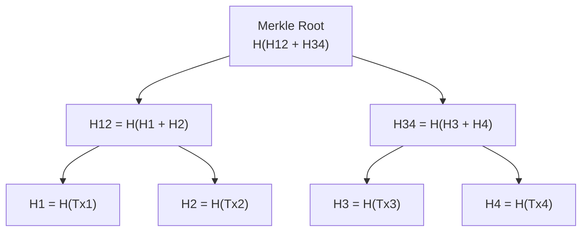

### Why it was invented
Ralph Merkle invented it to make **digital signatures and integrity checks scalable** — to verify
one item out of many without trusting or transferring all of them.

### Problems it solves
1. **Efficient integrity verification** — prove one item belongs to a dataset in *O(log n)*.
2. **Tamper evidence** — change any leaf and the root changes; tampering is detectable.
3. **Cheap commitment** — commit to a huge dataset by publishing a single 32-byte root.
4. **Partial verification** — verify a slice of data without downloading the whole thing.

### Real-world use cases
Bitcoin & Ethereum blocks, Git (commits/trees), IPFS (content addressing), BitTorrent, ZFS/Btrfs
file systems, Certificate Transparency, NoSQL anti-entropy (Cassandra/DynamoDB), blockchain
light-clients, airdrop allowlists, and zk/optimistic rollups.

### Exercises
1. In one sentence, what does the Merkle root represent?
2. If a 1-million-item dataset changes by one byte, how many leaf hashes change? How many internal
   nodes up to the root?
3. Name three systems you use daily that *might* rely on Merkle trees.

### Interview questions
- **Q:** What is a Merkle tree and what's its single most important property?
  **A:** A hash tree summarizing many data blocks into one root; its key property is that the root
  is a tamper-evident commitment — any change to any leaf changes the root.
- **Q:** Why not just hash all data together into one big hash?
  **A:** A single combined hash proves the *whole set* is intact but can't efficiently prove that a
  *specific item* is included; Merkle trees give *O(log n)* membership proofs.

---

## 2. Hashing Fundamentals

### Intuition first
A hash function is a **blender that makes a unique smoothie fingerprint** of any input. Same fruit
in → same smoothie out. But you can never reconstruct the fruit from the smoothie, and changing one
grape changes the whole color.

### What is a cryptographic hash?
A function `H(x)` that maps arbitrary-length input to a fixed-length output (a "digest") with:
- **Deterministic** — same input → same output, always.
- **Fast** to compute.
- **Pre-image resistance** (one-way) — given `H(x)`, you can't find `x`.
- **Second pre-image resistance** — given `x`, you can't find `x' ≠ x` with `H(x)=H(x')`.
- **Collision resistance** — you can't find *any* two inputs with the same hash.
- **Avalanche effect** — flipping one input bit flips ~half the output bits.

### SHA-256 explained
**SHA-256** (Secure Hash Algorithm, 256-bit) outputs 32 bytes (64 hex chars). It pads the message,
splits it into 512-bit blocks, and runs 64 rounds of bitwise mixing per block. For our purposes:
**input → 256-bit fingerprint, irreversible, collision-resistant.** Bitcoin uses SHA-256 (twice).
Ethereum uses **keccak-256** (a SHA-3 variant) — same idea, different internals.

### Deterministic output & avalanche (see it)
```
H("hello")  = 2cf24dba5fb0a30e26e83b2ac5b9e29e1b161e5c1fa7425e73043362938b9824
H("hellp")  = 9c2e... (one letter changed → totally different digest)
```

### Why blockchains rely on hashes
- **Linking blocks:** each block stores the previous block's hash → tamper-evident chain.
- **Commitment:** the Merkle root commits to all transactions in a block.
- **Proof of work:** miners search for a block hash below a target.
- **Addresses & IDs:** derived from hashes of public keys.

### JavaScript example
```js
// hash.js  — Node's built-in crypto, no dependencies
const { createHash } = require('crypto');

function sha256(input) {
  return createHash('sha256').update(input).digest('hex');
}

console.log(sha256('hello'));        // deterministic
console.log(sha256('hello').length); // 64 hex chars = 32 bytes
console.log(sha256('hellp'));        // avalanche: completely different
```

### TypeScript example
```ts
// hash.ts
import { createHash } from 'crypto';

export function sha256(input: string | Buffer): string {
  return createHash('sha256').update(input).digest('hex');
}

// double SHA-256, the Bitcoin way
export function hash256(input: string | Buffer): string {
  const first = createHash('sha256').update(input).digest();
  return createHash('sha256').update(first).digest('hex');
}
```

### Exercises
1. Hash your name, then change one letter. Compare the digests — how different are they?
2. Why must a hash used in a Merkle tree be **collision resistant**?
3. What breaks if the hash is **not** deterministic?

### Interview questions
- **Q:** Difference between collision resistance and second pre-image resistance?
  **A:** Second pre-image: given a specific `x`, hard to find a different `x'` colliding with it.
  Collision: hard to find *any* pair `x, x'` that collide. Collision resistance is the stronger.
- **Q:** Why does Bitcoin double-hash (SHA-256 twice)?
  **A:** Defense-in-depth against length-extension attacks and theoretical weaknesses in single
  SHA-256.

---

## 3. Merkle Tree Basics

### Intuition first
Think of a **knockout tournament bracket**. Players (transactions) are leaves; each match produces
a winner that advances; the **champion at the top is the root**. Replace any player and the whole
upward path to the champion changes.

### The vocabulary
- **Leaf node** — `H(data block)`. The bottom row.
- **Parent (internal) node** — `H(leftChild ‖ rightChild)` (`‖` = concatenate).
- **Root hash** — the single top node; the commitment to everything.
- **Binary tree** — each parent has (up to) two children.

### Complete example — 4 transactions
Transactions: `Tx1="Alice→Bob:5"`, `Tx2="Bob→Carol:3"`, `Tx3="Carol→Dan:2"`, `Tx4="Dan→Eve:1"`.

**Step 1 — hash the leaves** (illustrative short digests):
```
H1 = H(Tx1) = a1...
H2 = H(Tx2) = b2...
H3 = H(Tx3) = c3...
H4 = H(Tx4) = d4...
```
**Step 2 — hash pairs into parents:**
```
H12 = H(H1 ‖ H2) = e5...
H34 = H(H3 ‖ H4) = f6...
```
**Step 3 — hash parents into the root:**
```
ROOT = H(H12 ‖ H34) = 9z...
```

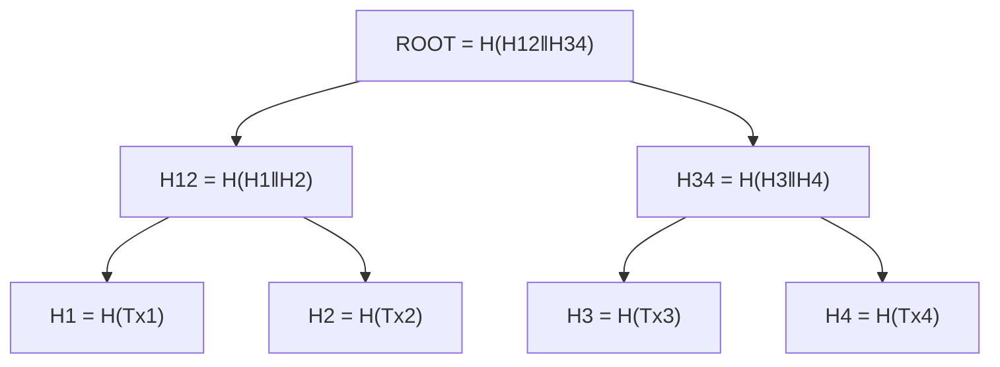

Run it for real:
```js
const { createHash } = require('crypto');
const H = s => createHash('sha256').update(s).digest('hex');
const [Tx1,Tx2,Tx3,Tx4] = ['Alice->Bob:5','Bob->Carol:3','Carol->Dan:2','Dan->Eve:1'];
const H1=H(Tx1), H2=H(Tx2), H3=H(Tx3), H4=H(Tx4);
const H12=H(H1+H2), H34=H(H3+H4);
const ROOT=H(H12+H34);
console.log({H1,H2,H3,H4,H12,H34,ROOT});
```

### Exercises
1. Recompute the root if `Tx3` becomes `"Carol→Dan:20"`. Which nodes change?
2. How many levels does a tree with 8 leaves have? With 16?
3. Why is concatenation order (`H1‖H2` vs `H2‖H1`) important?

### Interview questions
- **Q:** What is stored at a leaf vs an internal node?
  **A:** Leaf = hash of a data block; internal node = hash of its two child hashes.
- **Q:** How many internal nodes does a balanced tree with `n` leaves have?
  **A:** `n − 1` (for a full binary tree with `n` a power of two).

---

## 4. Building a Merkle Tree Manually

### Intuition first
You're folding a row of paper strips in half repeatedly. Each fold glues two strips into one until
a single strip remains — that final strip is the root.

### The algorithm
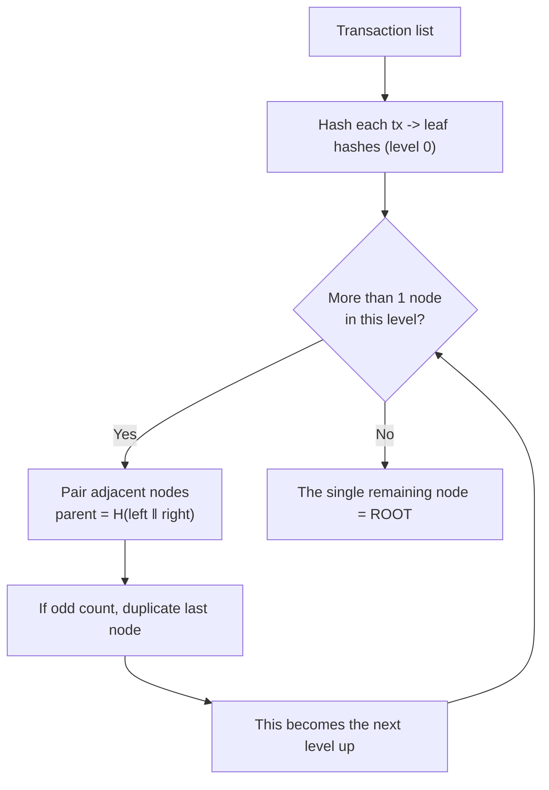

### Worked walk-through (6 transactions)
```
Level 0 (leaves):  H1 H2 H3 H4 H5 H6
Level 1:           H12=H(H1‖H2)  H34=H(H3‖H4)  H56=H(H5‖H6)
                   (3 nodes → odd → duplicate last)
Level 1 padded:    H12 H34 H56 H56
Level 2:           H1234=H(H12‖H34)   H5656=H(H56‖H56)
Level 3 (root):    ROOT=H(H1234‖H5656)
```

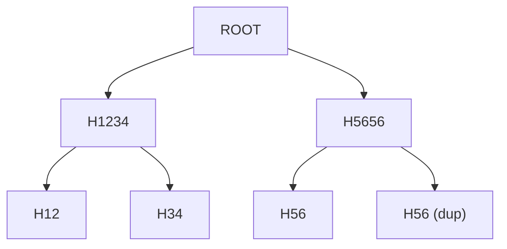

### Exercises
1. Build the tree for `["a","b","c","d","e"]` by hand (5 leaves — see Section 7).
2. At which level does duplication first happen for 6 leaves?
3. Write pseudocode for `buildLevel(nodes)` that returns the next level up.

### Interview questions
- **Q:** Walk me through building a Merkle tree from a list of transactions.
  **A:** Hash each tx into leaves; repeatedly pair adjacent nodes and hash them into parents
  (duplicating the last if a level has odd count) until one root remains.
- **Q:** What's the height of the tree for `n` leaves?
  **A:** `⌈log2(n)⌉`.

---

## 5. Merkle Proofs

### Intuition first
To prove your name is in a sealed phone book without revealing the whole book, you only need the
**siblings along the path** from your entry to the cover stamp (root). Anyone with the cover stamp
can replay your path and confirm.

### What a Merkle proof is
A **Merkle proof** (a.k.a. *Merkle path* / *authentication path*) is the **ordered list of sibling
hashes** needed to recompute the root from one leaf. Each proof element carries a hash **and which
side it's on** (left/right), because hashing order matters.

### Why it exists
So a verifier holding only the **root** can confirm a single item's inclusion using a proof of size
**O(log n)** — no need for the full dataset.

### Step-by-step proof generation — prove `Tx3` in a 4-leaf tree
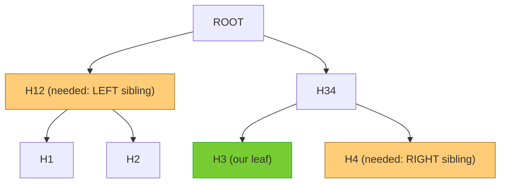
**Proof for Tx3 = `[ {hash: H4, side: 'right'}, {hash: H12, side: 'left'} ]`** (2 hashes).

### Step-by-step proof verification
```
computed = H3                       // hash of the claimed leaf
step1: sibling H4 is on the right → computed = H(computed ‖ H4) = H34
step2: sibling H12 is on the left → computed = H(H12 ‖ computed) = ROOT
check: computed == knownRoot ?  ✓ included   ✗ not included / tampered
```

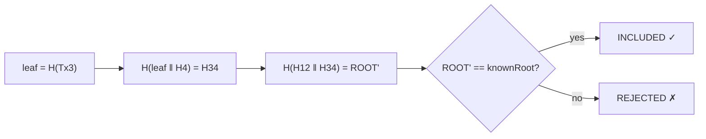

### Exercises
1. Write the proof for `Tx1` in the 4-leaf tree (which siblings, which sides?).
2. If a malicious server swaps `H4` for a fake hash, what happens during verification?
3. How big (in hashes) is a proof for a tree of 1,024 leaves?

### Interview questions
- **Q:** What exactly is in a Merkle proof and why do sides matter?
  **A:** The sibling hashes along the leaf→root path plus each sibling's left/right position;
  sides matter because `H(a‖b) ≠ H(b‖a)`.
- **Q:** What does a successful proof prove and *not* prove?
  **A:** It proves the leaf is included under that root; it does *not* prove the data's semantic
  validity or freshness.

---

## 6. Merkle Verification Deep Dive (SPV)

### Intuition first
A lightweight wallet is like checking a single fact in a library by asking the librarian for **just
the receipts that lead to the stamped index card**, instead of photocopying the whole library.

### How wallets verify transactions
A full node stores the entire blockchain. A **light client (SPV wallet)** stores only **block
headers** (~80 bytes each). To confirm "my transaction is in block N," it:
1. Knows block N's **header**, which contains the **Merkle root**.
2. Requests a **Merkle proof** for its transaction from a full node.
3. Recomputes the root from the tx + proof and checks it matches the header's root.

### SPV (Simplified Payment Verification)
Defined in the Bitcoin whitepaper §8. SPV trusts that the **header chain with the most proof-of-work
is valid** (it doesn't re-validate every tx), then uses Merkle proofs for inclusion.

```mermaid
sequenceDiagram
    participant W as SPV Wallet (headers only)
    participant N as Full Node (full chain)
    W->>N: Does Tx_x exist? give me a Merkle proof
    N-->>W: proof = [sibling hashes + sides], block height
    W->>W: recompute root from Tx_x + proof
    W->>W: compare with header.merkleRoot (already trusted via PoW)
    W-->>W: match → confirmed ; mismatch → reject
```

### Why a full download isn't required
- Headers are tiny: ~80 bytes × ~850k blocks ≈ a few dozen MB vs hundreds of GB.
- Inclusion proof is **O(log n)** hashes, not the whole block.
- Security rests on the **PoW-heaviest header chain** + the Merkle commitment.

### Complete flow
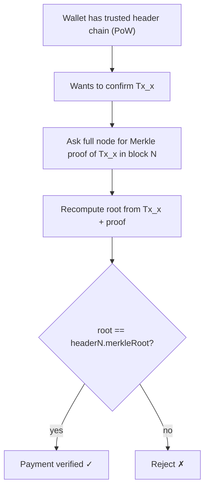

### Exercises
1. Why can an SPV wallet be fooled about *non-inclusion* but not *inclusion*?
2. What data does an SPV wallet store vs a full node?
3. How does header-chain PoW relate to trusting the Merkle root?

### Interview questions
- **Q:** What is SPV and what does it trust?
  **A:** Simplified Payment Verification; it trusts the most-PoW header chain and uses Merkle
  proofs to verify tx inclusion without full validation.
- **Q:** What's the storage difference between SPV and full nodes?
  **A:** SPV stores only ~80-byte headers (tens of MB); full nodes store every block (hundreds of
  GB).

---

## 7. Odd Number of Leaves

### Intuition first
Dancing in pairs but one person is left without a partner — in Bitcoin, that person **dances with a
mirror of themselves** (duplicates) so every level pairs up cleanly.

### Why duplication happens
A binary tree level needs pairs. If a level has an **odd** number of nodes, Bitcoin **duplicates
the last node** and hashes it with itself so the level becomes even.

### How Bitcoin handles it
At each level with odd count: `lastParent = H(lastNode ‖ lastNode)`.

### 3 leaves
```
Level 0: H1 H2 H3            (odd → duplicate H3)
Level 1: H12=H(H1‖H2)  H33=H(H3‖H3)
Root:    H(H12‖H33)
```
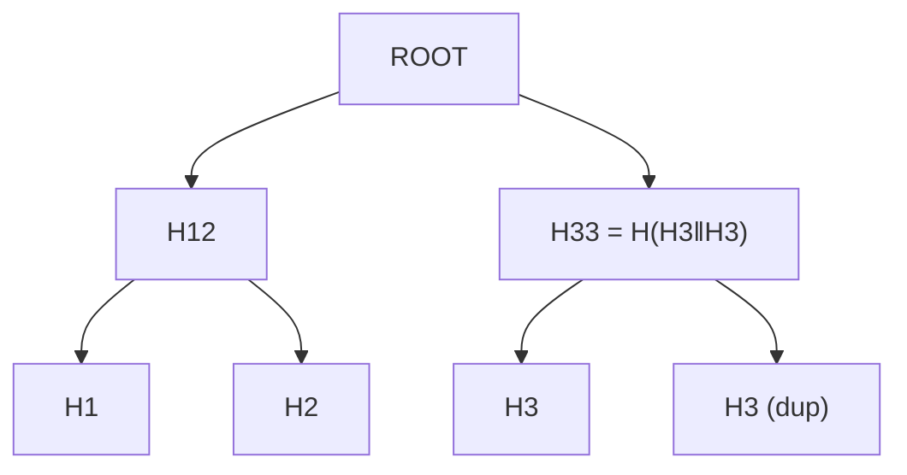

### 5 leaves
```
Level 0: H1 H2 H3 H4 H5             (odd → dup H5)
Level 1: H12 H34 H55               (3 nodes, odd → dup H55)
Level 2: H1234 H5555
Root:    H(H1234‖H5555)
```

### 7 leaves
```
Level 0: H1..H7                     (odd → dup H7) → 8 nodes
Level 1: H12 H34 H56 H77            (4 nodes, even)
Level 2: H1234 H5677
Root:    H(H1234‖H5677)
```

### ⚠️ The CVE-2012-2459 caveat
Naive duplication enabled a Bitcoin vulnerability where **two different transaction lists could
produce the same Merkle root** (by crafting duplicate-pair structures). Bitcoin mitigated it by
rejecting blocks with duplicate txids. **Lesson:** duplication rules must be implemented carefully.

### Exercises
1. Draw the tree for 6 leaves — does duplication occur, and at which level?
2. Build the 5-leaf tree's proof for `H3`.
3. Why is "duplicate the last node" not the only valid scheme? (Hint: "promote unchanged".)

### Interview questions
- **Q:** How does Bitcoin handle an odd number of nodes at a level?
  **A:** It duplicates the last node and hashes it with itself.
- **Q:** What security issue arose from duplication and how was it fixed?
  **A:** CVE-2012-2459 — different tx sets could yield the same root; fixed by forbidding duplicate
  txids in a block.

---

## 8. Bitcoin and Merkle Trees

### Intuition first
A Bitcoin block is a **sealed box of transactions with a label on the outside**. The label (header)
carries the **Merkle root** — a fingerprint of everything inside — so you can verify the contents
without opening the box.

### Transactions inside blocks
Each block has a list of transactions. Their **txids** (double-SHA-256 of each tx) are the leaves;
the tree's root is the **Merkle root**.

### Where the Merkle root is stored — the Block Header (80 bytes)
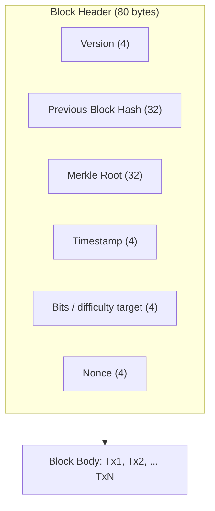

### Mining relationship
Miners hash the **header** repeatedly (varying the nonce) seeking a hash below the target. The
header **includes the Merkle root**, so **any change to any transaction changes the root → changes
the header → invalidates the miner's work.** This binds the PoW to the exact transaction set.

### Block structure
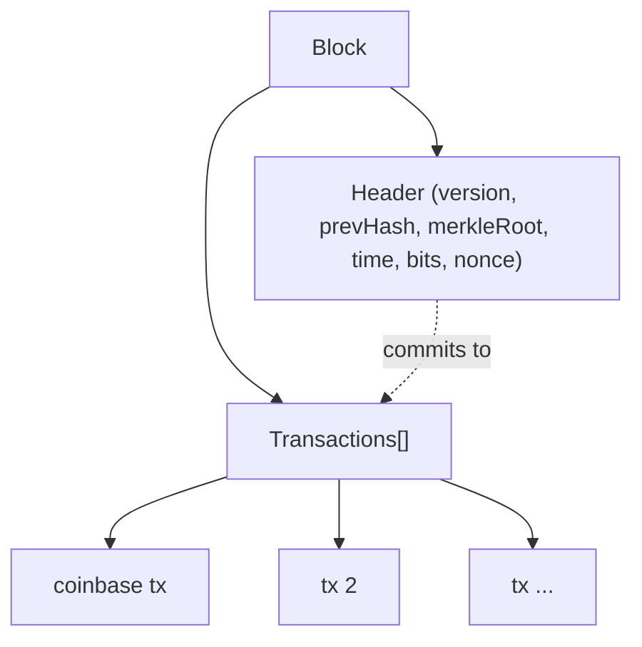

### Transaction verification workflow (SPV)
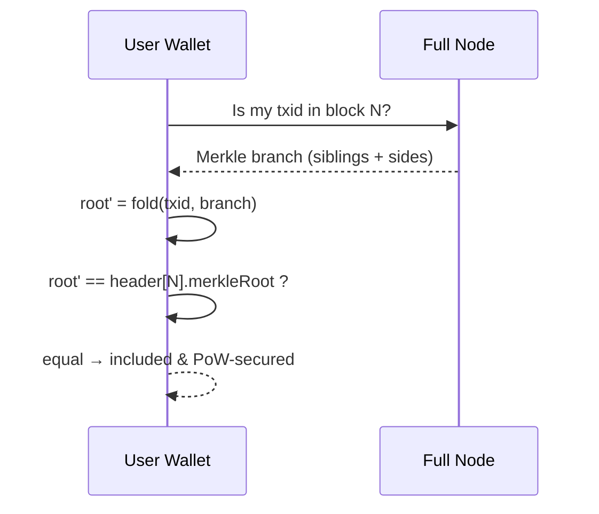

### Exercises
1. Which 32-byte field in the header is the Merkle root, and why is it there and not in the body?
2. If a miner alters one tx after mining, what must they redo?
3. Why does the coinbase transaction being first matter for the tree?

### Interview questions
- **Q:** Where is the Merkle root stored in Bitcoin and why?
  **A:** In the 80-byte block header, so the PoW commits to the full transaction set and light
  clients can verify inclusion from headers alone.
- **Q:** How does the Merkle root tie into mining security?
  **A:** The header (which is hashed for PoW) contains the root; changing any tx changes the root
  and invalidates the proof of work.

---

## 9. Ethereum and Merkle Trees

### Intuition first
Bitcoin's tree is a **read-only snapshot** of transactions. Ethereum needs a **constantly-updating
ledger of account balances and contract storage** — like a spreadsheet edited every block. A plain
Merkle tree is clumsy to update and look up by key, so Ethereum uses a **Merkle Patricia Trie
(MPT)** — a Merkle tree married to a key-value radix trie.

### Merkle tree vs Merkle Patricia Trie (MPT)
| | Merkle tree | Merkle Patricia Trie |
|---|---|---|
| Indexed by | position (order) | **key** (e.g. account address) |
| Good at | membership proof | key→value lookup + proof + **cheap updates** |
| Structure | binary | radix-16 (hex) trie with hashes |
| Used by | Bitcoin tx tree | Ethereum state/storage/tx/receipts |

### Why Ethereum uses MPT
- **Keyed access:** prove "account 0xabc has balance B" by key, not position.
- **Efficient updates:** changing one account re-hashes only its path, reusing unchanged subtrees.
- **Cryptographic authentication:** every node is referenced by its hash → tamper-evident, like a
  Merkle tree.

### The four tries
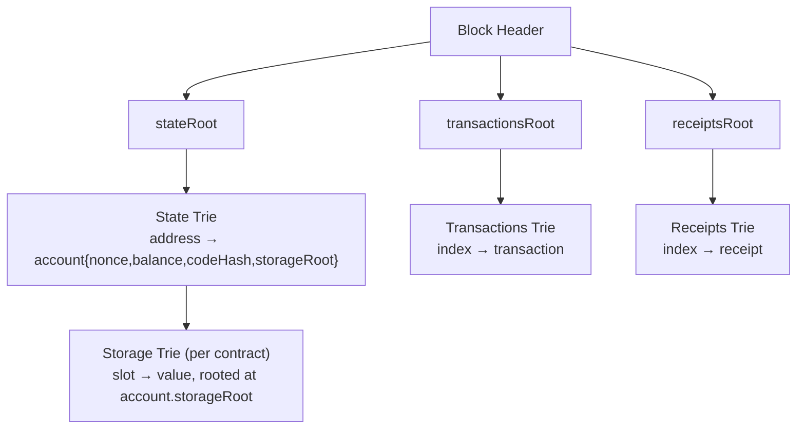
- **State Trie** (one global) — maps every address to its account; its root is `stateRoot` in the
  header.
- **Storage Trie** (one per contract) — maps storage slots to values; its root lives inside the
  account, linked from the state trie.
- **Transactions Trie** (per block) — maps index → transaction; root = `transactionsRoot`.
- **Receipts Trie** (per block) — maps index → receipt (logs/gas); root = `receiptsRoot`.

### Diagram: MPT node types
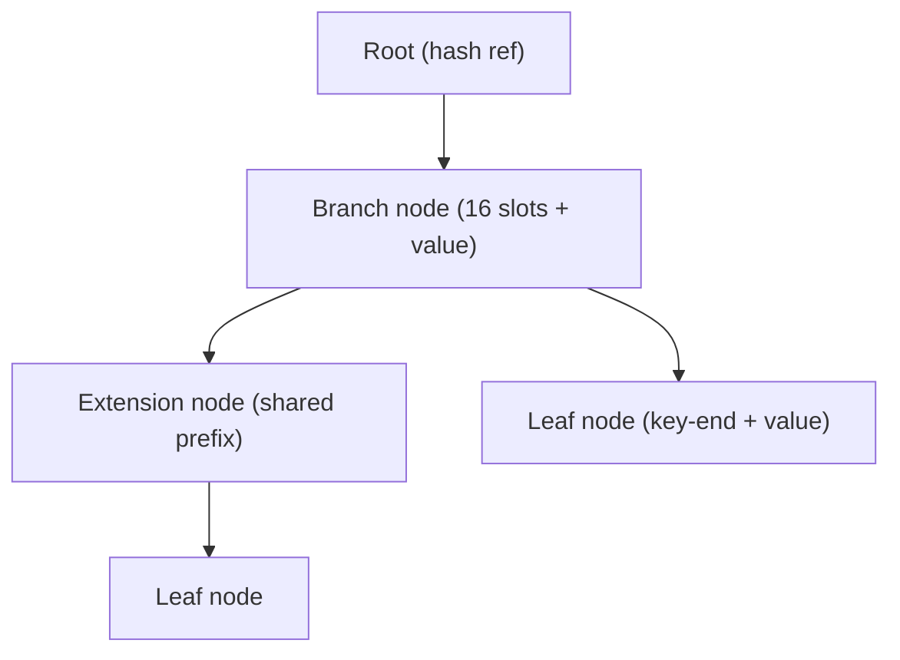

### Exercises
1. Which header field roots the global account state?
2. Why is an account's `storageRoot` nested inside the state trie rather than a separate header
   field?
3. Why does keyed access make MPT better than a plain Merkle tree for Ethereum?

### Interview questions
- **Q:** Why does Ethereum use a Merkle Patricia Trie instead of a plain Merkle tree?
  **A:** It needs keyed key-value lookups and cheap incremental updates over a mutable state, with
  authenticated proofs — a radix trie with hashing provides all three.
- **Q:** Name Ethereum's four tries and their header roots.
  **A:** State (`stateRoot`), Transactions (`transactionsRoot`), Receipts (`receiptsRoot`), and
  per-contract Storage (rooted via each account's `storageRoot`).

---

## 10. Implementing a Merkle Tree from Scratch

### JavaScript implementation (every line explained)
```js
// merkle.js
const { createHash } = require('crypto');

// 1) Hash wrapper: turn any string into a 32-byte hex digest.
function sha256(data) {
  return createHash('sha256').update(data).digest('hex');
}

// 2) Tree builder: returns an array of levels; level[0] = leaves, last = [root].
function buildTree(items) {
  if (items.length === 0) throw new Error('need at least one item');

  // Hash raw items into leaf hashes (level 0).
  let level = items.map(sha256);
  const levels = [level];

  // Fold upward until a single root remains.
  while (level.length > 1) {
    const next = [];
    for (let i = 0; i < level.length; i += 2) {
      const left = level[i];
      const right = level[i + 1] ?? left; // odd count → duplicate the last node
      next.push(sha256(left + right));     // parent = H(left ‖ right)
    }
    levels.push(next);
    level = next;
  }
  return levels;
}

// 3) Root generator: top of the tree.
function getRoot(items) {
  const levels = buildTree(items);
  return levels[levels.length - 1][0];
}

// 4) Proof generator: sibling hashes + side, from leaf `index` up to the root.
function getProof(items, index) {
  const levels = buildTree(items);
  const proof = [];
  let idx = index;
  for (let l = 0; l < levels.length - 1; l++) {
    const nodes = levels[l];
    const isRight = idx % 2 === 1;                 // our node's position parity
    const siblingIdx = isRight ? idx - 1 : idx + 1;
    const sibling = nodes[siblingIdx] ?? nodes[idx]; // duplicated node case
    proof.push({ hash: sibling, side: isRight ? 'left' : 'right' });
    idx = Math.floor(idx / 2);                     // move to parent index
  }
  return proof;
}

// 5) Proof verifier: recompute the root from the leaf data + proof.
function verifyProof(item, proof, root) {
  let computed = sha256(item);
  for (const { hash, side } of proof) {
    computed = side === 'left' ? sha256(hash + computed) : sha256(computed + hash);
  }
  return computed === root;
}

// --- demo ---
const txs = ['Tx1', 'Tx2', 'Tx3', 'Tx4'];
const root = getRoot(txs);
const proof = getProof(txs, 2);                    // prove 'Tx3'
console.log('root  :', root);
console.log('valid :', verifyProof('Tx3', proof, root)); // true
console.log('forged:', verifyProof('FAKE', proof, root)); // false
module.exports = { sha256, buildTree, getRoot, getProof, verifyProof };
```

### TypeScript implementation (production-quality)
```ts
// merkle.ts
import { createHash } from 'crypto';

export type Side = 'left' | 'right';
export interface ProofStep { hash: string; side: Side; }

export type Hasher = (data: string) => string;

const sha256: Hasher = (data) => createHash('sha256').update(data).digest('hex');

export function buildTree(items: string[], hash: Hasher = sha256): string[][] {
  if (items.length === 0) throw new Error('MerkleTree: empty input');
  let level = items.map((i) => hash(i));
  const levels: string[][] = [level];
  while (level.length > 1) {
    const next: string[] = [];
    for (let i = 0; i < level.length; i += 2) {
      const left = level[i];
      const right = level[i + 1] ?? left;
      next.push(hash(left + right));
    }
    levels.push(next);
    level = next;
  }
  return levels;
}

export function getRoot(items: string[], hash: Hasher = sha256): string {
  const levels = buildTree(items, hash);
  return levels[levels.length - 1][0];
}

export function getProof(items: string[], index: number, hash: Hasher = sha256): ProofStep[] {
  if (index < 0 || index >= items.length) throw new RangeError('index out of bounds');
  const levels = buildTree(items, hash);
  const proof: ProofStep[] = [];
  let idx = index;
  for (let l = 0; l < levels.length - 1; l++) {
    const nodes = levels[l];
    const isRight = idx % 2 === 1;
    const siblingIdx = isRight ? idx - 1 : idx + 1;
    proof.push({ hash: nodes[siblingIdx] ?? nodes[idx], side: isRight ? 'left' : 'right' });
    idx = Math.floor(idx / 2);
  }
  return proof;
}

export function verifyProof(item: string, proof: ProofStep[], root: string, hash: Hasher = sha256): boolean {
  let computed = hash(item);
  for (const step of proof) {
    computed = step.side === 'left' ? hash(step.hash + computed) : hash(computed + step.hash);
  }
  return computed === root;
}
```

### Exercises
1. Swap `sha256` for a `keccak256` hasher (via `js-sha3`) and confirm the API still works.
2. Add a `getProofByValue(item)` that finds the index first.
3. Make `verifyProof` return the *recomputed root* instead of a boolean.

### Interview questions
- **Q:** Why do you pass the leaf's *raw data* (not its hash) into `verifyProof`?
  **A:** The verifier must hash it itself to be sure the leaf maps to the data; trusting a
  pre-hashed leaf would let an attacker substitute arbitrary leaves.
- **Q:** Where does the odd-leaf handling live in your code?
  **A:** `const right = level[i+1] ?? left;` duplicates the last node when a level is odd.

---

## 11. Building a Reusable MerkleTree Class

### Architecture
Encapsulate state (leaves + cached levels) behind a clean API. Build lazily/explicitly; cache the
levels so `getRoot`/`getProof` don't rebuild each call.

```ts
// MerkleTree.ts
import { createHash } from 'crypto';

export type Hasher = (data: string) => string;
export type Side = 'left' | 'right';
export interface ProofStep { hash: string; side: Side; }

export class MerkleTree {
  private leaves: string[] = [];      // leaf HASHES
  private levels: string[][] = [];    // cached tree, rebuilt on change
  private dirty = true;

  constructor(private readonly hash: Hasher = (d) => createHash('sha256').update(d).digest('hex')) {}

  /** Add a raw item; it is hashed into a leaf. Returns the leaf index. */
  addLeaf(item: string): number {
    this.leaves.push(this.hash(item));
    this.dirty = true;
    return this.leaves.length - 1;
  }

  addLeaves(items: string[]): void { items.forEach((i) => this.addLeaf(i)); }

  /** (Re)build the tree from current leaves. */
  buildTree(): void {
    if (this.leaves.length === 0) throw new Error('MerkleTree: no leaves');
    let level = [...this.leaves];
    const levels: string[][] = [level];
    while (level.length > 1) {
      const next: string[] = [];
      for (let i = 0; i < level.length; i += 2) {
        const left = level[i];
        const right = level[i + 1] ?? left;
        next.push(this.hash(left + right));
      }
      levels.push(next);
      level = next;
    }
    this.levels = levels;
    this.dirty = false;
  }

  private ensureBuilt(): void { if (this.dirty) this.buildTree(); }

  getRoot(): string {
    this.ensureBuilt();
    return this.levels[this.levels.length - 1][0];
  }

  getProof(index: number): ProofStep[] {
    if (index < 0 || index >= this.leaves.length) throw new RangeError('bad index');
    this.ensureBuilt();
    const proof: ProofStep[] = [];
    let idx = index;
    for (let l = 0; l < this.levels.length - 1; l++) {
      const nodes = this.levels[l];
      const isRight = idx % 2 === 1;
      const siblingIdx = isRight ? idx - 1 : idx + 1;
      proof.push({ hash: nodes[siblingIdx] ?? nodes[idx], side: isRight ? 'left' : 'right' });
      idx = Math.floor(idx / 2);
    }
    return proof;
  }

  /** Static verify so a light client can check without holding the tree. */
  static verifyProof(item: string, proof: ProofStep[], root: string,
                     hash: Hasher = (d) => createHash('sha256').update(d).digest('hex')): boolean {
    let computed = hash(item);
    for (const s of proof) computed = s.side === 'left' ? hash(s.hash + computed) : hash(computed + s.hash);
    return computed === root;
  }
}
```

### Usage
```ts
const tree = new MerkleTree();
tree.addLeaves(['Tx1', 'Tx2', 'Tx3', 'Tx4']);
const root = tree.getRoot();
const proof = tree.getProof(2);
console.log(MerkleTree.verifyProof('Tx3', proof, root)); // true
```

### Complexity of each method
| Method | Time | Space |
|---|---|---|
| `addLeaf` | O(1) (marks dirty) | O(1) |
| `buildTree` | O(n) hashes | O(n) for cached levels |
| `getRoot` | O(n) first time, O(1) cached | O(n) |
| `getProof` | O(log n) | O(log n) |
| `verifyProof` | O(log n) | O(1) |

### Exercises
1. Add `updateLeaf(index, newItem)` that rebuilds efficiently (or marks dirty).
2. Add `getRootHex()` and `size()`.
3. Make the class generic over `Buffer` leaves for raw-byte hashing.

### Interview questions
- **Q:** Why cache `levels` and use a `dirty` flag?
  **A:** Building is O(n); caching avoids rebuilding on every `getRoot`/`getProof` while the dirty
  flag keeps the cache correct after mutations.
- **Q:** Why is `verifyProof` static?
  **A:** A verifier (light client) only has the leaf, proof, and root — not the tree — so
  verification shouldn't require an instance.

---

## 12. Time and Space Complexity

Let `n` = number of leaves.

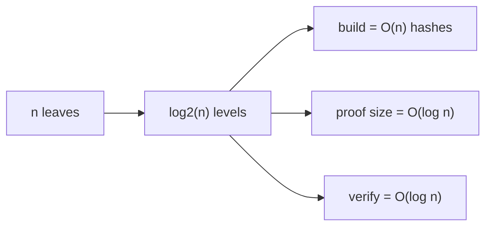

| Operation | Time | Space | Why |
|---|---|---|---|
| **Tree creation** | **O(n)** | **O(n)** | ~`2n` hash ops total (n + n/2 + n/4 + … ≈ 2n); store all nodes |
| **Proof generation** | **O(log n)** | **O(log n)** | one sibling per level, `log n` levels |
| **Proof verification** | **O(log n)** | **O(1)** | `log n` hashes, single accumulator |
| **Root storage** | **O(1)** | **O(1)** | always one 32-byte hash |
| **Single-leaf update** | **O(log n)** | — | re-hash only the path to root (if subtrees cached) |

**Key takeaway:** building is linear, but **everything a verifier does is logarithmic** — that's
the entire value proposition.

### Exercises
1. For `n = 1,048,576` (2²⁰), how many hashes in a proof? How many to build?
2. Why is verification space O(1) while proof size is O(log n)?
3. Derive why total build hashes ≈ 2n.

### Interview questions
- **Q:** Why are Merkle proofs O(log n)?
  **A:** The tree has `log2(n)` levels; a proof carries exactly one sibling hash per level.
- **Q:** What's the cost of building the tree and why?
  **A:** O(n): the geometric series n + n/2 + n/4 + … ≈ 2n hash operations.

---

## 13. Production Considerations

### Security issues
- **Second pre-image / leaf–node confusion:** an attacker may present an *internal node* as if it
  were a leaf. **Fix:** domain-separate by prefixing leaves and nodes with different tags, e.g.
  `H(0x00 ‖ leaf)` and `H(0x01 ‖ left ‖ right)` (RFC 6962 / Certificate Transparency does this).
- **CVE-2012-2459 (duplicate-pair ambiguity):** naive duplication can let two datasets share a
  root. **Fix:** forbid duplicate adjacent leaves / duplicate txids.
- **Don't trust pre-hashed leaves:** verifiers must hash the raw data themselves.

### Hash function choice
- Use a **collision-resistant** hash: SHA-256 (Bitcoin), keccak-256 (Ethereum), BLAKE2/3 (fast).
- **Never** MD5 or SHA-1 (broken). Match the on-chain hash if you'll verify on-chain.

### Duplicate leaves
Decide policy: reject duplicates, or accept (membership still works but uniqueness proofs don't).
Document it.

### Data ordering
- **Order matters** for the root. Fix a canonical ordering (insertion order, or sorted).
- **Pair ordering:** either store left/right sides in proofs (our approach) **or** sort each pair
  before hashing (`H(min(a,b) ‖ max(a,b))` — OpenZeppelin style) so proofs need no side flags.
  Pick one and use it identically on both sides.

### Tree updates
- Plain Merkle trees are awkward to mutate; for frequently-changing data use **Incremental Merkle
  Trees** (append-only) or **Sparse Merkle Trees** (key-value), or an **MPT**.

### Large datasets
- Stream leaves; don't hold raw data in memory — hash and discard.
- Persist intermediate nodes; recompute only affected paths on update.
- Consider chunking and **Merkle Mountain Ranges** for append-only logs.

### Canonical serialization
- Hash a **canonical** byte encoding (fixed field order, encoding, endianness). JSON key order and
  whitespace differences silently change hashes.

### Exercises
1. Implement domain-separated hashing (`0x00`/`0x01` tags) and show the root differs.
2. Convert the proof format to the *sorted-pair* convention and drop the `side` field.
3. Why does canonical serialization matter across languages?

### Interview questions
- **Q:** How do you prevent leaf/internal-node confusion attacks?
  **A:** Domain-separate the hash inputs (distinct prefixes/tags for leaves vs internal nodes).
- **Q:** Two ways to handle pair ordering in proofs?
  **A:** Store explicit left/right sides, or sort each pair before hashing so order is implicit.

---

## 14. Merkle Trees in Modern Systems

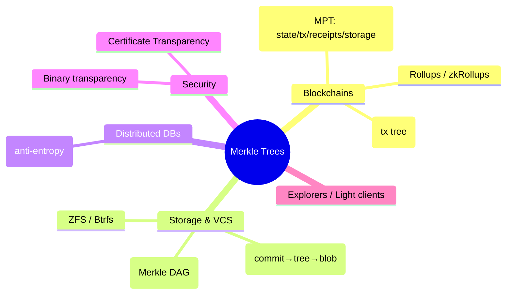

- **Bitcoin** — transactions hashed into a per-block Merkle root in the header; SPV proofs.
- **Ethereum** — four Merkle Patricia Tries (state, storage, transactions, receipts) for
  authenticated, updatable, keyed state.
- **IPFS** — content addressed via a **Merkle DAG**; a CID is a hash of a node; dedup + integrity.
- **Git** — commits point to **tree** objects pointing to **blob** hashes; a Merkle DAG of history.
- **Distributed databases** — Cassandra/DynamoDB use Merkle trees for **anti-entropy** (efficiently
  finding which ranges differ between replicas).
- **Certificate Transparency** — append-only Merkle logs of TLS certs (RFC 6962); browsers verify
  inclusion + consistency proofs.
- **Rollups** — batch txs off-chain; commit a Merkle root on L1 for data/state.
- **zkRollups** — Merkle/Verkle commitments to state, proven valid with succinct ZK proofs.
- **Blockchain explorers** — display Merkle roots, build/verify inclusion proofs for tx pages.

### Exercises
1. How is Git's object model a Merkle DAG (not a strict tree)?
2. Why are Merkle trees ideal for replica anti-entropy?
3. What does Certificate Transparency's *consistency proof* guarantee?

### Interview questions
- **Q:** How does Git use Merkle structures?
  **A:** Commit → tree → blob objects each addressed by content hash, forming a Merkle DAG that
  makes history tamper-evident.
- **Q:** What problem do Merkle trees solve in distributed databases?
  **A:** Anti-entropy: comparing roots/subtrees locates differing data ranges with minimal data
  transfer.

---

## 15. Practical Project: Mini Blockchain Verifier

Build a CLI that stores transactions, builds a Merkle tree per block, and generates/verifies
inclusion proofs.

### Folder structure
```
mini-merkle-chain/
├── package.json
├── tsconfig.json
└── src/
    ├── hash.ts          # sha256 wrapper
    ├── MerkleTree.ts    # the reusable class (Section 11)
    ├── Block.ts         # a block: txs + merkleRoot + prevHash
    ├── Blockchain.ts    # chain of blocks
    └── cli.ts           # command-line demo
```

### `package.json`
```json
{
  "name": "mini-merkle-chain",
  "version": "1.0.0",
  "type": "commonjs",
  "scripts": {
    "build": "tsc",
    "start": "node dist/cli.js",
    "dev": "ts-node src/cli.ts"
  },
  "devDependencies": { "typescript": "^5.7.0", "ts-node": "^10.9.0", "@types/node": "^24" }
}
```

### `src/hash.ts`
```ts
import { createHash } from 'crypto';
export const sha256 = (d: string): string => createHash('sha256').update(d).digest('hex');
```

### `src/MerkleTree.ts`
Use the full `MerkleTree` class from **Section 11** (copy it here).

### `src/Block.ts`
```ts
import { MerkleTree } from './MerkleTree';
import { sha256 } from './hash';

export class Block {
  readonly merkleRoot: string;
  readonly hash: string;
  private readonly tree: MerkleTree;

  constructor(
    public readonly index: number,
    public readonly transactions: string[],
    public readonly prevHash: string,
    public readonly timestamp: number = 0, // pass in to stay deterministic
  ) {
    this.tree = new MerkleTree();
    this.tree.addLeaves(transactions);
    this.merkleRoot = this.tree.getRoot();
    this.hash = sha256(`${index}|${prevHash}|${this.merkleRoot}|${timestamp}`);
  }

  proofFor(txIndex: number) { return this.tree.getProof(txIndex); }
}
```

### `src/Blockchain.ts`
```ts
import { Block } from './Block';

export class Blockchain {
  readonly blocks: Block[] = [];

  constructor() {
    this.blocks.push(new Block(0, ['genesis'], '0'.repeat(64), 0));
  }

  get tip(): Block { return this.blocks[this.blocks.length - 1]; }

  addBlock(transactions: string[]): Block {
    const block = new Block(this.blocks.length, transactions, this.tip.hash, this.blocks.length);
    this.blocks.push(block);
    return block;
  }
}
```

### `src/cli.ts`
```ts
import { Blockchain } from './Blockchain';
import { MerkleTree } from './MerkleTree';

const chain = new Blockchain();
const b1 = chain.addBlock(['Alice->Bob:5', 'Bob->Carol:3', 'Carol->Dan:2', 'Dan->Eve:1']);

console.log('Block #', b1.index);
console.log('Merkle root :', b1.merkleRoot);
console.log('Block hash  :', b1.hash);

// Prove tx index 2 ("Carol->Dan:2") is included
const target = 'Carol->Dan:2';
const proof = b1.proofFor(2);
console.log('\nProof for', target, '=', proof);

const ok = MerkleTree.verifyProof(target, proof, b1.merkleRoot);
console.log('Inclusion verified :', ok); // true

// Tamper attempt
const bad = MerkleTree.verifyProof('Carol->Dan:200', proof, b1.merkleRoot);
console.log('Forged tx verified :', bad); // false
```

### Run it
```bash
npm install
npx ts-node src/cli.ts
# or: npm run build && npm start
```

### Explanation
- Each **Block** builds a Merkle tree over its transactions and stores only the **root** in its
  hash — exactly like Bitcoin's header binds to the tx set.
- `proofFor(i)` returns a light-client inclusion proof.
- `MerkleTree.verifyProof` recomputes the root from the tx + proof; tampering fails verification.
- The block hash chains via `prevHash`, giving a tamper-evident chain on top of tamper-evident
  blocks.

### Exercises
1. Add a `verifyChain()` that recomputes every block hash and checks `prevHash` links.
2. Add a `getMerkleRootForBlock(index)` explorer command.
3. Persist the chain to JSON and reload it.

---

## 16. Merkle Trees in My Blockchain Explorer Project

This repo's app (**VoltusWave AMI**) advertises **"Private Ethereum · connected"** and already has
a faked `merkle_root` + a `merkle_proof_valid` verification check. Here's how Merkle trees fit a
real **Geth private-chain + block explorer** built around it. (See companion docs `chains.md`,
`project.md`, `blockchain.md`.)

### Where Merkle trees live in the stack
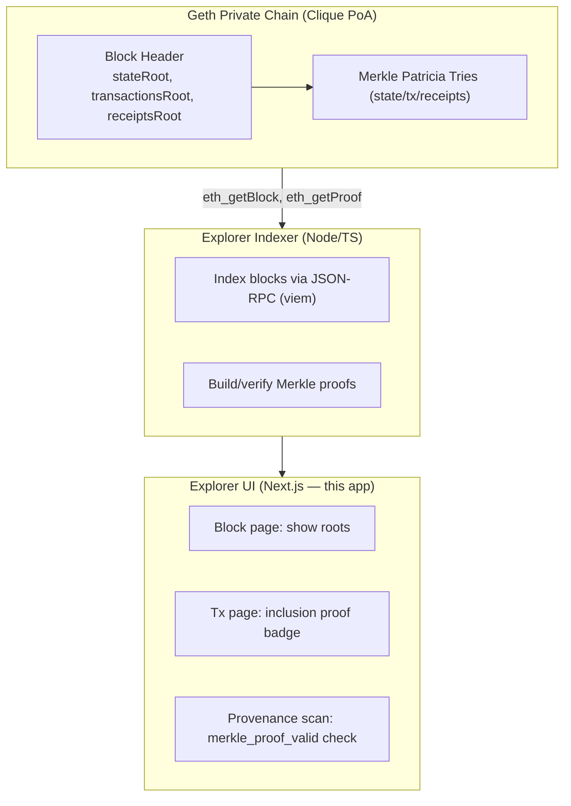

### Transaction verification (explorer)
1. Indexer reads a block via JSON-RPC; the header carries `transactionsRoot`.
2. For a tx page, build/fetch a Merkle proof of that tx under `transactionsRoot`.
3. UI shows a green **"Inclusion verified ✓"** badge by recomputing the root client-side.

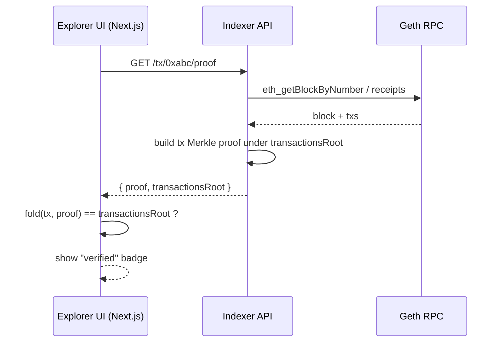

### Block verification
- Recompute `transactionsRoot` from the block's tx list and compare with the header — proves the
  explorer's tx list matches what the chain committed.
- For account/state queries, use Ethereum's **`eth_getProof`** (returns an MPT proof) to verify a
  balance/storage slot against `stateRoot` without trusting the indexer.

### Tie-in to the existing provenance feature
In `lib/store/provenance.ts`, the `merkle_proof_valid` check (weight 0.2) is currently faked. With
a real chain:
- At **mint** (Batch Minting Console), compute a Merkle root over a batch of part records and store
  it on-chain via a `ProvenanceRegistry.sol` contract (its tx lands in a block → `transactionsRoot`).
- At **scan** (`scanServiceRequest`), fetch the batch's anchored root + a Merkle proof for the part
  and verify client-side → drives the `merkle_proof_valid` attribution for real.

### Explorer UI architecture
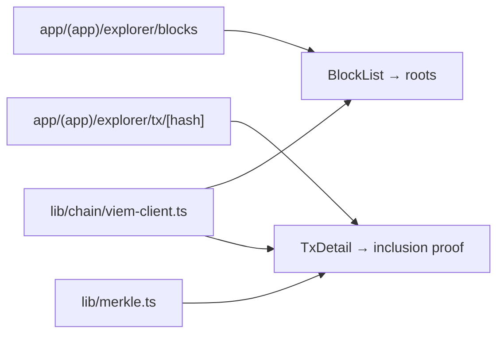

### Exercises
1. Add a `lib/merkle.ts` and wire `merkle_proof_valid` to real verification (see `merkle.md` plan).
2. Sketch the indexer endpoint `/block/:n` returning header roots.
3. Use `eth_getProof` to verify a dealer account's on-chain status against `stateRoot`.

---

## 17. Advanced Topics

### Sparse Merkle Tree (SMT)
A tree over a **huge fixed key space** (e.g. 2²⁵⁶ leaves), mostly empty. Default-empty subtrees
share a precomputed "zero hash," so it's tractable. Enables **non-membership proofs** (prove a key
maps to empty).
- **Pros:** key-value, membership *and* non-membership proofs, deterministic structure.
- **Cons:** proofs are deep (key-length) without optimization; needs zero-hash caching.

### Merkle Patricia Trie (MPT)
Radix-16 trie + hashing (Ethereum). Keyed, updatable, authenticated.
- **Pros:** efficient keyed lookups/updates, inclusion + exclusion proofs.
- **Cons:** complex; proofs larger than binary trees; many hash ops per update.

### Verkle Tree
Replaces hashes with **vector commitments** (polynomial/KZG). Children committed in one short proof.
- **Pros:** **much smaller witnesses** (key to Ethereum statelessness), wide nodes.
- **Cons:** advanced crypto (trusted setup/KZG), newer, heavier proving.

### Incremental Merkle Tree (IMT)
Append-only tree of fixed depth; tracks a "frontier" so each insert is O(log n) without storing all
leaves. Used by Tornado Cash / zk deposit trees.
- **Pros:** cheap appends, constant memory frontier, great for on-chain.
- **Cons:** append-only (no arbitrary updates), fixed capacity.

### Merkle Mountain Range (MMR)
A list of perfect binary trees ("peaks") "bagged" into one root; ideal for **append-only logs**.
- **Pros:** O(1) amortized append, efficient history proofs, no rebalancing.
- **Cons:** root changes shape as it grows; proof logic more involved.

### Comparison
| Structure | Keyed? | Updates | Non-membership | Proof size | Used by |
|---|---|---|---|---|---|
| Binary Merkle | No (positional) | Rebuild path | No | O(log n) | Bitcoin |
| Sparse Merkle | Yes | O(depth) | **Yes** | O(depth) | Plasma, identity |
| MPT | Yes | O(key len) | Yes | larger | Ethereum |
| Verkle | Yes | O(key len) | Yes | **tiny** | Ethereum (future) |
| Incremental | No | append only | No | O(log n) | zk mixers |
| MMR | No | append only | No | O(log n) | Grin, Mina, chains |

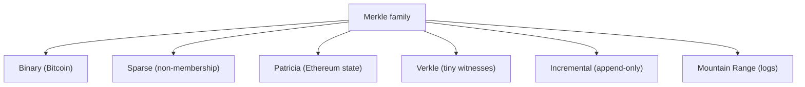

### Interview questions
- **Q:** Why are Verkle trees attractive for Ethereum?
  **A:** Vector commitments shrink witnesses dramatically, enabling stateless clients.
- **Q:** When choose an MMR over a binary Merkle tree?
  **A:** For append-only logs needing cheap appends and history/consistency proofs without rebuilds.

---

## 18. Interview Preparation (150 Q&A)

### Beginner (1–50)
1. **What is a Merkle tree?** A hash tree summarizing many data blocks into one root hash.
2. **What is the Merkle root?** The single top hash committing to all leaves.
3. **What is a leaf node?** The hash of a single data block/transaction.
4. **What is an internal node?** The hash of its two child hashes.
5. **Who invented it?** Ralph Merkle (1979).
6. **What is a hash function?** A function mapping arbitrary input to a fixed-size digest.
7. **Is hashing reversible?** No — it's one-way (pre-image resistant).
8. **What is determinism in hashing?** Same input always yields the same output.
9. **What is the avalanche effect?** One input bit changing flips ~half the output bits.
10. **What is collision resistance?** Hard to find two inputs with the same hash.
11. **Which hash does Bitcoin use?** SHA-256 (applied twice).
12. **Which hash does Ethereum use?** keccak-256.
13. **Why are Merkle trees binary?** Each parent combines two children; simple and balanced.
14. **How is a parent computed?** `H(leftChild ‖ rightChild)`.
15. **What does the root prove?** That a specific set of leaves is intact and committed.
16. **What is a Merkle proof?** Sibling hashes along the path from a leaf to the root.
17. **What is proof size?** O(log n) hashes.
18. **What does verification do?** Recompute the root from a leaf + proof and compare.
19. **Why store only the root on-chain?** It's a tiny, tamper-evident commitment to all data.
20. **What changes if one leaf changes?** That leaf's hash and every node up to the root.
21. **Tree height for n leaves?** ⌈log2(n)⌉.
22. **What is tamper evidence?** Any change is detectable because the root changes.
23. **What is an SPV wallet?** A light client verifying via headers + Merkle proofs.
24. **What does an SPV wallet store?** Block headers only.
25. **Why do sides (left/right) matter in proofs?** Because `H(a‖b) ≠ H(b‖a)`.
26. **How are odd leaves handled in Bitcoin?** Duplicate the last node.
27. **Where is the Merkle root in Bitcoin?** In the 80-byte block header.
28. **What's in a block header?** Version, prevHash, merkleRoot, time, bits, nonce.
29. **What is the genesis block?** The first block in a chain.
30. **What links blocks together?** Each header stores the previous block's hash.
31. **Can you reconstruct data from the root?** No — it's a one-way commitment.
32. **What is a digest?** The fixed-size output of a hash.
33. **How many bytes is SHA-256 output?** 32 bytes (64 hex chars).
34. **What is concatenation in this context?** Joining two child hashes before hashing.
35. **What is a hash pointer?** A reference to data plus its hash (used in blockchains).
36. **Is a Merkle root unique to its data?** Practically yes (collision-resistant hash).
37. **What is membership proof?** Proving an item is in the set via a Merkle proof.
38. **What does O(log n) mean intuitively?** Grows very slowly as data grows.
39. **Why not hash everything into one hash?** You lose efficient single-item proofs.
40. **What is a full node?** A node storing/validating the whole chain.
41. **What is a light node?** A node storing minimal data (headers) using proofs.
42. **What's a txid?** A transaction's hash identifier.
43. **What is double hashing?** Hashing the output of a hash again (Bitcoin: SHA-256²).
44. **What is a balanced tree?** All leaves at (nearly) the same depth.
45. **What if there's a single leaf?** The root equals that leaf's hash (or H of it).
46. **What does "commit to data" mean?** Publish a value (root) fixing the data without revealing it.
47. **Are Merkle trees encryption?** No — integrity/commitment, not confidentiality.
48. **What's the smallest meaningful tree?** Two leaves and one root.
49. **Why are they used in blockchains?** Compact, verifiable commitments to many transactions.
50. **Name one non-blockchain use.** Git, IPFS, ZFS, or Certificate Transparency.

### Intermediate (51–100)
51. **Why O(log n) proofs?** One sibling per level; log n levels.
52. **Build-time complexity?** O(n) (~2n hash ops).
53. **Verify-time complexity?** O(log n).
54. **Verify-space complexity?** O(1).
55. **Single-leaf update cost?** O(log n) re-hashing the path (with cached subtrees).
56. **What's a second pre-image attack on Merkle trees?** Passing an internal node as a leaf.
57. **How to prevent it?** Domain-separate leaf vs node hashing (distinct prefixes).
58. **What is CVE-2012-2459?** Duplicate-pair ambiguity letting two tx sets share a root.
59. **How was it mitigated?** Reject blocks with duplicate txids.
60. **Sorted-pair vs side-tagged proofs?** Sort each pair to drop side flags vs store left/right.
61. **What is OpenZeppelin's MerkleProof convention?** Sorted-pair (`H(min‖max)`).
62. **Why must leaves be hashed by the verifier?** To bind proof to actual data, not a chosen hash.
63. **Why canonical serialization?** Different encodings yield different hashes across systems.
64. **What is an inclusion proof?** Proof a leaf is in the tree.
65. **What is a consistency proof?** Proof one log is an append-only extension of an earlier one.
66. **Which system uses consistency proofs?** Certificate Transparency.
67. **What's a Merkle DAG?** A DAG (not strict tree) of hash-linked nodes (Git, IPFS).
68. **How does Git use Merkle structures?** commit→tree→blob, all content-addressed.
69. **How does IPFS use them?** CIDs hash Merkle DAG nodes for dedup + integrity.
70. **How do distributed DBs use them?** Anti-entropy to find differing replica ranges.
71. **What is anti-entropy?** Reconciling replicas by comparing Merkle roots/subtrees.
72. **What is the transactionsRoot in Ethereum?** Root of the per-block transactions trie.
73. **What is the receiptsRoot?** Root of the per-block receipts trie.
74. **What is the stateRoot?** Root of the global account state trie.
75. **What is a storageRoot?** Per-contract storage trie root, nested in the account.
76. **Why MPT over binary Merkle in Ethereum?** Keyed access + cheap updates + proofs.
77. **What node types does an MPT have?** Branch, extension, leaf.
78. **What is eth_getProof?** RPC returning an MPT proof for an account/storage slot.
79. **What is a Sparse Merkle Tree?** A tree over a huge key space, mostly empty.
80. **What does an SMT enable that binary trees don't?** Non-membership proofs.
81. **What is an Incremental Merkle Tree?** Append-only fixed-depth tree tracking a frontier.
82. **Where are IMTs used?** zk mixers (e.g. Tornado Cash deposit trees).
83. **What is a Merkle Mountain Range?** Bagged perfect trees for append-only logs.
84. **MMR advantage?** O(1) amortized appends, history proofs, no rebuild.
85. **What is a Verkle tree?** Merkle-like tree using vector commitments for tiny witnesses.
86. **Why Verkle for Ethereum?** Statelessness via small witnesses.
87. **What is a witness?** The proof data a verifier needs (siblings/commitments).
88. **What's a frontier in an IMT?** The right-edge nodes needed to append next.
89. **How do rollups use Merkle roots?** Commit batched state/data roots to L1.
90. **How do zkRollups differ?** Add succinct validity proofs over the committed state.
91. **What's a coinbase transaction?** The first tx in a block paying the miner; a tree leaf.
92. **Why is tx order fixed in the tree?** Order determines the root; must be deterministic.
93. **How big is a proof for 1M leaves?** ~20 hashes.
94. **What's the root for n=1?** The single leaf hash.
95. **Can Merkle proofs prove non-inclusion in a binary tree?** Not directly (use SMT/MPT).
96. **What hash sizes are common?** 256-bit (SHA-256/keccak-256).
97. **Why not MD5/SHA-1?** Broken collision resistance.
98. **What is BLAKE3 used for?** Fast hashing in some Merkle implementations.
99. **What's a light client's trust assumption in Bitcoin?** Most-PoW header chain.
100. **What's the explorer's role with Merkle data?** Show roots and build/verify proofs.

### Advanced (101–150)
101. **Derive total build hashes.** n + n/2 + n/4 + … ≈ 2n = O(n).
102. **Why O(1) verify space but O(log n) proof?** Verifier folds with one accumulator; proof
     itself is log n elements.
103. **Design a domain-separated hashing scheme.** `H(0x00‖leaf)` for leaves, `H(0x01‖L‖R)` for
     nodes (RFC 6962).
104. **How does RFC 6962 define leaf/node hashing?** With 0x00/0x01 prefixes for CT logs.
105. **Explain a consistency proof's mechanics.** Provide nodes proving old root is a prefix of the
     new appended log.
106. **How does an SMT compress empty subtrees?** Precomputed zero hashes per level shared by all
     empty nodes.
107. **SMT non-membership proof?** Show the path to a default/empty leaf for that key.
108. **MPT path encoding (hex-prefix)?** Encodes nibble path + leaf/extension flag + parity.
109. **Why are MPT proofs larger than binary?** Branch nodes have 16 children; nodes are bigger.
110. **What does eth_getProof return exactly?** Account proof (state trie) + storage proofs +
     account fields.
111. **Verkle vs Merkle witness sizes?** Verkle witnesses are far smaller (vector commitments).
112. **What crypto underlies Verkle?** Polynomial/vector commitments (e.g. KZG, IPA).
113. **Trade-off of KZG?** Needs a trusted setup; constant-size proofs.
114. **Why do IMTs use fixed depth?** Predictable on-chain gas + frontier-only state.
115. **MMR peak bagging?** Hash peaks together right-to-left into a single root.
116. **How do you prove an old element in an MMR?** Path to its peak + bagging of peaks.
117. **Parallelizing tree construction?** Hash sibling pairs independently per level (map-reduce).
118. **Streaming construction for huge data?** Hash leaves on the fly; keep a frontier (IMT-style).
119. **Caching strategy for updates?** Store internal nodes; recompute only the changed path.
120. **Concurrency hazards?** Rebuilding while reading; use immutability/snapshots or locks.
121. **Why might proofs differ between libraries?** Different pair-ordering/duplication/hash rules.
122. **On-chain verification gas concerns?** Each hash costs gas; keep proofs short, hash sorted.
123. **How to verify a Merkle proof in Solidity?** Fold sorted pairs with keccak256 vs stored root.
124. **Risk of unsorted on-chain proofs?** Must pass and trust side flags; bugs enable forgery.
125. **What is a multiproof?** A proof for several leaves sharing internal nodes (compressed).
126. **Benefit of multiproofs?** Fewer total hashes than separate proofs (airdrops, batches).
127. **How do airdrops use Merkle trees?** Root on-chain; users submit leaf+proof to claim.
128. **Replay/duplicate-claim defense in airdrops?** Track claimed leaves; unique leaf per address.
129. **How does Plasma use Merkle/SMT?** Commit child-chain state roots; exit with proofs.
130. **State vs history commitment difference?** State = current snapshot; history = append-only log.
131. **Why MMRs for chains like Mina?** Succinct history with constant-size blockchain via recursion.
132. **Recursive proofs relation?** ZK proofs can attest Merkle/Verkle roots succinctly.
133. **How to prove a range of leaves?** Range proof / multiproof over contiguous leaves.
134. **What breaks if hashing isn't collision-resistant?** Forged inclusion proofs / two datasets,
     one root.
135. **Length-extension attack relevance?** Affects raw SHA-256 concatenation; mitigate with
     double-hash/HMAC/domain tags.
136. **Why does Bitcoin double-SHA256?** Length-extension + extra safety margin.
137. **How to make proofs side-channel safe?** Constant-time comparisons of digests.
138. **Deterministic builds across languages?** Fix encoding, byte order, hash, pairing, duplication.
139. **Testing strategy for a Merkle lib?** Known-answer vectors, property tests (verify(proof) true,
     mutated false), cross-impl checks.
140. **Property: any single-bit data change?** Root must change with overwhelming probability.
141. **How to handle billions of leaves?** Persisted node store, chunking, MMR, incremental updates.
142. **Memory-bound construction?** Don't hold raw data; stream and keep frontier.
143. **Why are receipts in their own trie?** Independent commitment to execution outcomes/logs.
144. **How does a stateless client work?** Validates blocks using witnesses against state root.
145. **Verkle enabling statelessness — why?** Small witnesses make per-block proofs practical.
146. **What's a binary vs hex (radix-16) trie trade-off?** Hex = shallower but bigger nodes/proofs.
147. **How to migrate Merkle→Verkle safely?** Dual-tree transition, overlay, gradual conversion.
148. **Authenticated data structures (ADS) — relation?** Merkle trees are the canonical ADS.
149. **How to prove deletion in an SMT?** Update key to empty; prove path now hits the zero leaf.
150. **Explain end-to-end how an explorer proves a tx belongs to a block.** Recompute
     transactionsRoot from the tx + Merkle branch and compare to the header's transactionsRoot
     (itself secured by consensus).

---

## 19. Common Mistakes

### Implementation mistakes
- **Forgetting odd-leaf handling** → out-of-bounds or wrong root. Always pair the lonely node
  (duplicate or promote — consistently).
- **Inconsistent pair ordering** between build and verify → roots never match. Pick side-tagged
  *or* sorted-pair and use it everywhere.
- **Rebuilding the tree on every call** → O(n) per proof. Cache levels with a dirty flag.
- **Non-canonical leaf serialization** → cross-language mismatch. Fix encoding/field order.
- **Off-by-one in sibling index** → wrong proof. Test `getProof` against `verifyProof` for every
  index.

### Security mistakes
- **No domain separation** → leaf/internal-node confusion (second pre-image). Tag leaves vs nodes.
- **Allowing duplicate leaves/txids** → CVE-2012-2459-style ambiguity. Reject duplicates.
- **Trusting pre-hashed leaves from the prover** → forged inclusion. Verifier must hash raw data.
- **Weak/broken hash (MD5/SHA-1)** → collisions. Use SHA-256/keccak-256/BLAKE3.
- **Non-constant-time digest comparison** → timing leaks. Use constant-time compare where relevant.

### Verification mistakes
- **Ignoring sides with unsorted proofs** → accept invalid proofs. Honor left/right or sort.
- **Comparing the wrong root** (stale/another block) → false negatives/positives. Pin the correct
  root.
- **Assuming inclusion implies validity** → a tx can be *included* yet semantically invalid;
  Merkle proves membership only.
- **No bounds checks on index/proof length** → crashes or acceptance of malformed proofs.

```mermaid
flowchart TD
    A["Proof fails?"] --> B{"Same hash function?"}
    B -- no --> F1["Fix: match hash"]
    B -- yes --> C{"Same pairing/order rule?"}
    C -- no --> F2["Fix: side-tagged vs sorted"]
    C -- yes --> D{"Same leaf serialization?"}
    D -- no --> F3["Fix: canonical bytes"]
    D -- yes --> E{"Correct root pinned?"}
    E -- no --> F4["Fix: use right block's root"]
    E -- yes --> G["Check odd-leaf + index math"]
```

---

## 20. Final Summary & Cheat Sheet

### One-page cheat sheet
```
MERKLE TREE = hash tree; root commits to all leaves; tamper-evident.

BUILD:   leaf   = H(data)
         parent = H(left ‖ right)      (duplicate last if level is odd)
         root   = fold up until one node remains

PROVE:   proof  = sibling hashes + side (left/right) from leaf → root
VERIFY:  computed = H(leaf); for each step:
            computed = side=='left' ? H(sib ‖ computed) : H(computed ‖ sib)
         return computed == knownRoot

COMPLEXITY:  build O(n) / O(n) ·  proof O(log n) ·  verify O(log n) time, O(1) space
ON-CHAIN:    store 1 root; proof ~log2(n) hashes (1M leaves ≈ 20)

PITFALLS:  odd leaves · pair ordering · domain separation · canonical bytes ·
           duplicate leaves · don't trust pre-hashed leaves · collision-resistant hash only
```

### Revision notes
- The root is a **commitment**; proofs give **O(log n) membership** verification.
- **Bitcoin:** binary tree, root in header, SPV light clients, duplicate odd nodes.
- **Ethereum:** **MPT** for keyed, updatable state — four tries (state/tx/receipts/storage).
- **Variants:** Sparse (non-membership), Incremental (append), MMR (logs), Verkle (tiny witnesses).
- **Security:** domain-separate, reject duplicates, canonical encoding, strong hash.

### Key formulas
```
height        = ⌈log2(n)⌉
proof size    = ⌈log2(n)⌉ hashes
build hashes  ≈ 2n  → O(n)
verify hashes = ⌈log2(n)⌉ → O(log n)
parent        = H(left ‖ right)
```

### Key diagrams (mental models)
```mermaid
graph TD
    R["ROOT (commitment)"] --> P1["parent = H(L‖R)"]
    R --> P2["parent = H(L‖R)"]
    P1 --> L1["leaf = H(data)"]
    P1 --> L2["leaf = H(data)"]
    P2 --> L3["leaf = H(data)"]
    P2 --> L4["leaf = H(data)"]
```

### Implementation checklist
- [ ] Collision-resistant hash chosen (SHA-256 / keccak-256), matching any on-chain verifier
- [ ] Canonical leaf serialization defined (encoding, field order, endianness)
- [ ] Domain separation for leaves vs internal nodes
- [ ] Odd-leaf rule chosen and applied identically on build + verify
- [ ] Pair-ordering convention (side-tagged or sorted) consistent everywhere
- [ ] Duplicate leaves rejected (or policy documented)
- [ ] `buildTree` caches levels; mutations mark dirty
- [ ] `getProof` returns sibling + side; bounds-checked index
- [ ] `verifyProof` hashes raw leaf itself; constant-time root compare
- [ ] Tests: known-answer vectors + property tests (valid proof true, mutated false) per index
- [ ] Complexity verified: build O(n), proof/verify O(log n)

---

*You now have the full arc: intuition → hashing → trees → proofs → SPV → Bitcoin/Ethereum →
from-scratch code → a reusable class → complexity → production hardening → modern systems → a
runnable project → integration with this repo's Geth explorer → advanced variants → 150 Q&A →
pitfalls → cheat sheet. Build it, break it, and you'll explain it cold in any interview.*

---

## 21. Solidity and Smart Contract Integration

### Intuition first
Off-chain you can build a tree over a million addresses cheaply. But storing a million entries
**on-chain** would cost a fortune in gas. So the pattern is: **build the tree off-chain, store only
the 32-byte root on-chain, and let each user submit a tiny proof to claim/verify.** The contract
re-folds the proof and checks it equals the stored root. That's the whole game.

```mermaid
flowchart LR
    A["1M addresses (off-chain)"] --> B["Build Merkle tree"]
    B --> C["root (32 bytes)"]
    C --> D["Store root on-chain (cheap)"]
    E["User"] --> F["Submit leaf + proof"]
    F --> G["Contract: MerkleProof.verify(proof, root, leaf)"]
    G --> H{"valid?"}
    H -- yes --> I["Allow claim/mint"]
    H -- no --> J["revert"]
```

### OpenZeppelin `MerkleProof` Library

#### What it is
A tiny, audited, gas-optimized Solidity library (`@openzeppelin/contracts/utils/cryptography/MerkleProof.sol`)
that verifies Merkle inclusion proofs on-chain using **keccak256**.

#### Why it exists
Everyone needs the same primitive (airdrops, whitelists, snapshots). Rolling your own invites bugs
(ordering, leaf/node confusion). OZ provides a vetted, **sorted-pair** implementation so proofs
need no left/right side flags.

#### How it works internally (the key design decisions)
1. **Sorted pairs:** it hashes `H(min(a,b) ‖ max(a,b))` instead of carrying left/right sides. This
   means your off-chain tree **must also sort each pair** (merkletreejs `sortPairs: true`).
2. **Assembly hashing:** `_efficientHash` writes the two 32-byte values to scratch memory and
   keccak256's them in-place — cheaper than `keccak256(abi.encodePacked(a, b))`.
3. **Leaf is pre-hashed by the caller:** you pass in `leaf = keccak256(abi.encodePacked(account, amount))`,
   and to resist second-preimage attacks production code **double-hashes** the leaf
   (`keccak256(bytes.concat(keccak256(...)))`).

#### `verify()` — line by line
```solidity
// @openzeppelin/contracts/utils/cryptography/MerkleProof.sol  (essentials)
function verify(
    bytes32[] memory proof,   // sibling hashes from leaf → root
    bytes32 root,             // the trusted root stored on-chain
    bytes32 leaf              // the (pre-hashed) leaf we claim is included
) internal pure returns (bool) {
    return processProof(proof, leaf) == root;   // re-fold, compare to root
}
```
- **`proof`** — the authentication path (one sibling per level).
- **`root`** — your stored commitment.
- **`leaf`** — caller-computed hash of the claimed data.
- The function recomputes the root from `leaf` + `proof` and returns whether it equals `root`.
  No sides needed because pairs are sorted.

```solidity
function processProof(bytes32[] memory proof, bytes32 leaf)
    internal pure returns (bytes32)
{
    bytes32 computedHash = leaf;                 // start at the leaf
    for (uint256 i = 0; i < proof.length; i++) { // climb one level per element
        computedHash = _hashPair(computedHash, proof[i]); // combine with sibling
    }
    return computedHash;                          // == root if proof is valid
}
```
- Loop runs `proof.length` (= tree height ≈ log2(n)) times → **O(log n)** hashes.

```solidity
function _hashPair(bytes32 a, bytes32 b) private pure returns (bytes32) {
    return a < b ? _efficientHash(a, b) : _efficientHash(b, a);  // SORT the pair
}

function _efficientHash(bytes32 a, bytes32 b) private pure returns (bytes32 value) {
    assembly {
        mstore(0x00, a)            // store a at scratch slot 0x00
        mstore(0x20, b)            // store b at scratch slot 0x20 (next 32 bytes)
        value := keccak256(0x00, 0x40) // hash the 64 contiguous bytes
    }
}
```
- **`a < b ? ... : ...`** — canonical ordering removes the need for left/right flags.
- **assembly** — uses the EVM scratch space (`0x00`–`0x3f`) so it doesn't allocate memory; saves gas
  vs `abi.encodePacked`.

#### `multiProofVerify()` — proving many leaves at once
When you need to prove **several** leaves under one root, separate proofs waste gas on shared
internal nodes. A **multiproof** supplies the minimal set of nodes plus a `proofFlags` boolean array
that tells the algorithm, at each step, whether to consume the next **leaf/computed hash** or the
next **proof element**.

```solidity
function multiProofVerify(
    bytes32[] memory proof,
    bool[] memory proofFlags,   // length = total hashes performed
    bytes32 root,
    bytes32[] memory leaves
) internal pure returns (bool) {
    return processMultiProof(proof, proofFlags, leaves) == root;
}

function processMultiProof(
    bytes32[] memory proof,
    bool[] memory proofFlags,
    bytes32[] memory leaves
) internal pure returns (bytes32 merkleRoot) {
    uint256 leavesLen = leaves.length;
    uint256 proofLen  = proof.length;
    uint256 totalHashes = proofFlags.length;

    // Each hash consumes exactly two inputs; the structure must balance:
    require(leavesLen + proofLen == totalHashes + 1, "MerkleProof: invalid multiproof");

    bytes32[] memory hashes = new bytes32[](totalHashes); // staging buffer
    uint256 leafPos = 0; uint256 hashPos = 0; uint256 proofPos = 0;

    for (uint256 i = 0; i < totalHashes; i++) {
        // a = next leaf, else next computed hash
        bytes32 a = leafPos < leavesLen ? leaves[leafPos++] : hashes[hashPos++];
        // b = (flag) ? next leaf/computed : next proof element
        bytes32 b = proofFlags[i]
            ? (leafPos < leavesLen ? leaves[leafPos++] : hashes[hashPos++])
            : proof[proofPos++];
        hashes[i] = _hashPair(a, b);   // sorted-pair hash again
    }

    if (totalHashes > 0)      merkleRoot = hashes[totalHashes - 1]; // last = root
    else if (leavesLen > 0)   merkleRoot = leaves[0];
    else                      merkleRoot = proof[0];
}
```
- **`proofFlags[i] == true`** → both inputs come from already-known values (leaves or previously
  computed hashes); **`false`** → the right input is pulled from `proof`.
- The `require` invariant `leaves + proof == hashes + 1` is the structural soundness check.
- Generate the matching `proof`/`proofFlags` off-chain with **merkletreejs**'s `getMultiProof` /
  `getProofFlags` (or OZ's JS `@openzeppelin/merkle-tree`).

---

### Building a Merkle Airdrop Contract

Stores the root, verifies each claim, prevents double-claims with a `BitMap`, emits events.

```solidity
// SPDX-License-Identifier: MIT
pragma solidity ^0.8.20;

import {IERC20} from "@openzeppelin/contracts/token/ERC20/IERC20.sol";
import {MerkleProof} from "@openzeppelin/contracts/utils/cryptography/MerkleProof.sol";
import {BitMaps} from "@openzeppelin/contracts/utils/structs/BitMaps.sol";

contract MerkleAirdrop {
    using BitMaps for BitMaps.BitMap;

    IERC20 public immutable token;     // token being distributed
    bytes32 public immutable merkleRoot; // the on-chain commitment (set once)
    BitMaps.BitMap private claimed;     // index → claimed? (1 bit each, gas-cheap)

    event Claimed(uint256 indexed index, address indexed account, uint256 amount);

    constructor(IERC20 _token, bytes32 _merkleRoot) {
        token = _token;
        merkleRoot = _merkleRoot;
    }

    function isClaimed(uint256 index) public view returns (bool) {
        return claimed.get(index);
    }

    function claim(
        uint256 index,            // unique position in the tree (for double-claim guard)
        address account,          // who receives
        uint256 amount,           // how much
        bytes32[] calldata proof  // Merkle proof for this leaf
    ) external {
        require(!claimed.get(index), "Airdrop: already claimed");

        // Recreate the exact leaf the off-chain tree used (double-hash for safety).
        bytes32 leaf = keccak256(bytes.concat(keccak256(abi.encode(index, account, amount))));

        // Verify inclusion against the stored root.
        require(MerkleProof.verify(proof, merkleRoot, leaf), "Airdrop: invalid proof");

        // Effects before interactions (reentrancy-safe ordering).
        claimed.set(index);
        emit Claimed(index, account, amount);

        require(token.transfer(account, amount), "Airdrop: transfer failed");
    }
}
```
**Key points**
- **Leaf format must match off-chain exactly** (`abi.encode(index, account, amount)` + double
  keccak). Mismatch = every proof fails.
- **`BitMaps`** packs 256 claim flags into one storage slot → far cheaper than `mapping(address=>bool)`.
- **Checks-Effects-Interactions:** set the claimed bit *before* transferring.

---

### NFT Whitelist Using Merkle Trees

Restrict minting to whitelisted addresses; only the **root** lives on-chain.

```solidity
// SPDX-License-Identifier: MIT
pragma solidity ^0.8.20;

import {ERC721} from "@openzeppelin/contracts/token/ERC721/ERC721.sol";
import {Ownable} from "@openzeppelin/contracts/access/Ownable.sol";
import {MerkleProof} from "@openzeppelin/contracts/utils/cryptography/MerkleProof.sol";

contract WhitelistNFT is ERC721, Ownable {
    bytes32 public merkleRoot;          // whitelist commitment (updatable by owner)
    uint256 public nextId;
    mapping(address => bool) public hasMinted; // one mint per whitelisted address

    constructor(bytes32 _root) ERC721("WhitelistNFT", "WLN") Ownable(msg.sender) {
        merkleRoot = _root;
    }

    function setMerkleRoot(bytes32 _root) external onlyOwner {
        merkleRoot = _root;             // rotate the whitelist if needed
    }

    function whitelistMint(bytes32[] calldata proof) external {
        require(!hasMinted[msg.sender], "Already minted");

        // Leaf = hash of the caller's address (sender-bound → proofs aren't transferable).
        bytes32 leaf = keccak256(bytes.concat(keccak256(abi.encode(msg.sender))));
        require(MerkleProof.verify(proof, merkleRoot, leaf), "Not whitelisted");

        hasMinted[msg.sender] = true;   // effect
        _safeMint(msg.sender, nextId++);
    }
}
```
**Gas optimizations used**
- **Address-bound leaf** (`msg.sender`) → a stolen proof can't be reused by another address.
- **Only the root on-chain** instead of an `N`-entry mapping → O(1) storage regardless of list size.
- **`calldata` proof** (not `memory`) avoids a copy.
- Could replace `mapping(address=>bool)` with a `BitMaps` keyed by an index for cheaper writes.

---

### ERC20 Airdrop Example (off-chain root → on-chain claim)

**Step 1 — generate the root off-chain** (TypeScript, using `@openzeppelin/merkle-tree`, which
matches OZ's `MerkleProof` conventions exactly):
```ts
// generate-root.ts
import { StandardMerkleTree } from '@openzeppelin/merkle-tree';
import fs from 'fs';

// recipients: [index, address, amount]
const values: [string, string, string][] = [
  ['0', '0xAbc...001', '1000000000000000000'], // 1 token
  ['1', '0xAbc...002', '2500000000000000000'],
  ['2', '0xAbc...003', '500000000000000000'],
];

// leaf encoding MUST match the contract's abi.encode(index, account, amount)
const tree = StandardMerkleTree.of(values, ['uint256', 'address', 'uint256']);

console.log('Merkle root:', tree.root);          // deploy contract with this
fs.writeFileSync('tree.json', JSON.stringify(tree.dump())); // keep to serve proofs

// later: serve a proof to a specific user
for (const [i, v] of tree.entries()) {
  if (v[1] === '0xAbc...002') {
    console.log('proof for user:', tree.getProof(i)); // pass to claim()
  }
}
```

**Step 2 — the claim contract** is the `MerkleAirdrop` above. The frontend calls
`claim(index, account, amount, proof)`; the contract verifies and transfers tokens.

> `StandardMerkleTree` double-hashes leaves and sorts pairs — exactly matching the
> `keccak256(bytes.concat(keccak256(abi.encode(...))))` leaf + `MerkleProof.verify` in the contract.
> **Always pair them; rolling your own merkletreejs config must replicate both rules.**

---

### Merkle Root Generation Pipeline (complete workflow)

```mermaid
sequenceDiagram
    participant FE as Frontend / Script
    participant Lib as merkle-tree lib (off-chain)
    participant Chain as Smart Contract (on-chain)
    participant User as Claimer

    FE->>Lib: encode entries → leaf hashes
    Lib->>Lib: build Merkle tree (sorted pairs, double-hashed leaves)
    Lib-->>FE: root + full tree dump
    FE->>Chain: deploy contract(root)  // store root on-chain
    User->>FE: request my proof
    FE->>Lib: getProof(index)
    Lib-->>User: proof[]
    User->>Chain: claim(index, account, amount, proof)
    Chain->>Chain: leaf = hash(...); MerkleProof.verify(proof, root, leaf)
    Chain-->>User: tokens transferred + Claimed event
```

**The seven stages, mapped to code:**
1. **Frontend** gathers the allowlist (`values`).
2. **Generate leaf hashes** — `abi.encode` + double keccak.
3. **Build tree** — `StandardMerkleTree.of(...)`.
4. **Get root** — `tree.root`.
5. **Deploy contract** — constructor stores the root.
6. **Store root on-chain** — immutable (or owner-updatable).
7. **User requests proof → contract verifies** — `getProof` off-chain, `MerkleProof.verify` on-chain.

---

## 22. Libraries Used in Production

### JavaScript / TypeScript

#### `merkletreejs` — flexible tree builder
```ts
import { MerkleTree } from 'merkletreejs';
import keccak256 from 'keccak256';

const leaves = ['0xAbc...001', '0xAbc...002', '0xAbc...003'].map((a) => keccak256(a));
const tree = new MerkleTree(leaves, keccak256, { sortPairs: true }); // sortPairs ↔ OZ
const root = tree.getHexRoot();
const proof = tree.getHexProof(keccak256('0xAbc...002'));
console.log(tree.verify(proof, keccak256('0xAbc...002'), root)); // true
```
- **Why used:** general-purpose, configurable (sort pairs, duplicate-odd, hash fn). For OZ
  compatibility set `{ sortPairs: true }` **or** prefer `@openzeppelin/merkle-tree` which bakes in
  the safe defaults.

#### `keccak256` — the Ethereum hash
```ts
import keccak256 from 'keccak256';
const h = keccak256('hello').toString('hex'); // matches Solidity keccak256("hello")
```
- **Why used:** Solidity uses keccak256; your off-chain leaves must use the *same* hash or proofs
  fail.

#### `ethers.js` — contract interaction + hashing utils
```ts
import { ethers } from 'ethers';
const leaf = ethers.keccak256(
  ethers.solidityPacked(['uint256', 'address', 'uint256'], [0, addr, amount])
);
const provider = new ethers.JsonRpcProvider('http://localhost:8545');
const airdrop = new ethers.Contract(addr, abi, await provider.getSigner());
await airdrop.claim(0, addr, amount, proof);
```
- **Why used:** mature, batteries-included library for reading chains, sending txs, ABI encoding,
  and keccak hashing identical to Solidity.

#### `viem` — modern, typed, tree-shakeable
```ts
import { createPublicClient, http, keccak256, encodePacked } from 'viem';
const client = createPublicClient({ transport: http('http://localhost:8545') });
const leaf = keccak256(encodePacked(['uint256', 'address', 'uint256'], [0n, addr, amount]));
const ok = await client.readContract({ address, abi, functionName: 'verifyProof', args: [proof, leaf] });
```
- **Why used:** TypeScript-first, smaller bundle, great DX; the natural choice for new Next.js dApps
  (and what this repo would use to connect its UI to a real chain).

### Solidity

#### OpenZeppelin `MerkleProof`
Audited, gas-optimized inclusion verification (sorted pairs, assembly hashing). **Why:** don't
hand-roll crypto; it's the de-facto standard for airdrops/whitelists/snapshots.

#### OpenZeppelin `BitMaps`
Packs booleans into `uint256` words (256 flags/slot). **Why:** double-claim guards over large
indexed sets become dramatically cheaper than `mapping(address=>bool)`.

#### OpenZeppelin `AccessControl`
Role-based permissions (`DEFAULT_ADMIN_ROLE`, custom roles, `onlyRole`). **Why:** real systems need
"who can set the Merkle root / pause / withdraw" — AccessControl gives auditable, revocable roles
instead of a single owner. (Maps neatly onto this project's `provenanceAdminRole` /
`hasMintRightsForDid` ideas.)

---

## 23. Geth and Private Ethereum Networks

### Where Merkle roots are stored in Ethereum blocks
Every Ethereum block **header** contains **three Merkle Patricia Trie roots** (plus the parent hash):

```mermaid
graph TD
    subgraph Header["Block Header"]
        PH["parentHash"]
        SR["stateRoot — global account state"]
        TR["transactionsRoot — this block's txs"]
        RR["receiptsRoot — this block's receipts/logs"]
        OTHER["number, gasLimit, gasUsed, timestamp, baseFeePerGas, ..."]
    end
    SR --> ST["State Trie (address → account)"]
    TR --> TT["Transactions Trie (index → tx)"]
    RR --> RT["Receipts Trie (index → receipt)"]
    ST --> STG["Storage Trie per contract (account.storageRoot)"]
```

### How Geth computes the transaction root
Geth builds a **Merkle Patricia Trie** keyed by `rlp(transactionIndex)` → `rlp(transaction)`, then
takes the trie's root hash. In Go (simplified, from go-ethereum `core/types`):
```go
// DeriveSha computes a trie root over a list (txs, receipts, withdrawals).
func DeriveSha(list DerivableList, hasher TrieHasher) common.Hash {
    hasher.Reset()
    // key = RLP(index), value = RLP(item)  for each i
    for i := 0; i < list.Len(); i++ {
        // ... encode index as key, item as value, insert into trie
    }
    return hasher.Hash() // the transactionsRoot / receiptsRoot
}
```
So `transactionsRoot = trieRoot( index → RLP(tx) )`. The same `DeriveSha` produces `receiptsRoot`.

### State roots
`stateRoot` is the root of the **global state trie**: `keccak256(address)` → `RLP(account)` where an
account = `{nonce, balance, storageRoot, codeHash}`. Crucially, `storageRoot` is itself a trie root
of that contract's storage — **tries nested in tries**. After each block, only the touched paths are
re-hashed, so updates are cheap.

### Receipt roots
`receiptsRoot` commits to each transaction's execution outcome (status, gas used, logs/bloom). Light
clients use it to prove a log/event happened without re-executing.

### Block header structure (the fields)
| Field | Meaning |
|---|---|
| `parentHash` | Hash of the previous block's header (the chain link) |
| `stateRoot` | Root of the global account-state MPT |
| `transactionsRoot` | Root of this block's transactions MPT |
| `receiptsRoot` | Root of this block's receipts MPT |
| `logsBloom` | Bloom filter over logs (fast "maybe present" checks) |
| `number`, `gasLimit`, `gasUsed`, `timestamp` | Block metadata |
| `baseFeePerGas` | EIP-1559 base fee (post-London) |
| `mixHash`/`nonce` (PoW) or `0` (PoS/Clique) | Consensus seal fields |

### Actual example (what `eth_getBlockByNumber` returns)
```json
{
  "number": "0x10",
  "hash": "0x2b3c...",
  "parentHash": "0x1a2b...",
  "stateRoot": "0x9f86d081884c7d659a2feaa0c55ad015a3bf4f1b2b0b822cd15d6c15b0f00a08",
  "transactionsRoot": "0x56e81f171bcc55a6ff8345e692c0f86e5b48e01b996cadc001622fb5e363b421",
  "receiptsRoot": "0x56e81f171bcc55a6ff8345e692c0f86e5b48e01b996cadc001622fb5e363b421",
  "transactions": ["0xabc...", "0xdef..."],
  "baseFeePerGas": "0x7"
}
```
> On a **private Clique chain** (this repo's "Private Ethereum · connected"), these roots are
> computed **identically** to mainnet — only the consensus seal differs. So everything in §24 works
> against your local Geth node unchanged.

---

## 24. Reading Merkle Data from a Blockchain Explorer

Goal: fetch a block, read its `transactionsRoot`, and **independently verify** a transaction is
included. Ethereum's tx trie is an **MPT keyed by `RLP(index)`** — not a plain binary tree — so the
clean way to verify inclusion is to **rebuild the trie from the block's tx list and compare roots**,
or use `eth_getProof` for state.

### Approach A — rebuild the transactions trie (ethers.js + @ethereumjs/trie)
```ts
// verify-tx-inclusion.ts
import { ethers } from 'ethers';
import { Trie } from '@ethereumjs/trie';
import { RLP } from '@ethereumjs/rlp';

const provider = new ethers.JsonRpcProvider('http://localhost:8545');

async function verifyTxInclusion(blockNumber: number, txHash: string) {
  // 1. Fetch the block WITH full transaction objects
  const block = await provider.send('eth_getBlockByNumber',
    [ethers.toQuantity(blockNumber), true]);

  // 2. Rebuild the transactions trie: key = RLP(index), value = raw tx RLP
  const trie = new Trie();
  for (let i = 0; i < block.transactions.length; i++) {
    const tx = block.transactions[i];
    const key = RLP.encode(i);
    const value = ethers.getBytes(serializeTxRlp(tx)); // encode tx per its type
    await trie.put(key, value);
  }

  // 3. Compare our computed root to the header's transactionsRoot
  const computedRoot = '0x' + Buffer.from(trie.root()).toString('hex');
  const included = block.transactions.some((t: any) => t.hash === txHash);

  return {
    headerTxRoot: block.transactionsRoot,
    computedTxRoot: computedRoot,
    rootsMatch: computedRoot.toLowerCase() === block.transactionsRoot.toLowerCase(),
    txIncluded: included,
  };
}
```
> Re-encoding typed transactions (legacy/EIP-1559/EIP-2930) to RLP is fiddly; in practice explorers
> use a helper (e.g. `@ethereumjs/tx`'s `TransactionFactory`) to serialize each tx. The principle:
> **rebuild trie → compare to `transactionsRoot`**.

### Approach B — verify account/storage state with `eth_getProof` (viem)
`eth_getProof` returns a ready-made **MPT proof** against `stateRoot` — the cleanest "real Merkle
proof" you can get from a node:
```ts
import { createPublicClient, http } from 'viem';

const client = createPublicClient({ transport: http('http://localhost:8545') });

async function getAccountProof(address: `0x${string}`, blockNumber: bigint) {
  // returns { accountProof, balance, nonce, storageHash, storageProof, ... }
  const proof = await client.request({
    method: 'eth_getProof',
    params: [address, [], `0x${blockNumber.toString(16)}`],
  });
  return proof; // verify accountProof nodes against the block's stateRoot
}
```

### Approach C — raw JSON-RPC (no library)
```bash
# fetch a block + its transactionsRoot
curl -s -X POST http://localhost:8545 \
  -H 'Content-Type: application/json' \
  -d '{"jsonrpc":"2.0","id":1,"method":"eth_getBlockByNumber","params":["0x10", true]}' \
  | jq '.result.transactionsRoot, (.result.transactions | length)'

# account proof against stateRoot
curl -s -X POST http://localhost:8545 \
  -H 'Content-Type: application/json' \
  -d '{"jsonrpc":"2.0","id":1,"method":"eth_getProof","params":["0xYourAddr", [], "latest"]}' \
  | jq '.result.accountProof'
```

### Explorer verification flow
```mermaid
flowchart TD
    A["Explorer requests block N (full txs)"] --> B["Read header.transactionsRoot"]
    B --> C["Rebuild tx trie from tx list"]
    C --> D{"computedRoot == transactionsRoot?"}
    D -- yes --> E["Block tx set authentic ✓"]
    D -- no --> F["Indexer data mismatch ✗"]
    E --> G["For a tx page: show inclusion + receipts via receiptsRoot"]
    G --> H["For balances: eth_getProof vs stateRoot"]
```

This is exactly what Section 16 wires into the VoltusWave explorer: the `merkle_proof_valid` badge
becomes a real check — rebuild the root and compare, or verify an `eth_getProof` against `stateRoot`.

---

## 25. Source Code Deep Dive

### Bitcoin Merkle tree (Bitcoin Core, `consensus/merkle.cpp`) — annotated
```cpp
// Simplified from Bitcoin Core ComputeMerkleRoot
uint256 ComputeMerkleRoot(std::vector<uint256> hashes, bool* mutated) {
    bool mutation = false;
    while (hashes.size() > 1) {                  // fold level by level
        if (mutated) {
            // Detect the CVE-2012-2459 duplicate: if the last two are equal
            // when we're about to duplicate, flag mutation.
            for (size_t pos = 0; pos + 1 < hashes.size(); pos += 2) {
                if (hashes[pos] == hashes[pos + 1]) mutation = true;
            }
        }
        if (hashes.size() & 1) {                 // odd count?
            hashes.push_back(hashes.back());     // duplicate the last node
        }
        // Hash adjacent pairs into the next level (double-SHA256).
        SHA256D64(hashes[0].begin(), hashes[0].begin(), hashes.size() / 2);
        hashes.resize(hashes.size() / 2);
    }
    if (mutated) *mutated = mutation;
    return hashes.empty() ? uint256() : hashes[0]; // the Merkle root
}
```
**Line-by-line takeaways**
- `while (hashes.size() > 1)` — classic level-folding until one root remains.
- `if (hashes.size() & 1) push_back(back())` — **odd-leaf duplication** (Section 7).
- The **mutation check** is the post-CVE-2012-2459 guard: equal adjacent hashes before duplication
  signal a malleable block; callers reject it.
- `SHA256D64` — optimized **double SHA-256** over 64-byte pairs (two child hashes concatenated).

### Ethereum trie (go-ethereum, `trie/trie.go` + `core/types/hashing.go`) — annotated
```go
// core/types/hashing.go — derive transactionsRoot / receiptsRoot
func DeriveSha(list DerivableList, hasher TrieHasher) common.Hash {
    hasher.Reset()
    var indexBuf []byte
    for i := 1; i < list.Len() && i <= 0x7f; i++ {
        indexBuf = rlp.AppendUint64(indexBuf[:0], uint64(i)) // key = RLP(index)
        value := encodeForDerive(list, i, valueBuf)          // value = RLP(item)
        hasher.Update(indexBuf, value)                       // insert (key,value)
    }
    // index 0 and indices > 0x7f handled with full RLP keys...
    return hasher.Hash()                                     // trie root hash
}
```
```go
// trie/trie.go — insert walks/rebuilds the Patricia path, re-hashing only that path
func (t *Trie) insert(n node, prefix, key []byte, value node) (bool, node, error) {
    // shortNode (extension/leaf): split on the common key prefix
    // fullNode (branch): 17 slots (16 nibbles + value)
    // ... recursively descend by key nibbles, creating/short-cutting nodes ...
    // returns the new (dirty) subtree; only touched nodes get re-hashed on commit
}
```
**Takeaways**
- Ethereum's roots come from an **MPT keyed by RLP(index)** (tx/receipt tries) or
  `keccak256(address)` (state trie) — *not* a plain binary tree.
- **Branch (full) nodes have 17 entries** (16 hex nibbles + a value slot); **short nodes** are
  extension/leaf with a shared key segment → this is what makes it *Patricia* (compressed radix).
- On update, only nodes along the changed key path become **dirty** and are re-hashed at commit →
  efficient incremental updates, the reason Ethereum chose MPT (Section 9).

### OpenZeppelin `MerkleProof.sol` — full annotated
```solidity
// SPDX-License-Identifier: MIT
pragma solidity ^0.8.20;

library MerkleProof {
    // Public entry: does `leaf` belong under `root` given `proof`?
    function verify(bytes32[] memory proof, bytes32 root, bytes32 leaf)
        internal pure returns (bool)
    {
        return processProof(proof, leaf) == root;   // recompute, compare
    }

    // Fold the leaf up through every sibling in the proof.
    function processProof(bytes32[] memory proof, bytes32 leaf)
        internal pure returns (bytes32)
    {
        bytes32 computedHash = leaf;
        for (uint256 i = 0; i < proof.length; i++) {       // O(log n) steps
            computedHash = _hashPair(computedHash, proof[i]);
        }
        return computedHash;                                // == root if valid
    }

    // Sorted-pair hashing removes the need for left/right side flags.
    function _hashPair(bytes32 a, bytes32 b) private pure returns (bytes32) {
        return a < b ? _efficientHash(a, b) : _efficientHash(b, a);
    }

    // Gas-cheap keccak over two 32-byte words using EVM scratch memory.
    function _efficientHash(bytes32 a, bytes32 b) private pure returns (bytes32 value) {
        assembly {
            mstore(0x00, a)             // scratch slot 1
            mstore(0x20, b)             // scratch slot 2
            value := keccak256(0x00, 0x40) // hash 64 contiguous bytes
        }
    }
    // (multiProofVerify / processMultiProof as detailed in Section 21)
}
```
**Why each design choice**
- **`internal pure`** → inlined into your contract, no external call, no state access.
- **Sorted pairs (`a < b`)** → proofs are just `bytes32[]` with no side metadata; your off-chain
  builder **must** sort pairs to match (use `@openzeppelin/merkle-tree` or `sortPairs: true`).
- **Assembly `_efficientHash`** → avoids `abi.encodePacked` allocation; meaningful gas savings since
  it runs once per proof element.
- **Caller supplies `leaf`** → the library is data-agnostic; you decide the leaf encoding (and should
  double-hash to resist second-preimage/leaf-node confusion).

### Cross-implementation comparison
| | Bitcoin | Ethereum tries | OZ MerkleProof |
|---|---|---|---|
| Hash | double SHA-256 | keccak-256 | keccak-256 |
| Structure | binary Merkle tree | Merkle Patricia Trie | binary, **sorted-pair** |
| Keyed? | no (positional) | yes (RLP index / address) | no |
| Odd leaves | duplicate last | n/a (radix) | n/a (sorted, even folding) |
| Side flags | implicit by position | path nibbles | none (sorted) |
| Special guard | CVE-2012-2459 mutation check | dirty-path re-hash | double-hash leaf (caller) |

### Exercises
1. Port the Bitcoin `ComputeMerkleRoot` mutation check into your TS `MerkleTree` (reject equal
   adjacent leaves).
2. Use `@ethereumjs/trie` to rebuild a real block's `transactionsRoot` from your local Geth node.
3. Write a Foundry/Hardhat test that builds a tree with `@openzeppelin/merkle-tree` and asserts
   `MerkleProof.verify` accepts valid proofs and rejects tampered ones.

### Interview questions
- **Q:** Why does OZ sort pairs while Bitcoin uses positional order?
  **A:** Sorting lets proofs omit left/right flags (smaller calldata, simpler verify); Bitcoin's tree
  is positional because tx order is consensus-critical and fixed.
- **Q:** Why is Ethereum's tx root an MPT, not a binary Merkle tree like Bitcoin's?
  **A:** Ethereum needs keyed lookups and cheap incremental state updates with proofs; a Patricia
  trie provides keyed access and re-hashes only changed paths.
- **Q:** What's the risk if your off-chain builder doesn't match OZ's leaf/pair rules?
  **A:** Every on-chain proof fails (or worse, a mismatched-but-lax setup accepts forgeries); leaf
  encoding, double-hashing, and pair sorting must be identical on both sides.
